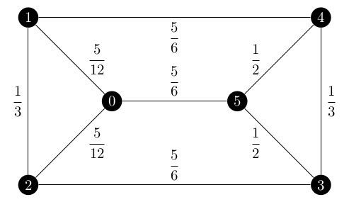
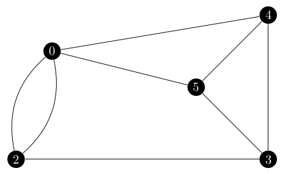

Implementing `spanning_tree_distribution` proved to have some NetworkX difficulties and one algorithmic difficulty.
Recall that the algorithm for creating the distribution is given in the Asadpour paper as

> 1. Set \\(\gamma = \vec{0}\\).
> 2. While there exists an edge \\(e\\) with \\(q\_e(\gamma) > (1 + \epsilon) z\_e\\):
>     * Compute \\(\delta\\) such that if we define \\(\gamma'\\) as \\(\gamma\_e' = \gamma\_e - \delta\\), and \\(\gamma\_f' = \gamma\_f\\) for all \\(f \in E\ \backslash \{e\}\\), then \\(q\_e(\gamma') = (1 + \epsilon/2)z\_e\\).
>     * Set \\(\gamma \leftarrow \gamma'\\).
> 3. Output \\(\tilde{\gamma} := \gamma\\).

Now, the procedure that I laid out in my last blog titled [*Entropy Distribution Setup*](https://blog.scientific-python.org/posts/networkx/entropy-distribution-setup) worked well for the while loop portion.
All of my difficulties with the NetworkX API happened in the `q` inner function.

After I programmed the function, I of course needed to run it and at first I was just printing the `gamma` dict out so that I could see what the values for each edge were.
My first test uses the symmetric fractional Held Karp solution and to my surprise, every value of \\(\gamma\\) returned as 0.
I didn't think that this was intended behavior because if it was, there would be no reason to include this step in the overall Asadpour algorithm, so I started to dig around the code with PyCharm's debugger.
The results were, as I suspected, not correct. 
I was running Krichhoff's tree matrix theorem on the original graph, so the returned probabilities were an order of magnitude smaller than the values of \\(z\_e\\) that I was comparing them to.
Additionally, all of the values were the same so I knew that this was a problem and not that the first edge I checked had unusually small probabilities.

So, I returned to the Asadpour paper and started to ask myself questions like 
* Do I need to normalize the Held Karp answer in some way?
* Do I need to consider edges outside of \\(E\\) (the undirected support of the Held Karp relaxation solution) or only work with the edges in \\(E\\)?

It was pretty easy to dismiss the first question, if normalization was required it would be mentioned in the Asadpour paper and without a description of how to normalize it the chances of me finding the `correct' way to do so would be next to impossible.
The second question did take some digging. 
The sections of the Asadpour paper which talk about using Krichhoff's theorem all discuss it using the graph \\(G\\) which is why I was originally using all edges in \\(G\\) rather than the edges 
in \\(E\\).
A few hints pointed to the fact that I needed to only consider the edges in \\(E\\), the first being the algorithm overview which states

> Find weights \\(\{\tilde{\gamma}\}\_{e \in E}\\)

In particular the \\(e \in E\\) statement says that I do not need to consider the edges which are not in \\(E\\).
Secondly, Lemma 7.2 starts by stating

> Let \\(G = (V, E)\\) be a graph with weights \\(\gamma\_e\\) for \\(e \in E\\)

Based on the current state of the function and these hints, I decided to reduce the input graph to `spanning_tree_distribution` to only edges with \\(z\_e > 0\\).
Running the test on the symmetric fractional solution now, it still returned \\(\gamma = \vec{0}\\) but the probabilities it was comparing were much closer during that first iteration.
Due to the fact that I do not have an example graph and distribution to work with, this could be the correct answer, but the fact that every value was the same still confused me.

My next step was to determine the actual probability of an edge being in the spanning trees for the first iteration when \\(\gamma = \vec{0}\\).
This can be easily done with my `SpanningTreeIterator` and exploits the fact that \\(\gamma = \vec{0} \equiv \lambda\_e = 1\ \forall\ e \in \gamma\\) so we can just iterate over the spanning trees and count how often each edge appears.

That script is listed below

```python
import networkx as nx

edges = [
    (0, 1),
    (0, 2),
    (0, 5),
    (1, 2),
    (1, 4),
    (2, 3),
    (3, 4),
    (3, 5),
    (4, 5),
]

G = nx.from_edgelist(edges, create_using=nx.Graph)

edge_frequency = {}
sp_count = 0
for tree in nx.SpanningTreeIterator(G):
    sp_count += 1
    for e in tree.edges:
        if e in edge_frequency:
            edge_frequency[e] += 1
        else:
            edge_frequency[e] = 1

for u, v in edge_frequency:
    print(
        f"({u}, {v}): {edge_frequency[(u, v)]} / {sp_count} = {edge_frequency[(u, v)] / sp_count}"
    )
```

This output revealed that the probabilities returned by `q` should vary from edge to edge and that the correct solution for \\(\gamma\\) is certainly not \\(\vec{0}\\).

```
(networkx-dev) mjs@mjs-ubuntu:~/Workspace$ python3 spanning_tree_frequency.py 
(0, 1): 40 / 75 = 0.5333333333333333
(0, 2): 40 / 75 = 0.5333333333333333
(0, 5): 45 / 75 = 0.6
(1, 4): 45 / 75 = 0.6
(2, 3): 45 / 75 = 0.6
(1, 2): 40 / 75 = 0.5333333333333333
(5, 3): 40 / 75 = 0.5333333333333333
(5, 4): 40 / 75 = 0.5333333333333333
(4, 3): 40 / 75 = 0.5333333333333333
```

Let's focus on that first edge, \\((0, 1)\\).
My brute force script says that it appears in 40 of the 75 spanning trees of the below graph where each edge is labelled with its \\(z\_e\\) value.

<center></center>

Yet `q` was saying that the edge was in 24 of 75 spanning trees.
Since the denominator was correct, I decided to focus on the numerator which is the number of spanning trees in \\(G\ \backslash\ \\{(0, 1)\\}\\).
That graph would be the following.

<center></center>

An argument can be made that this graph should have a self-loop on vertex 0, but this does not affect the Laplacian matrix in any way so it is omitted here.
Basically, the \\([0, 0]\\) entry of the adjacency matrix would be 1 and the degree of vertex 0 would be 5 and \\(5 - 1 = 4\\) which is what the entry would be without the self loop.

What was happening was that I was giving `nx.contracted_edge` a graph of the Graph class (not a directed graph since \\(E\\) is undirected) and was getting a graph of the Graph class back.
The Graph class does not support multiple edges between two nodes so the returned graph only had one edge between node 0 and node 2 which was affecting the overall Laplacian matrix and thus the number of spanning trees.
Switching from a Graph to a MultiGraph did the trick, but this subtle change should be mentioned in the NetworkX documentation for the function, linked [here](https://networkx.org/documentation/stable/reference/algorithms/generated/networkx.algorithms.minors.contracted_edge.html?).
I definitely believed that if a contracted an edge the output should automatically include both of the \\((0, 2)\\) edges.
An argument can be made for changing the default behavior to match this, but at the very least the documentation should explain this problem.

Now the `q` function was returning the correct \\(40 / 75\\) answer for \\((0, 1)\\) and correct values for the rest of the edges so long as all of the \\(\gamma\_e\\)'s were 0.
But the test was erroring out with a `ValueError` when I tried to compute \\(\delta\\).
`q` was returning a probability of an edge being in a sampled spanning tree of more than 1, which is clearly impossible but also caused the denominator of \\(\delta\\) to become negative and violate the domain of the natural log.

During my investigation of this problem, I noticed that after computing \\(\delta\\) and subtracting it from \\(\gamma\_e\\), it did not have the desired effect on \\(q\_e\\).
Recall that we define \\(\delta\\) so that \\(\gamma\_e - \delta\\) yields a \\(q\_e\\) of \\((1 + \epsilon / 2) z\_e\\).
In other words, the effect of \\(\delta\\) is to decrease an edge probability which is too high, but in my current implementation it was having the opposite effect.
The value of \\(q\_{(0, 1)}\\) was going from 0.5333 to just over 0.6.
If I let this trend continue, the program would eventually hit one of those cases where \\(q\_e \geq 1\\) and crash the program.

Here I can use edge \\((0, 1)\\) as an example to show the problem.
The original Laplacian matrix for \\(G\\) with \\(\gamma = \vec{0}\\) is

\\[
\begin{bmatrix}
 3 & -1 & -1 &  0 &  0 & -1 \\\\\\
-1 &  3 & -1 &  0 & -1 &  0 \\\\\\
-1 & -1 &  3 & -1 &  0 &  0 \\\\\\
 0 &  0 & -1 &  3 & -1 & -1 \\\\\\
 0 & -1 &  0 & -1 &  3 & -1 \\\\\\
-1 &  0 &  0 & -1 & -1 &  3 
\end{bmatrix}
\\]

and the Laplacian for \\(G\ \backslash\ \\{(0, 1)\\}\\) is 

\\[
\begin{bmatrix}
 4 & -2 & -1 & -1 &  0 \\\\\\
-2 &  3 &  0 &  0 & -1 \\\\\\
-1 &  0 &  3 & -1 & -1 \\\\\\
-1 &  0 & -1 &  3 & -1 \\\\\\
 0 & -1 & -1 & -1 &  3 
\end{bmatrix}
\\]

The determinant of the first cofactor is how we get the \\(40 / 75\\).
Now consider the Laplacian matrices after we updated \\(\gamma\_{(0, 1)}\\) for the first time.
The one for \\(G\\) becomes

\\[
\begin{bmatrix}
 2.74 & -0.74 & -1 &  0 &  0 & -1 \\\\\\
-0.74 &  2.74 & -1 &  0 & -1 &  0 \\\\\\
-1 & -1 &  3 & -1 &  0 &  0 \\\\\\
 0 &  0 & -1 &  3 & -1 & -1 \\\\\\
 0 & -1 &  0 & -1 &  3 & -1 \\\\\\
-1 &  0 &  0 & -1 & -1 &  3 
\end{bmatrix}
\\]

and its first cofactor determinant is reduced from 75 to 61.6.
What do we expect the value of the matrix for \\(G\ \backslash\ \\{(0, 1)\\}\\) to be?
Well, we know that the final value of \\(q\_e\\) needs to be \\((1 + \epsilon / 2) z\_e\\) or \\(1.1 \times 0.41\overline{6}\\) which is \\(0.458\overline{3}\\).
So

\\[
\begin{array}{r c l}
\displaystyle\frac{x}{61.6} &=& 0.458\overline{3} \\\\\\
x &=& 28.2\overline{3}
\end{array}
\\]

and the value of the first cofactor determinant should be \\(28.2\overline{3}\\).
However, the contracted Laplacian for \\((0, 1)\\) after the value of \\(\gamma\_e\\) is updated is

\\[
\begin{bmatrix}
 4 & -2 & -1 & -1 &  0 \\\\\\
-2 &  3 &  0 &  0 & -1 \\\\\\
-1 &  0 &  3 & -1 & -1 \\\\\\
-1 &  0 & -1 &  3 & -1 \\\\\\
 0 & -1 & -1 & -1 &  3 
\end{bmatrix}
\\]

the **same as before!**
The only edge with a different \\(\gamma\_e\\) than before is \\((0, 1)\\), but since it is the contracted edge it is no longer in the graph any more and thus cannot affect the value of the first cofactor's determinant!

But if we change the algorithm to add \\(\delta\\) to \\(\gamma\_e\\) rather than subtract it, the determinant of the first cofactor for \\(G\ \backslash\ \\{e\\}\\)’s Laplacian will not change but the determinant for the Laplacian of \\(G\\)'s first cofactor will increase.
This reduces the overall probability of picking \\(e\\) in a spanning tree.
And, if we happen to use the same formula for \\(\delta\\) as before for our example of \\((0, 1)\\) then \\(q\_{(0, 1)}\\) becomes \\(0.449307\\).
Recall our target value of \\(0.458\overline{3}\\).
This anwser has a \\(-1.96\%\\) error.

\\[
\begin{array}{r c l}
\text{error} &=& \frac{0.449307 - 0.458333}{0.458333} \times 100 \\\\\\
&=& \frac{-0.009026}{0.458333} \times 100 \\\\\\
&=& -0.019693 \times 100 \\\\\\
&=& -1.9693\% 
\end{array}
\\]

Also, the test now completes without error.

## Update! (28 July 2021)

Further research and discussion with my mentors revealed just how flawed my original analysis was.
In the next step, sampling the spanning trees, adding anything to \\(\gamma\\) would directly increase the probability that the edge would be sampled.
That being said, the original problem that I found was still an issue.

Going back to the notion that we a graph on which every spanning tree maps to every spanning tree which contains the desired edge, this is still the key idea which lets us use Krichhoff's Tree Matrix Theorem.
And, contracting the edge will still give a graph in which every spanning tree can be mapped to a corresponding spanning tree which includes \\(e\\).
However, the weight of those spanning trees in \\(G \backslash \\{e\\}\\) do not quite map between the two graphs.

Recall that we are dealing with a multiplicative weight function, so the final weight of a tree is the product of all the \\(\lambda\\)'s on its edges.

\\[
c(T) = \prod\_{e \in E} \lambda\_e
\\]

The above statement can be expanded into 

\\[
c(T) = \lambda\_1 \times \lambda\_2 \times \dots \times \lambda\_{|E|}
\\]

with some arbitary ordering of the edges \\(1, 2, \dots |E|\\).
Because the ordering of the edges is arbitary and due to the associative property of multiplcation, we can assume without loss of generality that the desired edge \\(e\\) is the last one in the sequence.

Any spanning tree in \\(G \backslash \\{e\\}\\) cannot include that last \\(\lambda\\) in it becuase that edge does not exist in the graph.
Therefore in order to convert the weight from a tree in \\(G \backslash \\{e\\}\\) we need to multiply \\(\lambda\_e\\) back into the weight of the contracted tree.
So, we can now state that

\\[
c(T \in \mathcal{T}: T \ni e) = \lambda\_e \prod\_{f \in E} \lambda\_f\ \forall\ T \in G \backslash \\{e\\}
\\]

or that for all trees in \\(G \backslash \\{e\\}\\), the cost of the corresponding tree in \\(G\\) is the product of its edge \\(\lambda\\)'s times the weight of the desired edge.
Now recall that \\(q\_e(\gamma)\\) is

\\[
\frac{\sum\_{T \ni e} \exp(\gamma(T))}{\sum\_{T \in \mathcal{T}} \exp(\gamma(T))}
\\]

In particular we are dealing with the numerator of the above fraction and using \\(\lambda\_e = \exp(\gamma\_e)\\) we can rewrite it as

\\[
\sum\_{T \ni e} \exp(\gamma(T)) = \sum\_{T \ni e} \prod\_{e \in T} \lambda\_e
\\]

Since we now know that we are missing the \\(\lambda\_e\\) term, we can add it into the expression.

\\[
\sum\_{T \ni e} \lambda\_e \times \prod\_{f \in T, f \not= e} \lambda\_f
\\]

Using the rules of summation, we can pull the \\(\lambda\_e\\) factor out of the summation to get

\\[
\lambda\_e \times \sum\_{T \ni e} \prod\_{f \in T, f \not= e} \lambda\_f
\\]

And since we use that applying Krichhoff's Theorem to \\(G \backslash \\{e\\}\\) will yeild everything except the factor of \\(\lambda\_e\\), we can just multiply it back manually.
This would let the peusdo code for `q` become

```
def q
    input: e, the edge of interest
    
    # Create the laplacian matrices
    write lambda = exp(gamma) into the edges of G
    G_laplace = laplacian(G, lambda)
    G_e = nx.contracted_edge(G, e)
    G_e_laplace = laplacian(G, lambda)
    
    # Delete a row and column from each matrix to made a cofactor matrix
    G_laplace.delete((0, 0))
    G_e_laplace.delete((0, 0))

    # Calculate the determinant of the cofactor matrices
    det_G_laplace = G_laplace.det
    det_G_e_laplace = G_e_laplace.det
    
    # return q_e
    return lambda_e * det_G_e_laplace / det_G_laplace
```

Making this small change to `q` worked very well. 
I was able to change back to subtracting \\(\delta\\) as the Asadpour paper does and even added a check to code so that everytime we update a value in \\(\gamma\\) we know that \\(\delta\\) has had the correct effect.

```python
# Check that delta had the desired effect
new_q_e = q(e)
desired_q_e = (1 + EPSILON / 2) * z_e
if round(new_q_e, 8) != round(desired_q_e, 8):
    raise Exception
```

And the test passes without fail!

## What's Next

I technically do not know if this distribution is correct until I can start to sample from it.
I have written the test I have been working with into a proper test but since my oracle is the program itself, the only way it can fail is if I change the function's behavior without knowing it.

So I must press onwards to write `sample_spanning_tree` and get a better test for both of those functions.

As for the tests of `spanning_tree_distribution`, I would of course like to add more test cases.
However, if the Held Karp relaxation returns a cycle as an answer, then there will be \\(n - 1\\) path spanning trees and the notion of creating this distribution in the first place as we have already found a solution to the ATSP.
I really need more truly fractional Held Karp solutions to expand the test of these next two functions.

## References

A. Asadpour, M. X. Goemans, A. Mardry, S. O. Ghran, and A. Saberi, *An o(log n / log log n)-approximation algorithm for the asymmetric traveling salesman problem*, Operations Research, 65 (2017), pp. 1043-1061.

