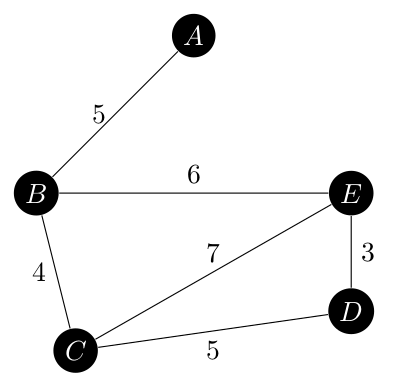
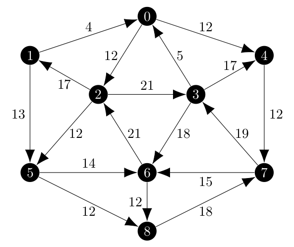
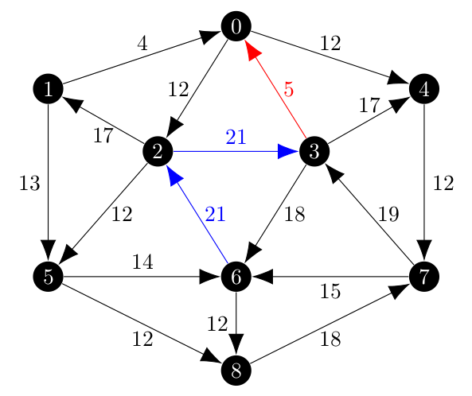
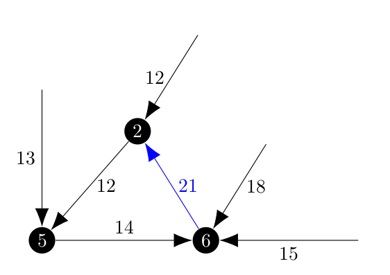
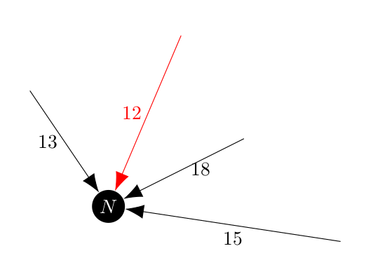

We are coming into the end of the first week of coding for the Summer of Code, and I have implemented two new, but related, features in NetworkX.
In this post, I will discuss how I implemented them, some of the challenges and how I tested them.
Those two new features are a spanning tree iterator and a spanning arborescence iterator.

The arborescence iterator is the feature that I will be using directly in my GSoC project, but I though that it was a good idea to implement the spanning tree iterator first as it would be easier and I could directly refer back to the research paper as needed.
The partition schemes between the two are the same, so once I figured it out for the spanning tress what I learned there would directly port into the arborescence iterator and there I could focus on modifying Edmond's algorithm to respect the partition.

## Spanning Tree Iterator

This was the first of the new freatures.
It follows the algorithm detailed in a paper by Sörensen and Janssens from 2005 titled *An Algorithm to Generate all Spanning Trees of a Graph in Order of Increasing Cost* which can be found [here](https://www.scielo.br/j/pope/a/XHswBwRwJyrfL88dmMwYNWp/?lang=en&format=pdf) [2].

Now, I needed to tweak the implementation of the algorithm because I wanted to implement a python iterator, so somebody can write

```python
for tree in nx.SpanningTreeIterator(G):
```

and that loop would return spanning trees starting with the ones of minimum cost and climbing to the ones of maximum cost.

In order to implement this feature, my first step was to ensure that once I know what the edge partition of the graph was, I could find a minimum spanning tree which respected the partition.
As a brief reminder, the edge partition creates two disjoint sets of edges of which one *must* appear in the resulting spanning tree and one *cannot* appear in the spanning tree.
Edges which are neither included or excluded from the spanning tree and called open.

The easiest algorithm to implement this which is Kruskal's algorithm.
The included edges are all added to the spanning tree first, and then the algorithm can join the components created with the included edges using the open edges.

This was easy to implement in NetworkX.
The Kruskal's algorithm in NetworkX is a generator which returns the edges in the minimum spanning tree one at a time using a sorted list of edges.
All that I had to do was change the sorting process so that the included edges where always at the front of that list, then the algorithm would always select them, regardless of weight for the spanning tree.

Additionally, since the general spanning tree of a graph is a partitioned tree where the partition has no included or excluded edges, I was about to convert the normal Kruskal's implementation into a wrapper for my partition respecting one in order to reduce redunant code.

As for the partitioning process itself, that proved to be a bit more tricky mostly stemming from my own limited python experience. 
(I have only been working with python since the start of the calendar year)
In order to implement the partitioning scheme I needed an ordered data structure and choose the [`PriorityQueue`](https://docs.python.org/3/library/queue.html) class.
This was convienct, but for elements with the same weight for their minimum spanning trees it tried to compare the dictionaries hold the edge data was is not a supported operation.
Thus, I implemented a dataclass where only the weight of the spanning tree was comparable.
This means that for ties in spanning tree weight, the oldest partition with that weight is considered first.

Once the implementation details were ironed out, I moved on to testing.
At the time of this writting, I have tested the `SpanningTreeIterator` on the sample graph in the Sörensen and Janssens paper.
That graph is

<center></center>

It has eight spanning trees, ranging in weight from 17 to 23 which are all shown below.

<center>


</center>

Since this graph only has a few spanning trees, it was easy to explicitly test that each graph returned from the iterator was the next one in the sequence.
The iterator also works backwards, so calling

```python
for tree in nx.SpanningTreeIterator(G, minimum=False):
```

starts with the maximum spanning tree and works down to the minimum spanning tree.

The code for the spanning tree iterator can be found [here](https://github.com/mjschwenne/networkx/blob/bothTSP/networkx/algorithms/tree/mst.py) starting around line 761.

## Arborescence Iterator

The arborescence iterator is what I actually need for my GSoC project, and as expected was more complicated to implement.
In my original post titled [Finding All Minimum Arborescences](https://blog.scientific-python.org/posts/networkx/finding-all-minimum-arborescences), I discussed cases that Edmond's algorithm [1] would need to handle and proposed a change to the `desired_edge` method.

These changes where easy to make, but were not the extent of the changes that needed to be made as I originally thought.
The original graph from Edmonds' 1967 paper is below

<center></center>

In my first test, which was limited to the minimum spanning arborescence of a random partition I created, the results where close.
Below, the blue edges are included and the red one is excluded.

<center></center>

The minimum spanning arborescence initially is shown below.

<center></center>

While the \\((3, 0)\\) edge is properly excluded and the \\((2, 3)\\) edge is included, the \\((6, 2)\\) is not present in the arborescence (show as a dashed edge).
Tracking this problem down was a hassle, but the way that Edmonds' algorithm works is that a cycle, which would have been present if the \\((6, 2)\\) edge was included, are collasped into a signle vertex as the algorithm moves to the next iteration.
Once that cycle is collapsed into a vertex, it still has to choose how to access that vertex and the choice is based on the best edge as before (this is step I1 in [1]).
Then, when the algorithm expands the cycle out, it will remove the edge which is

* Wholly contained inside the cycle and,
* Directed towards the vertex which is the 'access point' for the cycle.

Which is this case, would be \\((6, 2)\\) shown in red in the next image.
Represented visually, the cycle with incoming edges would look like

<center></center>

And that would be collapsed into a new vertex, \\(N\\) from which the incoming edge with weight 12 would be selected.

<center></center>

In this example we want to forbid the algorithm from picking the edge with weight 12, so that when the cycle is reconstructed the included edge \\((6, 2)\\) is still present.
Once we make one of the incoming edges an included edge, we know from the definition of an arborescence that we cannot get to that vertex from any other edges.
They are all effectivily excluded, so once we find an included edge directed towards a vertex we can made all of the other incoming edges excluded.

Returning to the example, the collapsed vertex \\(N\\) would have the edge of weight 12 excluded and would pick the edge of weight 13.

<center></center>

At this point the iterator would find 236 arborescences with cost ranging from 96 to 125.
I thought that I was very close to being finished and I knew that the cost of the minimum spanning arborescence was 96, until I checked to see what the weight of the maximum spanning arborescence was: 131.

This means that I was removing partitions which contained a valid arborescence before they were being added to priority queue.
My `check_partition` method within the `ArborescenceIterator` was doing the following:

* Count the number of included and excluded incoming edges for each vertex.
* Save all of the included edges to a list to be checked for cycles.
* If there was more than one included edge or all of the edges where excluded, return `False`.
* If there was one included edge, make all of the others excluded.

Rather than try to debug what I though was a good method, I decided to change my process.
I moved the last bullet point into the `write_partition` method and then stopped using the `check_partition` method.
If an edge partition does not have a spanning arborescence, the `partition_spanning_arborescence` function will return `None` and I discard the partition.
This approach is more computationally intensive, but it increased the number of returned spanning araborescences from 236 to 680 and the range expanded to the proper 96 - 131.

But how do I know that it isn't skipping arborescences within that range?
Since 680 arborescences is too many to explicitly check, I decided to write another test case.
This one would check that the number of arborescences was correct and that the sequence never decreases.

In order to check the number of arborescecnes, I dicided to take a brute force approach.
There are 

\\[
\binom{18}{8} = 43,758
\\]

possible combinations of edges which could be arborescences.
That's a lot of combintation, more than I wanted to check by hand so I wrote a short python script.

```python
from itertools import combinations
import networkx as nx

edgelist = [
    (0, 2),
    (0, 4),
    (1, 0),
    (1, 5),
    (2, 1),
    (2, 3),
    (2, 5),
    (3, 0),
    (3, 4),
    (3, 6),
    (4, 7),
    (5, 6),
    (5, 8),
    (6, 2),
    (6, 8),
    (7, 3),
    (7, 6),
    (8, 7)
]

combo_count = 0
arbor_count = 0
for combo in combinations(edgelist, 8):
    combo_count += 1
    combo_test = nx.DiGraph()
    combo_test.add_edges_from(combo)
    if nx.is_arborescence(combo_test):
        arbor_count += 1

print(f"There are {combo_count} possible combinations of eight edges which "
      f"could be an arboresecnce.")
print(f"Of those {combo_count} combinations, {arbor_count} are arborescences.")
```

The output of this script is 

```
There are 43758 possible combinations of eight edges which could be an arboresecnce.
Of those 43758 combinations, 680 are arborescences.
```

So now I know how many arborescences where in the graph and it matched the number returned from the iterator.
Thus, I believe that the iterator is working well.

The iterator code is [here](https://github.com/mjschwenne/networkx/blob/bothTSP/networkx/algorithms/tree/branchings.py) and starts around line 783.
It can be used in the same way as the spanning tree iterator.

[Attached](https://blog.scientific-python.org/posts/networkx/iterator-output.pdf) is a sample output from the iterator detailing all 680 arborescences of the test graph.
Since Jekyll will not let me put up the txt file I had to convert it into a pdf which is 127 pages to show the 6800 lines of output from displaying all of the arborescences.

## References

[1] J. Edmonds, *Optimum Branchings*, Journal of Research of the National Bureau of Standards, 1967, Vol. 71B, p.233-240, [https://archive.org/details/jresv71Bn4p233](https://archive.org/details/jresv71Bn4p233)

[2] G.K. Janssens, K. Sörensen, *An algoirthm to generate all spanning trees in order of incresing cost*, Pesquisa Operacional, 2005-08, Vol. 25 (2), p. 219-229, [https://www.scielo.br/j/pope/a/XHswBwRwJyrfL88dmMwYNWp/?lang=en](https://www.scielo.br/j/pope/a/XHswBwRwJyrfL88dmMwYNWp/?lang=en)
