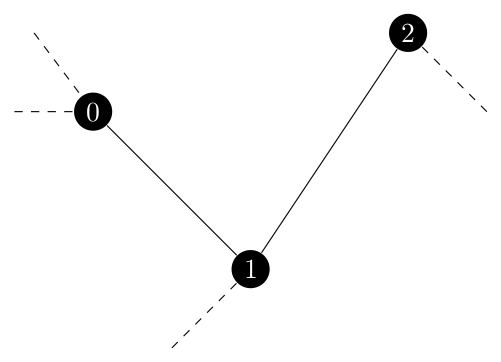

The heavy lifting I did in the preliminary post certainly paid off here!
In just one day I was able to implement `sample_spanning_tree` and its two helper functions.

## krichhoffs

This was a very easy function to implement. 
It followed exactly from the pesudo code and was working with `spanning_tree_distribution` before I started on `sample_spanning_tree`.

## sample\_spanning\_tree

This function was more difficult than I originally anticipated.
The code for the main body of the function only needed minor tweaks to work with the specifics of python such as `shuffle` being in place and returning `None` and some details about how sets work.
For example, I add edge \\(e\\) to \\(U\\) before calling `prepare_graph` on in and then switch the `if` statement to be the inverse to remove \\(e\\) from \\(U\\).
Those portions are functionally the same.
The issues I had with this function *all* stem back to contracting multiple nodes in a row and how that affects the graph.

As a side note, the `contracted_edge` function in NetworkX is a wrapper for `contracted_node` and the latter has a `copy` keyword argument that is assumed to be `True` by the former function. 
It was a trivial change to extend this functionality to `contracted_edge` but in the end I used `contracted_node` so the whole thing is moot.

First recall how edge contraction, or in this case node contraction, works.
Two nodes are merged into one which is connected by the same edges which connected the original two nodes.
Edges between those two nodes become self loops, but in this case I prevented the creation of self loops as directed by Kulkarni. 
If a node which is not contracted has edges to both of the contracted nodes, we insert a parallel edge between them.
I struggled with NetworkX's API about the graph classes in a past post titled [*The Entropy Distribution*](https://blog.scientific-python.org/posts/networkx/the-entropy-distribution.html).

For NetworkX's implementation, we would call `nx.contracted_nodes(G, u, v)` and `u` and `v` would always be merged into `u`, so `v` is the node which is no longer in the graph.

Now imagine that we have three edges to contract because they are all in \\(U\\) which look like the following.

If we process this from left to right, we first contract nodes 0 and 1.
At this point, the \\(\\{1, 2\\}\\) no longer exists in \\(G\\) as node 1 itself has been removed.
However, we would still need to contract the new \\(\\{0, 2\\}\\) edge which is equivalent to the old \\(\\{1, 2\\}\\) edge.

My first attempt to solve this was... messy and didn't work well. 
I developed an `if-elif` chain for which endpoints of the contracting edge no longer existed in the graph and tried to use dict comprehension to force a dict to always be up to date with which vertices were equivalent to each other.
It didn't work and was very messy.

Fortunately there was a better solution.
This next bit of code I actually first used in my Graph Algorithms class from last semester.
In particular it is the merge-find or disjoint set data structure from the components algorithm (code can be found [here](https://github.com/mjschwenne/GraphAlgorithms/blob/main/src/Components.py) and more information about the data structure [here](https://en.wikipedia.org/wiki/Disjoint-set_data_structure)).

Basically we create a mapping from a node to that node's representative.
In this case a node's representative is the node that is still in \\(G\\) but the input node has been merged into through a series of contractions.
In the above example, once node 1 is merged into node 0, 0 would become node 1's representative. 
We search recursively through the `merged_nodes` dict until we find a node which is not in the dict, meaning that it is still its own representative and therefore in the graph.
This will let us handle a representative node later being merged into another node.
Finally, we take advantage of path compression so that lookup times remain good as the number of entries in `merged_nodes` grows.

This worked well once I caught a bug where the `prepare_graph` function tried to contract a node with itself.
However, the function was running and returning a result but it could have one or two more edges than needed which of course means it is not a tree.
I was testing on the symmetric fractional Held Karp graph by the way, so with six nodes it should have five edges per tree.

I seeded the random number generator for one of the seven edge results and started to debug!
Recall that once we generate a uniform decimal between 0 and 1 we compare it to 

\\[
\lambda\_e \times \frac{K\_{G \backslash \{e\}}}{K\_G}
\\]

where \\(K\\) is the result of Krichhoff's Theorem on the subscripted graph.
One probability that caught my eye had the fractional component equal to 1.
This means that adding \\(e\\) to the set of contracted edges had no effect on where that edge should be included in the final spanning tree.
Closer inspection revealed that the edge \\(e\\) in question already could not be picked for the spanning tree since it did not exist in \\(G\\) it could not exist in \\(G \backslash \{e\}\\).

Imagine the following situation.
We have three edges to contract but they form a cycle of length three.

If we contract \\(\\{0, 1\\}\\) and then \\(\\{0, 2\\}\\) what does that mean for \\(\\{1, 2\\}\\)?
Well, \\(\{1, 2\}\\) would become a self loop on vertex 0 but we are deleting self loops so it cannot exist.
It has to have a probability of 0.
Yet in the current implementation of the function, it would have a probability of \\(\lambda\_{\\{1, 2\\}}\\). 
So, I have to check to see if a representative edge exists for the edge we are considering in the current iteration of the main for loop.

The solution to this is to return the merge-find data structure with the prepared graph for \\(G\\) and then check that an edge with endpoints at the two representatives for the endpoints of the original edge persent.
If so, use the kirchhoff value as normal but if not make `G_e_total_tree_weight` equal to zero so that this edge cannot be picked.
Finally I was able to sample trees from `G` consistently, but did they match the expected probabilities?

## Testing sample\_spanning\_tree

The first test I was working with sampled one tree and checked to see if it was actually a tree.
I first expanded it to sample 1000 trees and make sure that they were all trees.
At this point, I thought that the function will always return a tree, but I need to check the tree distribution.

So after a lot of difficulty writing the test itself to check which of the 75 possible spanning trees I had sampled I was ready to check the actual distribution.
First, the test iterates over all the spanning trees, records the products of edge weights and normalizes the data.
(Remember that the actual probability is only *proportional* to the product of edge weights).
Then I sample 50000 trees and record the actual frequency. 
Next, it calculates the percent error from the expected probability to the actual frequency.
The sample size is so large because at 1000 trees the percent error was all over the place but, as the Law of Large Numbers dictates, the larger sample shows the actual results converging to the expected results so I do believe that the function is working.

That being said, seeing the percent error converge to be less than 15% for all 75 spanning trees is not a very rigorous test.
I can either implement a formal test using the percent error or try to create a Chi squared test using scipy.

### Update! (29 July 2021)

This morning I was able to get a Chi squared test working and it was definatly the correct dicision. 
I was able to reduce the sample size from 50,000 to 1200 which is a near minimum sample.
In order to run a Chi squared test you need an expected frequency of at least 5 for all of the categories so I had to find the number of samples to ganturee that for a tree with a probabilty of about 0.4% which was 1163 that I rounded to 1200.

I am testing at the 0.01 signigance level, so this test may fail without reason 1% of the time but it is still a overall good test for distribution.

## References

A. Asadpour, M. X. Goemans, A. Mardry, S. O. Ghran, and A. Saberi, *An o(log n / log log n)-approximation algorithm for the asymmetric traveling salesman problem*, SODA ’10,
Society for Industrial and Applied Mathematics, 2010, pp. 379-389, [https://dl.acm.org/doi/abs/10.5555/1873601.1873633](https://dl.acm.org/doi/abs/10.5555/1873601.1873633).

V. G. Kulkarni, *Generating random combinatorial objects*, Journal of algorithms, 11 (1990), pp. 185–207.

