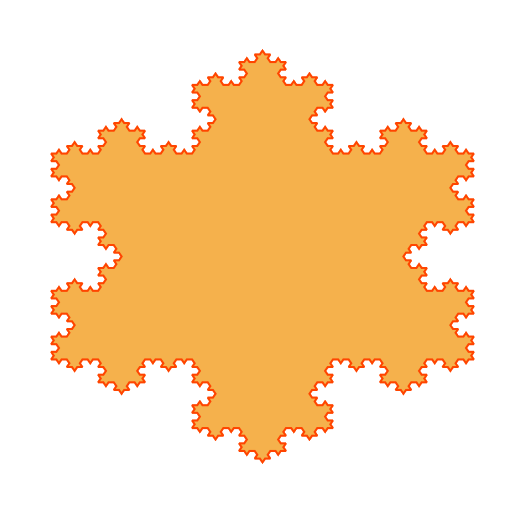
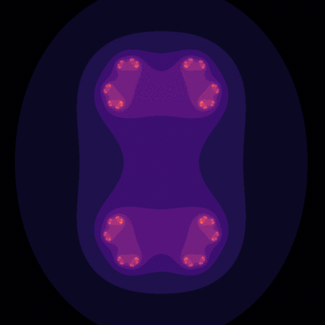

Imagine zooming an image over and over and never go out of finer details. It may sound bizarre but the mathematical
concept of [fractals](https://en.wikipedia.org/wiki/Fractal) opens the realm towards this intricating infinity. This
strange geometry exhibits the same or similar patterns irrespectively of the scale. We can see one fractal example
in the image above.

The _fractals_ may seem difficult to understand due to their peculiarity, but that's not the case. As Benoit Mandelbrot,
one of the founding fathers of the fractal geometry said in his legendary
[TED Talk](https://www.ted.com/talks/benoit_mandelbrot_fractals_and_the_art_of_roughness?language=en):

> A surprising aspect is that the rules of this geometry are extremely short. You crank the formulas several times and
> at the end, you get things like this (pointing to a stunning plot)
>
> -- <cite>Benoit Mandelbrot</cite>

In this tutorial blog post, we will see how to construct fractals in Python and animate them using the amazing
_Matplotlib's_ Animation API. First, we will demonstrate the convergence of the _Mandelbrot Set_ with an
enticing animation. In the second part, we will analyze one interesting property of the _Julia Set_. Stay tuned!

# Intuition

We all have a common sense of the concept of similarity. We say two objects are similar to each other if they share
some common patterns.

This notion is not only limited to a comparison of two different objects. We can also compare different parts of the
same object. For instance, a leaf. We know very well that the left side matches exactly the right side, i.e. the leaf
is symmetrical.

In mathematics, this phenomenon is known as [self-similarity](https://en.wikipedia.org/wiki/Self-similarity). It means
a given object is similar (completely or to some extent) to some smaller part of itself. One remarkable example is the
[An orange Koch Snowflake. It has 6 bulges which themselves have 3 sub-bulges. These sub-bulges have another 3 sub-sub bulges. ](https://isquared.digital/visualizations/2020-06-15-koch-curve/) as shown in the image below:



We can infinitely magnify some part of it and the same pattern will repeat over and over again. This is how fractal
geometry is defined.

# Animated Mandelbrot Set

[Mandelbrot Set](https://en.wikipedia.org/wiki/Mandelbrot_set) is defined over the set of _complex numbers_. It consists
of all complex numbers **c**, such that the sequence **zᵢ₊ᵢ = zᵢ² + c, z₀ = 0** is bounded. It means, after a certain
number of iterations the absolute value must not exceed a given limit. At first sight, it might
seem odd and simple, but in fact, it has some mind-blowing properties.

The _Python_ implementation is quite straightforward, as given in the code snippet below:

```python
def mandelbrot(x, y, threshold):
    """Calculates whether the number c = x + i*y belongs to the
    Mandelbrot set. In order to belong, the sequence z[i + 1] = z[i]**2 + c
    must not diverge after 'threshold' number of steps. The sequence diverges
    if the absolute value of z[i+1] is greater than 4.

    :param float x: the x component of the initial complex number
    :param float y: the y component of the initial complex number
    :param int threshold: the number of iterations to considered it converged
    """
    # initial conditions
    c = complex(x, y)
    z = complex(0, 0)

    for i in range(threshold):
        z = z**2 + c
        if abs(z) > 4.0:  # it diverged
            return i

    return threshold - 1  # it didn't diverge
```

As we can see, we set the maximum number of iterations encoded in the variable `threshold`. If the magnitude of the
sequence at some iteration exceeds **4**, we consider it as diverged (**c** does not belong to the set) and return the
iteration number at which this occurred. If this never happens (**c** belongs to the set), we return the maximum
number of iterations.

We can use the information about the number of iterations before the sequence diverges. All we have to do
is to associate this number to a color relative to the maximum number of loops. Thus, for all complex numbers
**c** in some lattice of the complex plane, we can make a nice animation of the convergence process as a function
of the maximum allowed iterations.

One particular and interesting area is the _3x3_ lattice starting at position -2 and -1.5 for the _real_ and
_imaginary_ axis respectively. We can observe the process of convergence as the number of allowed iterations increases.
This is easily achieved using the _Matplotlib's_ Animation API, as shown with the following code:

```python
import numpy as np
import matplotlib.pyplot as plt
import matplotlib.animation as animation

x_start, y_start = -2, -1.5  # an interesting region starts here
width, height = 3, 3  # for 3 units up and right
density_per_unit = 250  # how many pixles per unit

# real and imaginary axis
re = np.linspace(x_start, x_start + width, width * density_per_unit)
im = np.linspace(y_start, y_start + height, height * density_per_unit)

fig = plt.figure(figsize=(10, 10))  # instantiate a figure to draw
ax = plt.axes()  # create an axes object


def animate(i):
    ax.clear()  # clear axes object
    ax.set_xticks([], [])  # clear x-axis ticks
    ax.set_yticks([], [])  # clear y-axis ticks

    X = np.empty((len(re), len(im)))  # re-initialize the array-like image
    threshold = round(1.15 ** (i + 1))  # calculate the current threshold

    # iterations for the current threshold
    for i in range(len(re)):
        for j in range(len(im)):
            X[i, j] = mandelbrot(re[i], im[j], threshold)

    # associate colors to the iterations with an interpolation
    img = ax.imshow(X.T, interpolation="bicubic", cmap="magma")
    return [img]


anim = animation.FuncAnimation(fig, animate, frames=45, interval=120, blit=True)
anim.save("mandelbrot.gif", writer="imagemagick")
```

We make animations in _Matplotlib_ using the `FuncAnimation` function from the _Animation_ API. We need to specify
the `figure` on which we draw a predefined number of consecutive `frames`. A predetermined `interval` expressed in
milliseconds defines the delay between the frames.

In this context, the `animate` function plays a central role, where the input argument is the frame number, starting
from 0. It means, in order to animate we always have to think in terms of frames. Hence, we use the frame number
to calculate the variable `threshold` which is the maximum number of allowed iterations.

To represent our lattice we instantiate two arrays `re` and `im`: the former for the values on the _real_ axis
and the latter for the values on the _imaginary_ axis. The number of elements in these two arrays is defined by
the variable `density_per_unit` which defines the number of samples per unit step. The higher it is, the better
quality we get, but at a cost of heavier computation.

Now, depending on the current `threshold`, for every complex number **c** in our lattice, we calculate the number of
iterations before the sequence **zᵢ₊ᵢ = zᵢ² + c, z₀ = 0** diverges. We save them in an initially empty matrix called `X`.
In the end, we _interpolate_ the values in `X` and assign them a color drawn from a prearranged _colormap_.

After cranking the `animate` function multiple times we get a stunning animation as depicted below:


# Animated Julia Set

The [Julia Set](https://en.wikipedia.org/wiki/Julia_set) is quite similar to the _Mandelbrot Set_. Instead of setting
**z₀ = 0** and testing whether for some complex number **c = x + i\*y** the sequence **zᵢ₊ᵢ = zᵢ² + c** is bounded, we
switch the roles a bit. We fix the value for **c**, we set an arbitrary initial condition **z₀ = x + i\*y**, and we
observe the convergence of the sequence. The _Python_ implementation is given below:

```python
def julia_quadratic(zx, zy, cx, cy, threshold):
    """Calculates whether the number z[0] = zx + i*zy with a constant c = x + i*y
    belongs to the Julia set. In order to belong, the sequence
    z[i + 1] = z[i]**2 + c, must not diverge after 'threshold' number of steps.
    The sequence diverges if the absolute value of z[i+1] is greater than 4.

    :param float zx: the x component of z[0]
    :param float zy: the y component of z[0]
    :param float cx: the x component of the constant c
    :param float cy: the y component of the constant c
    :param int threshold: the number of iterations to considered it converged
    """
    # initial conditions
    z = complex(zx, zy)
    c = complex(cx, cy)

    for i in range(threshold):
        z = z**2 + c
        if abs(z) > 4.0:  # it diverged
            return i

    return threshold - 1  # it didn't diverge
```

Obviously, the setup is quite similar as the _Mandelbrot Set_ implementation. The maximum number of iterations is
denoted as `threshold`. If the magnitude of the sequence is never greater than **4**, the number **z₀** belongs to
the _Julia Set_ and vice-versa.

The number **c** is giving us the freedom to analyze its impact on the convergence of the sequence, given that the
number of maximum iterations is fixed. One interesting range of values for **c** is for **c = r cos α + i × r sin α**
such that **r=0.7885** and **α ∈ \[0, 2π\]**.

The best possible way to make this analysis is to create an animated visualization as the number **c** changes.
This [ameliorates our visual perception](https://isquared.digital/blog/2020-02-08-interactive-dataviz/) and
understanding of such abstract phenomena in a captivating manner. To do so, we use the Matplotlib's _Animation API_, as
demonstrated in the code below:

```python
import numpy as np
import matplotlib.pyplot as plt
import matplotlib.animation as animation

x_start, y_start = -2, -2  # an interesting region starts here
width, height = 4, 4  # for 4 units up and right
density_per_unit = 200  # how many pixles per unit

# real and imaginary axis
re = np.linspace(x_start, x_start + width, width * density_per_unit)
im = np.linspace(y_start, y_start + height, height * density_per_unit)


threshold = 20  # max allowed iterations
frames = 100  # number of frames in the animation

# we represent c as c = r*cos(a) + i*r*sin(a) = r*e^{i*a}
r = 0.7885
a = np.linspace(0, 2 * np.pi, frames)

fig = plt.figure(figsize=(10, 10))  # instantiate a figure to draw
ax = plt.axes()  # create an axes object


def animate(i):
    ax.clear()  # clear axes object
    ax.set_xticks([], [])  # clear x-axis ticks
    ax.set_yticks([], [])  # clear y-axis ticks

    X = np.empty((len(re), len(im)))  # the initial array-like image
    cx, cy = r * np.cos(a[i]), r * np.sin(a[i])  # the initial c number

    # iterations for the given threshold
    for i in range(len(re)):
        for j in range(len(im)):
            X[i, j] = julia_quadratic(re[i], im[j], cx, cy, threshold)

    img = ax.imshow(X.T, interpolation="bicubic", cmap="magma")
    return [img]


anim = animation.FuncAnimation(fig, animate, frames=frames, interval=50, blit=True)
anim.save("julia_set.gif", writer="imagemagick")
```

The logic in the `animate` function is very similar to the previous example. We update the number **c** as a function
of the frame number. Based on that we estimate the convergence of all complex numbers in the defined lattice, given the
fixed `threshold` of allowed iterations. Same as before, we save the results in an initially empty matrix `X` and
associate them to a color relative to the maximum number of iterations. The resulting animation is illustrated below:



# Summary

The fractals are really mind-gobbling structures as we saw during this blog. First, we gave a general intuition
of the fractal geometry. Then, we observed two types of fractals: the _Mandelbrot_ and _Julia_ sets. We implemented
them in Python and made interesting animated visualizations of their properties.
