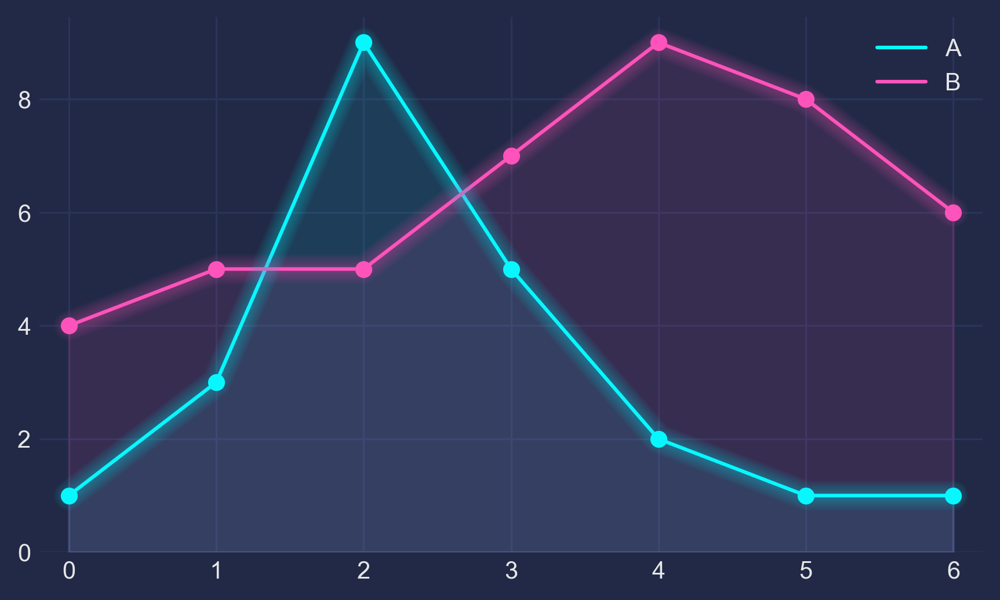
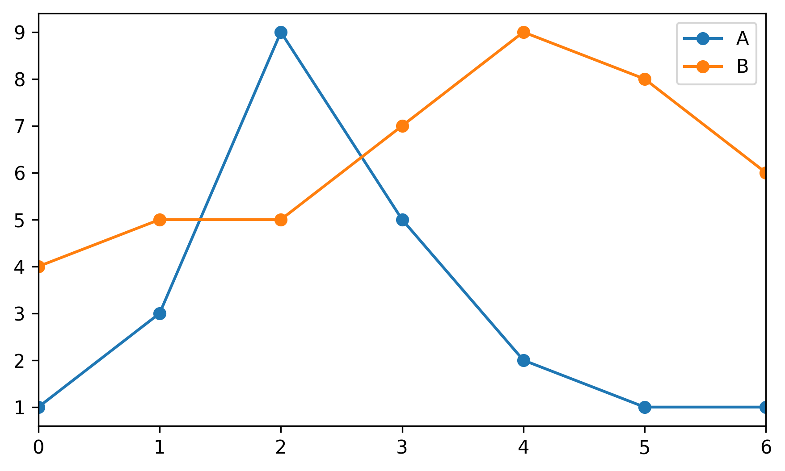
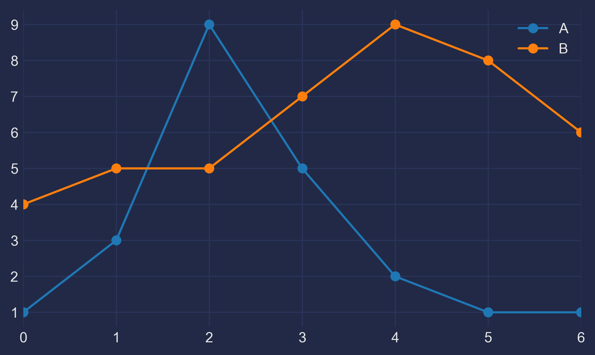
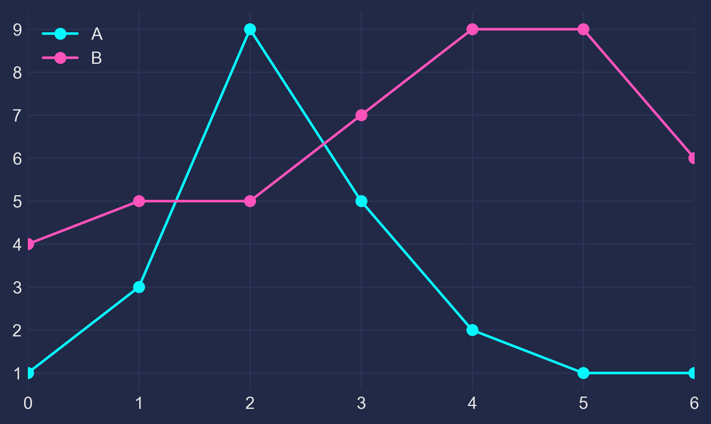
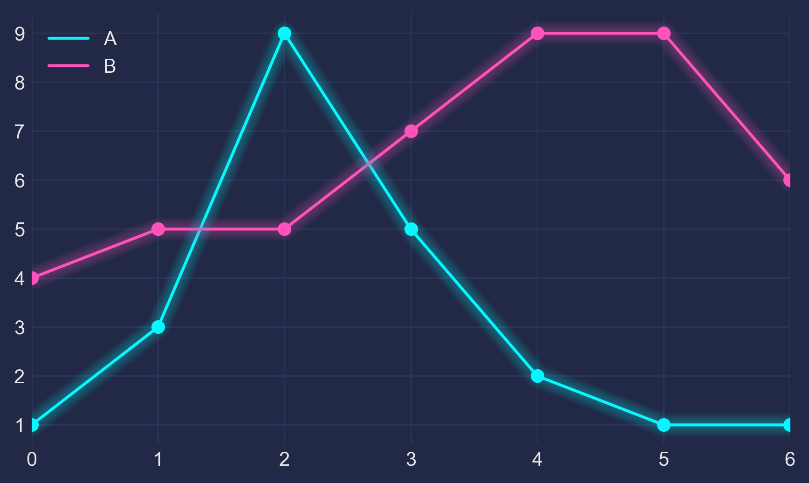

## 1 - The Basis

Let's make up some numbers, put them in a Pandas dataframe and plot them:

    import pandas as pd
    import matplotlib.pyplot as plt

    df = pd.DataFrame({'A': [1, 3, 9, 5, 2, 1, 1],
                       'B': [4, 5, 5, 7, 9, 8, 6]})

    df.plot(marker='o')
    plt.show()

## 2 - The Darkness

Not bad, but somewhat ordinary. Let's customize it by using Seaborn's dark style, as well as changing background and font colors:

    plt.style.use("seaborn-dark")

    for param in ['figure.facecolor', 'axes.facecolor', 'savefig.facecolor']:
        plt.rcParams[param] = '#212946'  # bluish dark grey

    for param in ['text.color', 'axes.labelcolor', 'xtick.color', 'ytick.color']:
        plt.rcParams[param] = '0.9'  # very light grey

    ax.grid(color='#2A3459')  # bluish dark grey, but slightly lighter than background

## 3 - The Light

It looks more interesting now, but we need our colors to shine more against the dark background:

    fig, ax = plt.subplots()
    colors = [
        '#08F7FE',  # teal/cyan
        '#FE53BB',  # pink
        '#F5D300',  # yellow
        '#00ff41', # matrix green
    ]
    df.plot(marker='o', ax=ax, color=colors)

## 4 - The Glow

Now, how to get that neon look? To make it shine, we _redraw the lines multiple times_, with low alpha value and slighty increasing linewidth. The overlap creates the glow effect.

    n_lines = 10
    diff_linewidth = 1.05
    alpha_value = 0.03

    for n in range(1, n_lines+1):

        df.plot(marker='o',
                linewidth=2+(diff_linewidth*n),
                alpha=alpha_value,
                legend=False,
                ax=ax,
                color=colors)

## 5 - The Finish

For some more fine tuning, we color the area below the line (via `ax.fill_between`) and adjust the axis limits.

Here's the full code:

    import pandas as pd
    import matplotlib.pyplot as plt

    plt.style.use("dark_background")

    for param in ['text.color', 'axes.labelcolor', 'xtick.color', 'ytick.color']:
        plt.rcParams[param] = '0.9'  # very light grey

    for param in ['figure.facecolor', 'axes.facecolor', 'savefig.facecolor']:
        plt.rcParams[param] = '#212946'  # bluish dark grey

    colors = [
        '#08F7FE',  # teal/cyan
        '#FE53BB',  # pink
        '#F5D300',  # yellow
        '#00ff41',  # matrix green
    ]

    df = pd.DataFrame({'A': [1, 3, 9, 5, 2, 1, 1],
                       'B': [4, 5, 5, 7, 9, 8, 6]})

    fig, ax = plt.subplots()

    df.plot(marker='o', color=colors, ax=ax)

    # Redraw the data with low alpha and slighty increased linewidth:
    n_shades = 10
    diff_linewidth = 1.05
    alpha_value = 0.3 / n_shades

    for n in range(1, n_shades+1):

        df.plot(marker='o',
                linewidth=2+(diff_linewidth*n),
                alpha=alpha_value,
                legend=False,
                ax=ax,
                color=colors)

    # Color the areas below the lines:
    for column, color in zip(df, colors):
        ax.fill_between(x=df.index,
                        y1=df[column].values,
                        y2=[0] * len(df),
                        color=color,
                        alpha=0.1)

    ax.grid(color='#2A3459')

    ax.set_xlim([ax.get_xlim()[0] - 0.2, ax.get_xlim()[1] + 0.2])  # to not have the markers cut off
    ax.set_ylim(0)

    plt.show()

If this helps you or if you have constructive criticism, I'd be happy to hear about it! Please contact me via [here](https://dhaitz.github.io) or [here](https://twitter.com/d_haitz). Thanks!
