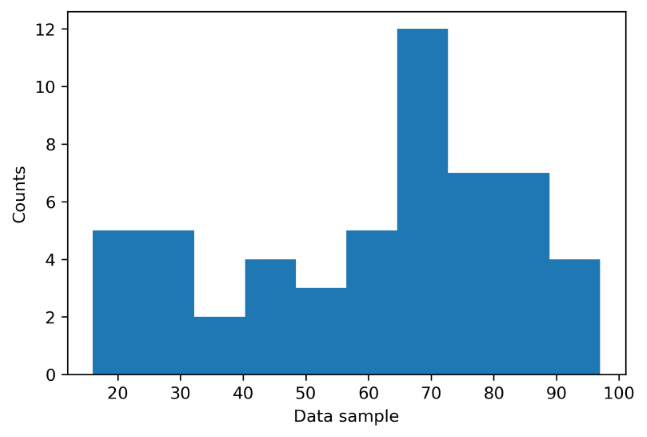
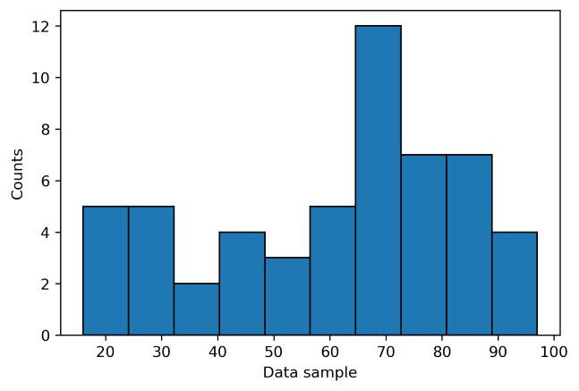
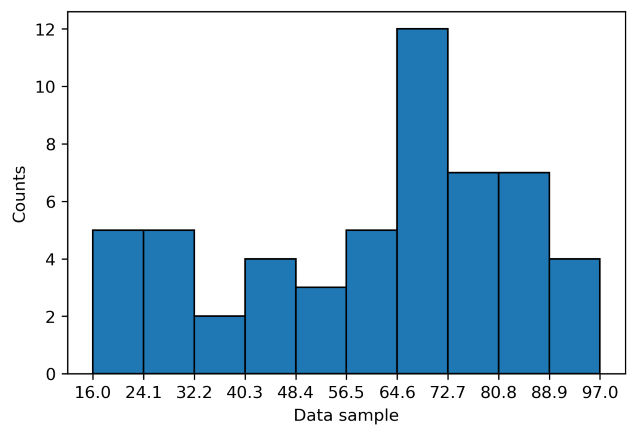
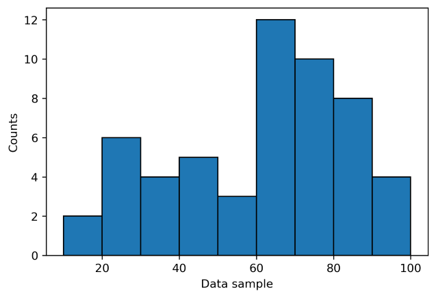
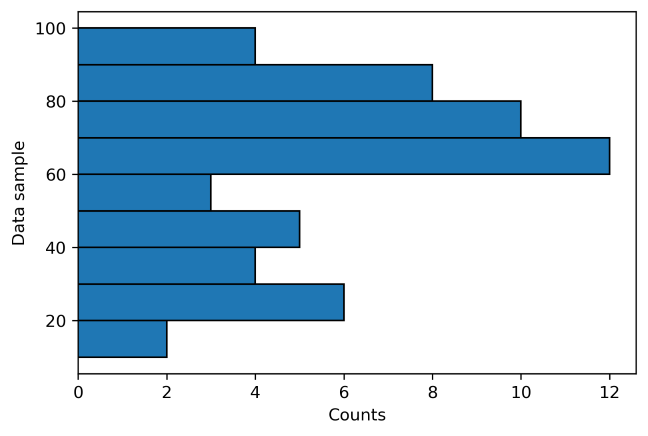

## Back to the basics: the Matplotlib histogram

We are all excited about exploring and developing new fancy plotting tools, but I want to take some time to revisit one of the basic plotting functions: Matplotlib's histogram [`hist()`](https://matplotlib.org/stable/api/_as_gen/matplotlib.pyplot.hist.html), which relies on the NumPy [`histogram()` function](https://numpy.org/doc/stable/reference/generated/numpy.histogram.html). Histograms are convenient to quickly inspect a dataset and get a feeling for the distribution of values that they contain. 

I am often not satisfied with the default histograms produced by Matplotlib, requiring me to do repetitive manual adjustments. Here I will show how the histograms can be enhanced while avoiding time-consuming manual tweaking. I hope that these suggestions will be useful to others and ultimately that these will be adopted as the default plotting style for histograms in newer versions of Matplotlib.

## Default histogram plotting

To illustrate the Matplotlib histogram I will be using a dataset from an [online tutorial](https://www.geeksforgeeks.org/python/matplotlib-pyplot-hist-in-python/). Here are the lines I used for importing Matplotlib’s plotting library, defining a sample dataset, and plotting a histogram with the default settings. 

```python
# Import Matplotlib plotting module
import matplotlib.pyplot as plt

# Define dataset (taken from online tutorial)
data = [32, 96, 45, 67, 76, 28, 79, 62, 43,
        81, 70, 61, 95, 44, 60, 69, 71, 23,
        69, 54, 76, 67, 82, 97, 26, 34, 18,
        16, 59, 88, 29, 30, 66, 23, 65, 72, 
        20, 78, 49, 73, 62, 87, 37, 68, 81,
        80, 77, 92, 81, 52, 43, 68, 71, 86]

# Plot default histogram
plt.figure()
plt.hist(data)
plt.xlabel('Data sample')
plt.ylabel('Counts')
plt.show()
```



This figure gives an indication on the range of values that are present in the dataset (ranging from somewhere below 20 to somewhere above 90, and with a higher concentration around 70). I will now make some small adjustments to improve the readability of the figure.

## Including black edge lines

I think readability can be improved already by simply including a black edge color (which should be the default in my opinion).

```python
# Plot histogram with black edge lines
plt.figure()
plt.hist(data, edgecolor='k')
plt.xlabel('Data sample')
plt.ylabel('Counts')
plt.show()
```



This helps me to more easily see where the edges of the bins are and thus to interpret the data.

## Aligning tick marks and histogram bins

The need to visually interpolate the bins relative to the tick marks can be avoided by setting the tick marks to the locations of the bins.

```python
# Plot histogram with aligned bins and xticks
plt.figure()
n, bins, patches = plt.hist(data, edgecolor='k')
plt.xticks(bins)
plt.xlabel('Data sample')
plt.ylabel('Counts')
plt.show()
```



This prevents the need to interpolate the values at the bin edges, but the numbers on the axis are not very pleasant to read. It is possible to set the bin edges (and subsequently the ticks on the x-axis) manually to round numbers by using the `bins` argument in `hist()`, but I would like to avoid manual tweaking as much as possible.

## Automatically aligning bins with well-readable ticks

The histogram can be further improved by first selecting bins with edges placed at well-readable numbers. Here we can benefit from the [`ticker` module](https://matplotlib.org/stable/api/ticker_api.html) in Matplotlib. Since this function is also used to determine the ticks, the ticks and bins will always be aligned if we do not further interfere with the ticks on the x-axis.

```python
# Import Matplotlib’s AutoLocator
from matplotlib.ticker import AutoLocator

# Determining appropriate bins based on the range of values
locator = AutoLocator()
bins = locator.tick_values(min(data), max(data))

# Plotting histogram with well-readable xticks aligned to bins
plt.figure()
plt.hist(data, bins=bins, edgecolor='k')
plt.xlabel('Data sample')
plt.ylabel('Counts')
plt.show()
```



Here the labels on the x-axis are not present at each bin edge, but because the values are so simple, it is still easy to read. The ticks on the x-axis are automatically set based on Matplotlib’s `locator` module but some of the labels are omitted during the rendering of the figure. Of course, it is possible to force Matplotlib to include all the labels.

```python
# Plotting histogram with well-readable xticks aligned to each bin
plt.figure()
plt.hist(data, bins=bins, edgecolor='k')
plt.xticks(bins)
plt.xlabel('Data sample')
plt.ylabel('Counts')
plt.show()
```


In this case, I think that this looks a bit better and that the values on the x-axis are not too cluttered.

## Changing the histogram orientation 

Most of the histograms I have seen have a data range on the x-axis and counts on the y-axis, but of course it is also possible to create a histogram where this is reversed. The aforementioned tweaks are easily done.

```python
# Plotting horizontal histogram with well-readable yticks aligned to bins
plt.figure()
plt.hist(data, bins=bins, orientation='horizontal', edgecolor='k')
plt.xlabel('Counts')
plt.ylabel('Data sample')
plt.show()
```



Again, some of the ticks on the data-axis have been omitted and we can include those if we want, but this time using `plt.yticks(bins)`.

## How could this be implemented?

It is easy to use the few lines of code presented here, but I also wondered how this could be implemented in Matplotlib. To answer this, it is helpful to know how binning currently works. The `bins` argument of the `hist()` function controls the binning behavior, which can be a string, a set of bin edges, or the desired number of bins. Whatever the user selects is passed on to the NumPy `histogram()` function.

We could introduce an additional keyword (e.g. `'aligned'`) for the `bins` argument that would trigger a call to Matplotlib’s `AutoLocator()` behind the scenes. This could be done e.g. by adding the following lines in the [`_axes.py` file](https://github.com/matplotlib/matplotlib/blob/main/lib/matplotlib/axes/_axes.py) (before the call to NumPy’s `histogram()` function!)

```python
if bins == 'aligned':
    locator = mticker.AutoLocator()
    bins = locator.tick_values(np.nanmin(x), np.nanmax(x))
```

Having this keyword to simply align the bins and ticks at well-readable values would simplify things for users, avoiding the need to import `AutoLocator()` that is probably unfamiliar to many Matplotlib users. Setting this as the default behavior (and the black edge color) would be a next step :). 

## In conclusion

Histograms may not be the most exciting plots, but are nevertheless very useful. Also my proposed changes are perhaps a bit ‘boring’, but I believe that having good basic plotting can help us save time, which we then can use for more exciting visualizations :).

During my PhD research I have been using various Python libraries, including Matplotlib for all my visualizations. I continue using Python in my research and have also integrated it in many of the courses that I am now teaching. I have greatly benefited from this open source software and hope to contribute a little bit to future improvements of Matplotlib.
