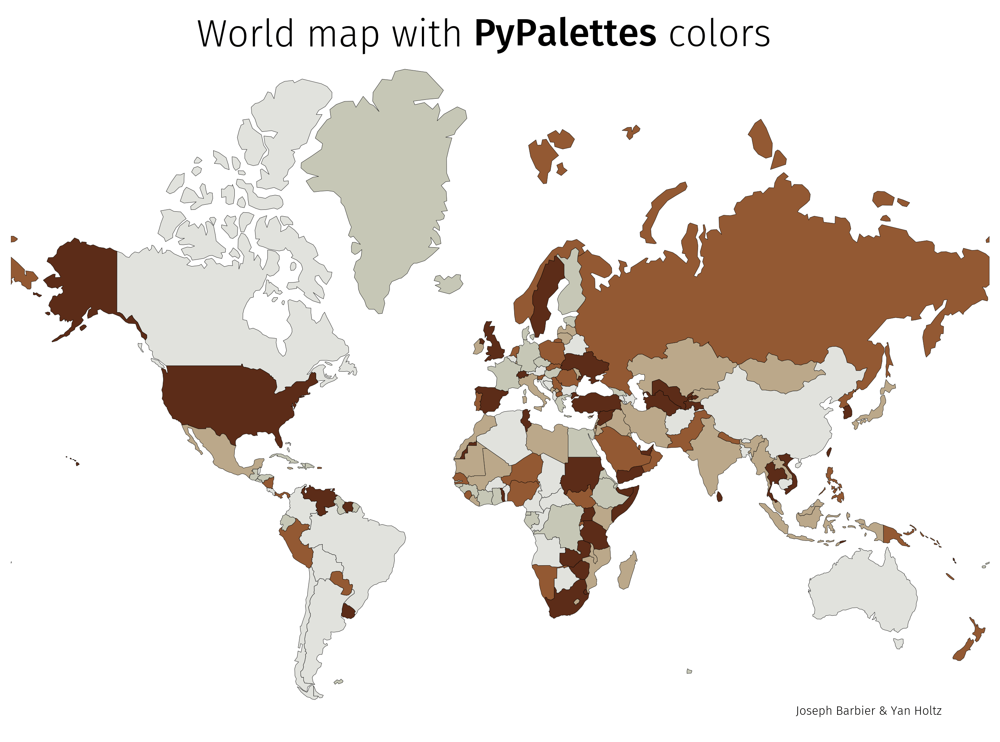

## Finding the right color has never been easier

[PyPalettes](https://github.com/JosephBARBIERDARNAL/pypalettes) is a new Python library designed to simplify the use of color palettes in Python charts.

It provides mainly two things:

- a [super-easy-to-use library](https://github.com/JosephBARBIERDARNAL/pypalettes) that requires only 1 line of code (in 99.99% of cases, 2 otherwise 🙃) to access thousands of pre-defined and attractive palettes.
- a [web app](https://python-graph-gallery.com/color-palette-finder/) to browse, filter, search, and preview all available palettes (with **bonus**: copy-pastable code to reproduce the charts).

[](https://python-graph-gallery.com/color-palette-finder/)

<center><i>A small sample of the available palettes</i></center>

<br>

## From R to Python

In R, there are dozens of packages dedicated to colors for data visualization. Then [Paletteer](https://emilhvitfeldt.github.io/paletteer/) came out to **aggregate** every color palette from those packages into a single one, meaning you **only need one package** to access almost all the color palettes people have created!

While re-crafting the [colors section of the Python Graph Gallery](https://python-graph-gallery.com/python-colors/), I started thinking of a way to have a similar tool to Paletteer but for Python.

<center><h3 style="color: lightgray;">That's where PyPalettes comes in.</h3></center>

Paletteer has a community-maintained [gallery](https://pmassicotte.github.io/paletteer_gallery/)—a single page showcasing all its color palettes, along with their original sources and names. With the author’s approval, I scraped this gallery to compile the data.

While there may have been other ways to obtain this information, using a short Python script to reproduce the dataset ensures both simplicity and reproducibility. To make **pypalettes** more comprehensive, I also incorporated all **built-in colors** from `Matplotlib`.

As a result, I created a dataset containing approximately **2,500 unique palettes**, each with a name, a list of hexadecimal colors, and a source.

At this point, the hardest part was already done. I just had to create a simple API to make them usable in a Python environment and add some additional simple features.

And since [Yan](https://www.yan-holtz.com/) supported the idea, he created this amazing [web app](https://python-graph-gallery.com/color-palette-finder/), making it much easier to browse available palettes.

As a thank-you to `Paletteer`, Yan created a color finder that features only `Paletteer` palettes! If you use R, [check it out here](https://r-graph-gallery.com/color-palette-finder).

<br>

## How to use pypalettes

The goal was to make the simplest API possible, and I'm quite satisfied with the result. For example, you really like the ["Esox lucius" palette](https://python-graph-gallery.com/color-palette-finder/?palette=Esox_lucius), and you want to make a chart with it.

First, you import the `load_cmap()` function (the main function of the library):

```python
from pypalettes import load_cmap
```

And then you just have to call this function with `name="Esox_lucius"`

```python
cmap = load_cmap("Esox_lucius")
```

The output of `load_cmap()` is either a [matplotlib.colors.ListedColormap](https://matplotlib.org/stable/api/_as_gen/matplotlib.colors.ListedColormap.html) or a [matplotlib.colors.LinearSegmentedColormap](https://matplotlib.org/stable/api/_as_gen/matplotlib.colors.LinearSegmentedColormap.html), depending on the value of the `cmap_type` argument (default is `"discrete"`, so it's `ListedColormap` in this case).

Finally, you can create your chart as you normally would:

```python
# load libraries
import cartopy.crs as ccrs
import geopandas as gpd
import matplotlib.pyplot as plt
from matplotlib.font_manager import FontProperties
from highlight_text import fig_text

# load font
personal_path = "/Users/josephbarbier/Library/Fonts/"  # change this to your own path
font = FontProperties(fname=personal_path + "FiraSans-Light.ttf")
bold_font = FontProperties(fname=personal_path + "FiraSans-Medium.ttf")

# projection
proj = ccrs.Mercator()

# load the world dataset
df = gpd.read_file(
    "https://raw.githubusercontent.com/holtzy/The-Python-Graph-Gallery/master/static/data/all_world.geojson"
)
df = df[~df["name"].isin(["Antarctica"])]
df = df.to_crs(proj.proj4_init)

fig, ax = plt.subplots(figsize=(12, 8), dpi=300, subplot_kw={"projection": proj})
ax.set_axis_off()
df.plot(
    column="name",
    ax=ax,
    cmap=cmap,  # here we pass the colormap loaded before
    edgecolor="black",
    linewidth=0.2,
)
fig_text(
    x=0.5,
    y=0.93,
    s="World map with <PyPalettes> colors",
    fontsize=25,
    ha="center",
    font=font,
    highlight_textprops=[{"font": bold_font}],
)
fig_text(
    x=0.85, y=0.14, s="Joseph Barbier & Yan Holtz", fontsize=8, ha="right", font=font
)

plt.show()
```

<center>



</center>

And once the code is working, you can change the color map name and see straight away what it would look like!

<br>

## Other usages

PyPalettes is primarily designed for `matplotlib` due to its **high compatibility** with the `cmap` argument, but one can imagine **much more**.

For example, the output of `load_cmap()` includes attributes like `colors` and `rgb`, which return lists of hexadecimal colors or RGB values. These can be used in **any context**—from Python visualization libraries like Plotly, Plotnine, and Altair to colorimetry, image processing, or any application that requires color!

<br>

## Learn more

The main links to find out more about this project are as follows:

- the [web app](https://python-graph-gallery.com/color-palette-finder/) to browse the palettes
- this [introduction to PyPalettes](https://python-graph-gallery.com/introduction-to-pypalettes/) for a more in-depth code explanation
- the [Github repo](https://github.com/JosephBARBIERDARNAL/pypalettes) with source code and palettes (give us a star! ⭐)
