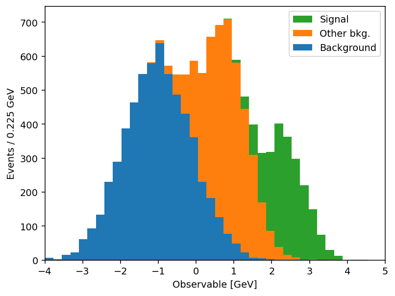
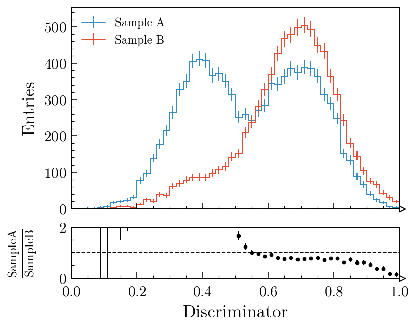
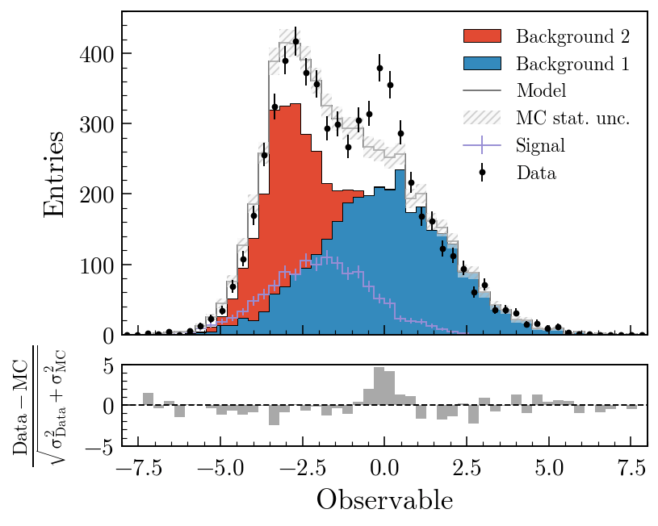
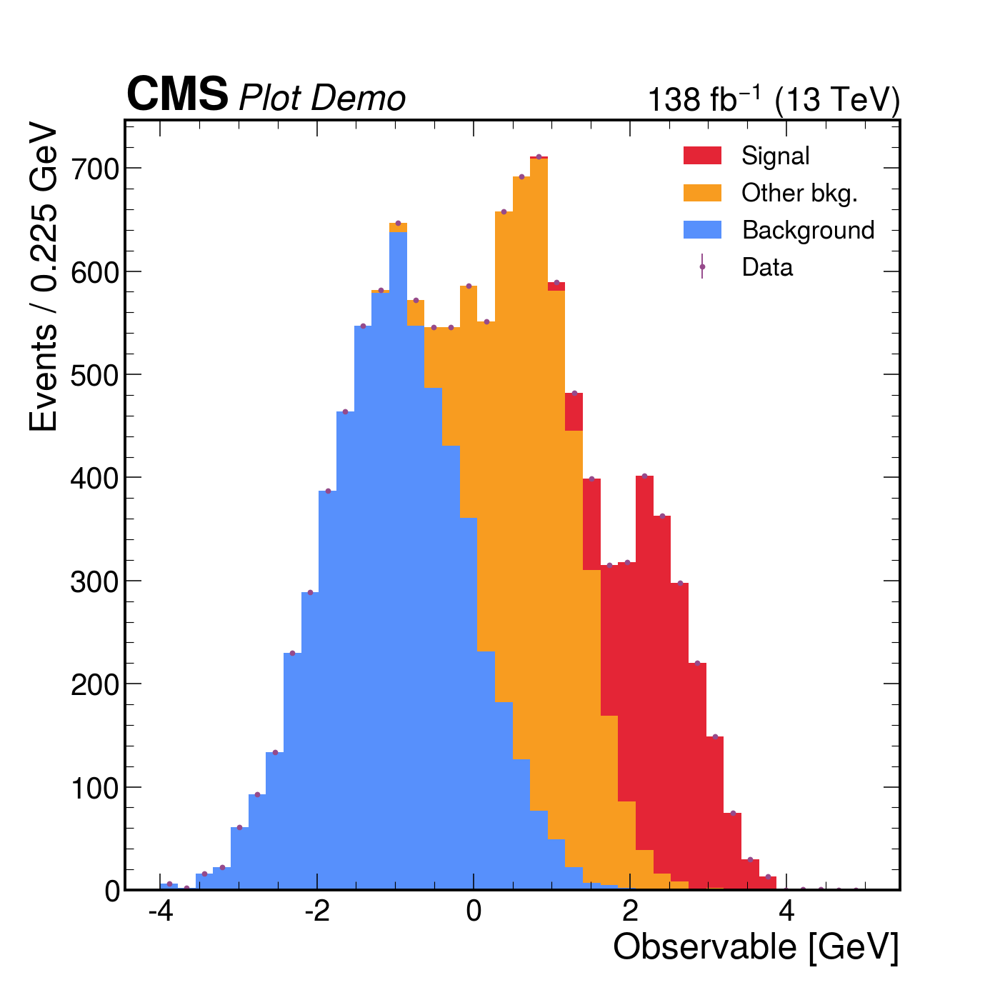
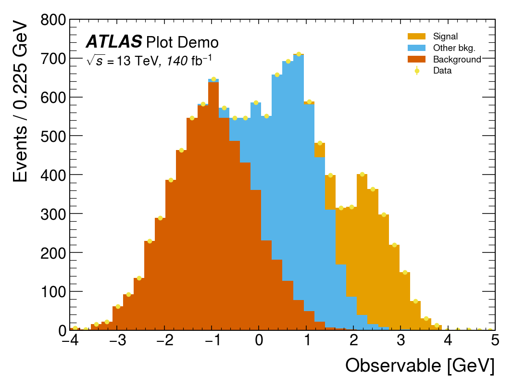
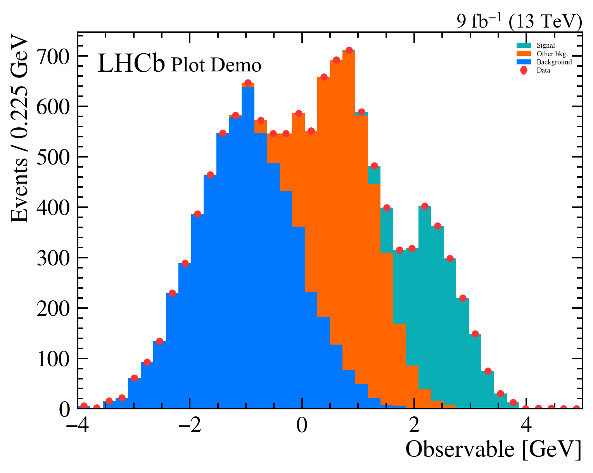
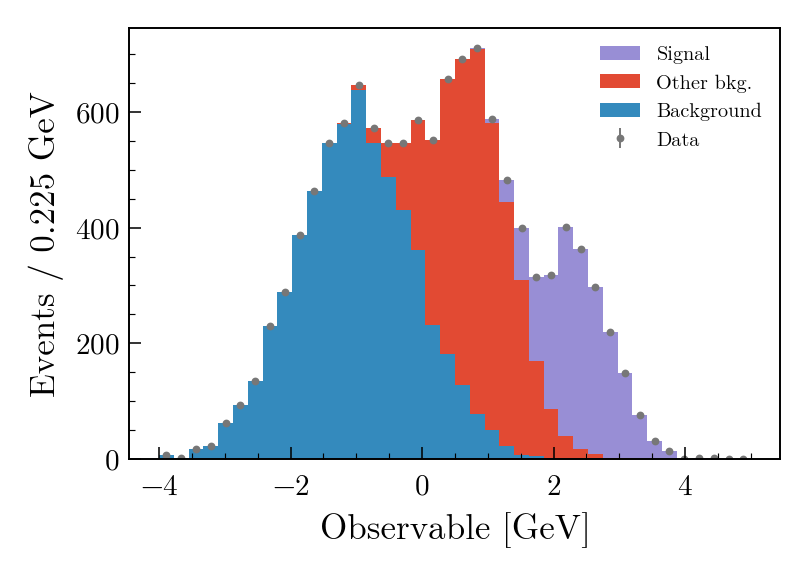

In particle or high energy physics (HEP), by the time you draw a plot the data are almost always _already binned_. A long stretch of the analysis pipeline — [Uproot](https://uproot.readthedocs.io/), [Coffea](https://coffea-hep.readthedocs.io/), [boost-histogram](https://boost-histogram.readthedocs.io/), [hist](https://hist.readthedocs.io/) — has reduced terabytes of events into a handful of histograms that you now want to display. That single fact bends what a good plotting API for HEP needs to look like, and it is where [mplhep](https://github.com/scikit-hep/mplhep) — a thin, focused matplotlib wrapper in the [Scikit-HEP](https://scikit-hep.org/) ecosystem — sits.

This post walks through three things mplhep contributes: a histogram plotting function for pre-binned data, comparison panels (ratio/pull/efficiency) on top of it, and a set of experiment style sheets that match the conventions ATLAS, CMS, LHCb, ALICE and DUNE publications require.

## Plotting pre-binned histograms

If you want to plot a histogram matplotlib had a great function for it - `plt.hist`, except in its convenience it not only serves the plotting, but also wraps the histogramming - `(counts, edges)` from `np.histogram`. But if the histogram you want to visualize is already _made_ you used to have to either "hack" `plt.hist` by filling 1's and passing histogram values as weights, or use `plt.step` and hack your `len(x) = len(y) + 1` input information into the same length or accept `plt.bar` with its own limitations.

To improve this particular user experience the `mplhep` authors contributed a new distinct primitive [`plt.stairs`](https://matplotlib.org/stable/api/_as_gen/matplotlib.pyplot.stairs.html), which was added in matplotlib 3.4 specifically for pre-binned data. This simplifies the syntax for HEP users significantly, but at the same time `plt.stairs` is still just a primitive function compared to the rich functionality of `plt.hist`. To mimic and indeed extend this functionality for the needs of particle physicists and indeed anyone who handles pre-binned histograms, we present the `mplhep` (imported as `mh`) library with [`mh.histplot`](https://scikit-hep.org/mplhep/latest/guide_basic_plotting/) at its core (see also the full [docs](https://scikit-hep.org/mplhep/latest/)).

<div style="display: grid; grid-template-columns: 1fr 1fr; column-gap: 1.5rem; row-gap: 0.5rem; margin: 1.5rem 0; align-items: start;">

<div>

**`plt.stairs` (matplotlib primitive)**

</div>
<div>

**`mh.histplot` (mplhep wrapper)**

</div>

<div>

```python
import matplotlib.pyplot as plt
import numpy as np

cumulative = np.zeros_like(ha, dtype=float)
for cnt, lab in zip([ha, hb, hc], labels):
    new = cumulative + cnt
    plt.stairs(new, edges, baseline=cumulative, fill=True, label=lab)
    cumulative = new
plt.legend()
```

</div>
<div>

```python
import matplotlib.pyplot as plt
import mplhep as mh

mh.histplot(
    [ha, hb, hc],
    edges,
    stack=True,
    histtype="fill",
    label=labels,
)
plt.legend()
```

</div>

<div>


</div>
<div>



</div>

</div>

Same output, half the code. And the savings compound once you actually use the keyword arguments. `mh.histplot` accepts a NumPy tuple, a `hist.Hist`, a `boost_histogram.Histogram`, or any object implementing the [PlottableProtocol](https://uhi.readthedocs.io/), so the same call works regardless of what your analysis framework hands you. From there, the keywords most analyses lean on:

- `yerr=True` → Poisson intervals for integer counts; pass a 1D array for symmetric errors, a 2D `(2, N)` array for asymmetric ones, or `yerr=False` to suppress them entirely.
- `w2=variances` → sum-of-weights-squared propagation for weighted MC. When combined with `yerr=True`, mplhep picks Poisson intervals for integer-like `w2` and `sqrt(w2)` otherwise; `w2method=` lets you force one or the other.
- `sort="yield"` → auto-sort a stack by total yield (largest at the bottom); `"label"` sorts alphabetically; append `_r` to reverse.
- `histtype=` → `"step"`, `"fill"`, `"errorbar"`, `"bar"`, `"barstep"`, or `"band"` (which spans the `yerr` range — perfect for systematic uncertainty bands without a second call).
- `density=True` / `binwnorm=1.0` → normalise to unit area or per unit bin width.
- `flow="show"` / `"sum"` / `"hint"` → handle under- and overflow bins explicitly.
- `blind=(lo, hi)` (or `mh.loc[lo:hi]`) → hide bins in a signal region for blind analyses.

The full list is in the [`mh.histplot` API reference](https://scikit-hep.org/mplhep/latest/api/#mplhep.histplot). A short example that exercises several of these — sum-of-weights-squared on a weighted MC stack, auto-sorting by yield, a hatched MC uncertainty band, and Poisson-interval errors on the data overlay:

```python
mh.histplot(
    mc_components,
    edges,
    w2=mc_variances,  # propagate Sumw2 for weighted MC
    stack=True,
    sort="yield",  # smallest yield on top of the stack
    histtype="fill",
    label=["Background", "Other bkg.", "Signal"],
)
mh.histplot(
    mc_total,
    edges,
    yerr=np.sqrt(mc_total_var),
    histtype="band",  # filled band spanning ±yerr
    label="MC stat. unc.",
    color="gray",
    alpha=0.4,
)
mh.histplot(
    data_counts,
    edges,
    yerr=True,  # Poisson intervals for integer counts
    histtype="errorbar",
    color="black",
    label="Data",
)
```

<div style="max-width: 60%; margin: 1.5rem auto;">


</div>

## Stacks and comparison panels

A HEP plot rarely stops at a single histogram. The canonical figure has a stacked background model, an unstacked signal or systematic-uncertainty band, data points with errors on top, and a thinner _comparison_ panel underneath: a ratio, a pull, an efficiency. Those panels all share a layout — twinned bins, reference line at 1 or 0 — and they're surprisingly tedious to assemble in matplotlib.

`mh.comp.hists` builds one in a single call for the two-histogram case; `mh.comp.data_model` handles the full data-versus-model figure with stacked and unstacked components, MC statistical uncertainty band, and any of the same comparison types in the lower panel:

<div style="display: grid; grid-template-columns: 1fr 1fr; column-gap: 1.5rem; row-gap: 0.5rem; margin: 1.5rem 0; align-items: start;">

<div>

**Two histograms with a ratio panel**

</div>
<div>

**Data vs model with a pull panel**

</div>

<div>

```python
fig, ax_main, ax_comp = mh.comp.hists(
    h1,
    h2,
    xlabel="Discriminator",
    h1_label="Sample A",
    h2_label="Sample B",
    comparison="ratio",
)
```

</div>
<div>

```python
fig, ax_main, ax_comp = mh.comp.data_model(
    data_hist=data,
    stacked_components=[bkg_a, bkg_b],
    stacked_labels=["Bkg 1", "Bkg 2"],
    unstacked_components=[signal],
    unstacked_labels=["Signal"],
    comparison="pull",
)
```

</div>

<div>



</div>
<div>



</div>

</div>

`comparison=` also accepts `"difference"`, `"relative_difference"`, `"asymmetry"` and `"efficiency"`; the MC statistical uncertainty is propagated through all of them. Swapping `"pull"` for `"ratio"` in the second example swaps the lower panel out with no other code changes. The [comparisons guide](https://scikit-hep.org/mplhep/latest/guide_comparisons/) covers every variant with worked examples; the [gallery](https://scikit-hep.org/mplhep/latest/gallery/) is the fastest way to find a plot that looks like the one you're trying to make.

## Experiment styles

The third thing mplhep does is take care of the typography. Every collaboration has a house style — a font, a "CMS" / "ATLAS" / "LHCb" label with a status qualifier, a √s and integrated-luminosity string, specific tick directions and minor-tick behaviour, a colour cycle. `mh.style.use("CMS")` (or `"ATLAS"`, `"LHCb2"`, `"ALICE"`, `"DUNE"`) sets matplotlib's `rcParams` accordingly and bundles the open fonts (TeX Gyre Heroes as a Helvetica stand-in, Fira Sans, etc.) so the result is reproducible across operating systems. The collaboration tag is placed by a matching helper — `mh.cms.label`, `mh.atlas.label`, `mh.lhcb.label`, `mh.alice.label`, `mh.dune.label` — which knows where each one is meant to live (CMS above the axes in the figure margin; ATLAS, LHCb and ALICE _inside_ the axes at top-left). For figures heading somewhere that doesn't fit a single collaboration's house style, `mh.style.use("plothist")` provides a neutral serif look with the same comparison-panel ergonomics and no experiment tag. The [styling guide](https://scikit-hep.org/mplhep/latest/guide_styling/) catalogues every available style and the exact arguments each `.label()` helper accepts.

```python
with plt.style.context(mh.style.CMS):
    fig, ax = plt.subplots()
    mh.histplot(
        [ha, hb, hc],
        edges,
        stack=True,
        histtype="fill",
        label=["Background", "Other bkg.", "Signal"],
        ax=ax,
    )
    mh.histplot(
        ha + hb + hc, edges, histtype="errorbar", color="black", label="Data", ax=ax
    )
    mh.cms.label("Plot Demo", data=True, lumi=138, com=13, ax=ax)
    mh.mpl_magic(ax=ax)
```

The same three-component stack with data points rendered four ways. Each style picks its own colour cycle, font, and label conventions; [`mh.mpl_magic`](https://scikit-hep.org/mplhep/latest/guide_utilities/) auto-grows the y-axis so the experiment tag, legend and data don't fight for the same space, and is one of a small set of layout helpers (`yscale_legend`, `yscale_anchored_text`, `sort_legend`, `append_axes`, …) that the [utilities guide](https://scikit-hep.org/mplhep/latest/guide_utilities/) covers in full.

<div style="display: grid; grid-template-columns: repeat(4, 1fr); gap: 0.75rem; margin: 1.5rem 0; align-items: start;">
<div>



</div>
<div>



</div>
<div>



</div>
<div>



</div>
</div>

The same data, the same single `mh.histplot` call — only the active style context changes.

## Where it fits

mplhep is part of [Scikit-HEP](https://scikit-hep.org/), a collection of pure-Python tools for particle physics that also includes [hist](https://hist.readthedocs.io/), [Uproot](https://uproot.readthedocs.io/), [Awkward Array](https://awkward-array.org/), [vector](https://vector.readthedocs.io/) and [pyhf](https://pyhf.readthedocs.io/), among many others. It deliberately stays a thin layer on top of plain matplotlib rather than replacing it — every figure mplhep produces is a regular `Figure`/`Axes` pair you can keep customising with the matplotlib API you already know. The point is to remove the friction of the conventions, not the flexibility underneath them.

If you work in HEP, `pip install mplhep` followed by `mh.style.use(...)` should be the first two lines of any plotting notebook. If you don't, `mh.histplot` for pre-binned data and the comparison-panel machinery are still useful well outside the field — anywhere "two histograms and their ratio" is the natural unit of a figure.

- Docs: [scikit-hep.org/mplhep](https://scikit-hep.org/mplhep/latest/) — start with the [basic plotting](https://scikit-hep.org/mplhep/latest/guide_basic_plotting/), [comparisons](https://scikit-hep.org/mplhep/latest/guide_comparisons/), [styling](https://scikit-hep.org/mplhep/latest/guide_styling/) and [utilities](https://scikit-hep.org/mplhep/latest/guide_utilities/) guides, browse the [gallery](https://scikit-hep.org/mplhep/latest/gallery/) for inspiration, or jump to the full [API reference](https://scikit-hep.org/mplhep/latest/api/).
- Source: [github.com/scikit-hep/mplhep](https://github.com/scikit-hep/mplhep)
- Discussion: [github.com/scikit-hep/mplhep/discussions](https://github.com/scikit-hep/mplhep/discussions)
