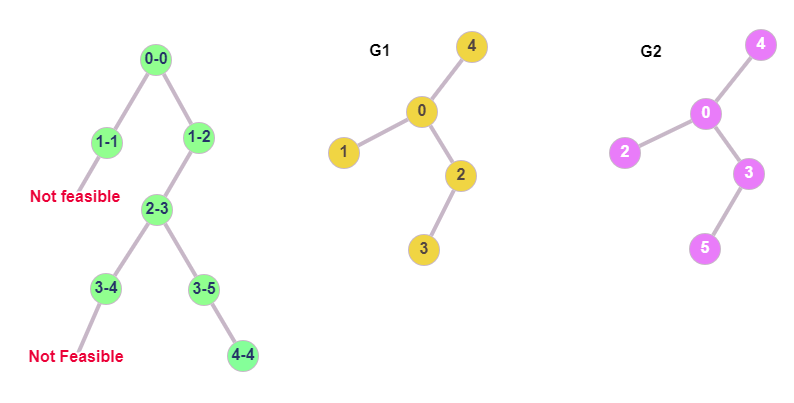
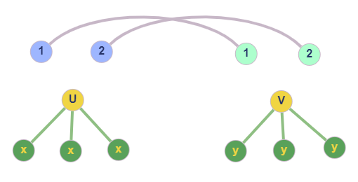
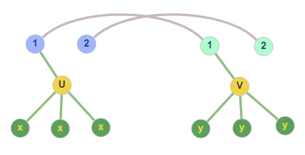

The previous post can be found [here](), be sure to check it out, so you
can
follow the process step by step. Since then, another two very significant features of the algorithm have been
implemented and tested.

## Introduction

As it was previously mentioned, in the ISO problem we are basically trying to create a **mapping** such that, every node
from the first graph is matched to a node from the second graph. This searching for "feasible pairs" can be visualized
by a tree, where each node is the candidate pair that we should examine. This can become much clearer if we take a look
at the below figure.

In order to check if the graphs $G_1$, $G_2$ are isomorphic, we check every candidate pair of nodes and if it is
feasible, we extend the mapping and go deeper into the tree of pairs. If it's not feasible, we climb up and follow a
different branch, until the mapping is extended to its full. In our example, we start by examining node 0 from G1, with
node 0 of G2. After some checks that are skipped for simplicity (but can be implied by observation), we decide that the
pair 0-0 are indeed candidates, so we go deeper to map the remaining nodes. The next pair is 1-1, which fails the
feasibility check, so we have to examine a different branch as shown. The new branch is 1-2, which is feasible, so we
continue on using the same logic until all the nodes are mapped.

## Candidate Pair Selection

Although in our example we use a random candidate pair of nodes, in the actual implementation we are able to target
specific pairs that are more likely to be matched, hence boosting the performance of the algorithm. The idea is that, in
every step of the algorithm, **given a candidate**

$$u\in V_1$$

**we compute the candidates**

$$v\in V_2$$

where $V_1$ and $V_2$ are the nodes of $G_1$ and $G_2$ respectively. Now this is a puzzle that does not require a lot of
specific knowledge on graphs or the algorithm itself. Keep up with me, and you will realize it yourself. First, let $M$
be the mapping so far, which includes all the "covered nodes" until this point. There are actually **three** different
types of $u$ nodes that we might encounter.

# Case 1

Node $u$ has no neighbors (degree of $u$ equals to zero). It can directly be realized that it would be redundant to test
as candidates for $u$, nodes from $G_2$ that have more than zero neighbors. That said, we eliminate most of the possible
candidates and keep those that have the same degree as $u$ (in this case, zero). Pretty easy right?

# Case 2

Node $u$ has neighbors, but none of them belong to the mapping. This situation is illustrated in the following figure.

The grey lines indicate that the nodes of G1 (left 1,2) are mapped to the nodes of G2 (right 1,2). They are basically
the mapping. Again, given $u$, we make the observation that candidates $v$ of u, should also have no neighbors in the
mapping, and also have the same degree as $u$ (as in the figure). Notice how if we add a neighbor to $v$, or if we place
one of its neighbors inside the mapping, there is no point examining the pair $u-v$ for matching.

# Case 3

Node $u$ has neighbors and some of them belong to the mapping. This scenario is also depicted in the below figure.

In this case, to obtain the candidates for $u$, we must look into the neighborhoods of nodes from $G_2$, which map back
to the covered neighbors of $u$. In our example, $u$ has one covered neighbor (1), and 1 from G1 maps to 1 from G2,
which has $v$ as neighbor. Also, for v to be considered as candidate, it should have the same degree as $u$, obviously.
Notice how every node that is not in the neighborhood of 1 (in G2) cannot be matched to $u$ without breaking the
isomorphism.
