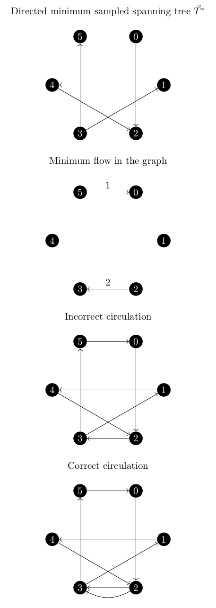
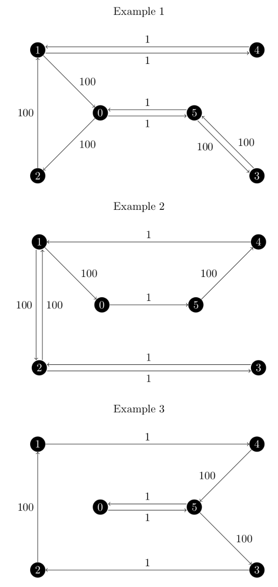
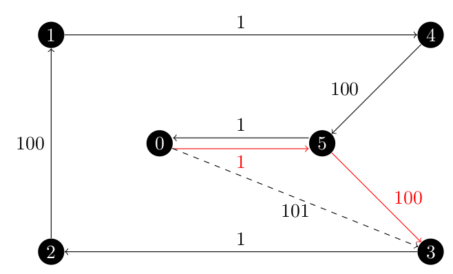

My implementation of `asadpour_atsp` is now working!
Recall that my pseudo code for this function from my last post was

```
def asadpour_tsp
    Input: A complete graph G with weight being the attribute key for the edge weights.
    Output: A list of edges which form the approximate ATSP solution.

    z_star = held_karp(G)
    # test to see if z_star is a graph or dict
    if type(z_star) is nx.DiGraph
        return z_star.edges

    z_support = nx.MultiGraph()
    for u, v in z_star
        if not in z_support.edges
            edge_weight = min(G[u][v][weight], G[v][u][weight])
            z_support.add_edge(u, v, weight=edge_weight)
    gamma = spanning_tree_distribution(z_support, z_star)

    for u, v in z_support.edges
        z_support[u][v][lambda] = exp(gamma[(u, v)])

    for _ in range 1 to 2 ceil(log(n))
        sampled_tree = sample_spanning_tree(G)
        sampled_tree_weight = sampled_tree.size()
        if sampled_tree_weight < minimum_sampled_tree_weight
            minimum_sampled_tree = sampled_tree.copy()
            minimum_sampled_tree_weight = sampled_tree_weight

    t_star = nx.DiGraph
    for u, v, d in minimum_sampled_tree.edges(data=weight)
        if d == G[u][v][weight]
            t_star.add_edge(u, v, weight=d)
        else
            t_star.add_edge(v, u, weight=d)

    for n in t_star
        node_demands[n] = t_star.out_degree(n) - t_star.in_degree(n)

    nx.set_node_attributes(G, node_demands)
    flow_dict = nx.min_cost_flow(G)

     for u, v in flow_dict
        if edge not in t_star.edges and flow_dict[u, v] > 0
            t_star.add_edge(u, v)
    eulerian_curcuit = nx.eulerian_circuit(t_star)
    return _shortcutting(eulerian_curcuit)
```

And this was more or less correct.
A few issues were present, as they always were going to be.

First, my largest issue came from a part of a word being in parenthesis in the Asadpour paper on page 385.

> This integral circulation \\(f^\*\\) corresponds to a directed (multi)graph \\(H\\) which contains \\(\vec{T}^\*\\).

Basically if the minimum flow is every larger than 1 along an edge, I need to add that many parallel edges in order to ensure that everything is still Eulerian.
This became a problem quickly while developing my test cases as shown in the below example.

<center></center>

As you can see, for the incorrect circulation, vertices 2 and 3 are not eulerian as they in and out degrees do not match.

All of the others were just minor points where the pseudo code didn't directly translate into python (because, after all, it isn't python).

## Understanding the Output

The first thing I did once `asadpour_atsp` was take the fractional, symmetric Held Karp relaxation test graph and run it through the general `traveling_salesman_problem` function.
Since there are random numbers involved here, the results were always within the \\(O(\log n / \log \log n)\\) approximation factor but were different.
Three examples are shown below.

<center></center>

The first thing we want to check is the approximation ratio.
We know that the minimum cost output of the `traveling_saleman_problem` function is 304 (This is actually lower than the optimal tour in the undirected version, more on this later).
Next we need to know what our maximum approximation factor is.
Now, the Asadpour algorithm is \\(O(\log n / \log \log n)\\) which for our six vertex graph would be \\(\ln(6) / \ln(\ln(6)) \approx 3.0723\\).
However, on page 386 they give the coefficients of the approximation as \\((2 + 8 \log n / \log \log n)\\) which would be \\(2 + 8 \times \ln(6) / \ln(\ln(6)) \approx 26.5784\\).
(Remember that all \\(\log\\)'s in the Asadpour paper refer to the natural logarithm.)
All of our examples are well below even the lower limit.

For example 1:

\\[
\begin{array}{r l}
\text{actual}: & 504 \\\\\\
\text{expected}: & 304 \\\\\\
\text{approx. factor}: & \frac{504}{304} \approx 1.6578 < 3.0723
\end{array}
\\]

Example 2:

\\[
\begin{array}{r l}
\text{actual}: & 404 \\\\\\
\text{expected}: & 304 \\\\\\
\text{approx. factor}: & \frac{404}{304} \approx 1.3289 < 3.0723
\end{array}
\\]

Example 3:

\\[
\begin{array}{r l}
\text{actual}: & 304 \\\\\\
\text{expected}: & 304 \\\\\\
\text{approx. factor}: & \frac{304}{304} = 1.0000 < 3.0723
\end{array}
\\]

At this point, you've probably noticed that the examples given are strictly speaking, _not_ hamiltonian cycles: they visit vertices multiple times.
This is because the graph we have is not complete.
The Asadpour algorithm only works on complete graphs, so the `traveling_salesman_problem` function finds the shortest cost path between every pair of vertices and inserts the missing edges.
In fact, if the `asadpour_atsp` function is given an incomplete graph, it will raise an exception.
Take example three, since there is only one repeated vertex, 5.

Behind the scenes, the graph is complete and the solution may contain the dashed edge in the below image.

<center></center>

But that edge is not in the original graph, so during the post-processing done by the `traveling_salesman_problem` function, the red edges are inserted instead of the dashed edge.

## Testing the Asadpour Algorithm

Before I could write any tests, I needed to ensure that the tests were consistent from execution to execution.
At the time, this was not the case since there were random numbers being generated in order to sample the spanning trees.
So I had to learn how to use the `@py_random_state` decorator.

When this decorator is added to the top of a function, we pass it either the position of the argument in the function signature or the name of the keyword for that argument.
It then takes that argument and configures a python Random object based on the input parameter.

- Parameter is `None`, use a new `Random` object.
- Parameter is an `int`, use a new `Random` object with that seed.
- Parameter is a `Random` object, use that object as is.

So I changed the function signature of `sample_spanning_tree` to have `random=None` at the end.
For most use cases, the default value will not be changed and the results will be different every time the method is called, but if we give it an `int`, the same tree will be sampled every time.
But, for my tests I can give it a seed to create repeatable behaviour.
Since the `sample_spanning_tree` function is not visible outside of the `treveling_salesman` file, I also had to create a pass-through parameter for `asadpour_atsp` so that my seed could have any effect.

Once this was done, I modified the test for `sample_spanning_tree` so that it would not have a 1 in 100 chance of spontaneously failing.
At first I just passed it an `int`, but that forced every tree sampled to be the same (since the edges were shuffled the same and sampled from the same sequence of numbers) and the test failed.
So I tweaked it to use a `Random` object from the random package and this worked well.

From here, I wrap the complete `asadpour_atsp` parameters I want in another function `fixed_asadpour` like this:

```python
def fixed_asadpour(G, weight):
    return nx_app.asadpour_atsp(G, weight, 56)


path = nx_app.traveling_salesman_problem(
    G, weight="weight", cycle=False, method=fixed_asadpour
)
```

I tested using both `traveling_salesman_problem` and `asadpour_atsp`.
The tests included:

- The fractional, symmetric Held Karp graph from above.
- A real world example using airline prices between six cities (also uses non-integer node names).
- The same real world example but asking for a path not a cycle.
- Using a disconnected graph (raises exception).
- Using an incomplete graph (raises exception).
- Using an integral Held Karp solution (returns directly after Held Karp with exact solution).
- Using an impossible graph (one vertex has only out edges).

## Bonus Feature

There is even a bonus feature!
The `asadpour_atsp` function accepts a fourth argument, `source`!
Since both of the return methods use `eulerian_circuit` and the `_shortcutting` functions, I can pass a `source` vertex to the circuit function and ensure that the returned path starts and returns to the desired vertex.

Access it by wrapping the method, just be sure that the source vertex is in the graph to avoid an exception.

```python
def fixed_asadpour(G, weight):
    return nx_app.asadpour_atsp(G, weight, source=0)


path = nx_app.traveling_salesman_problem(
    G, weight="weight", cycle=False, method=fixed_asadpour
)
```

## References

A. Asadpour, M. X. Goemans, A. Madry, S. O. Gharan, and A. Saberi, _An O (log n / log log n)-approximation algorithm for the asymmetric traveling salesman problem_, SODA ’10, Society for Industrial and Applied Mathematics, 2010, [https://dl.acm.org/doi/abs/10.5555/1873601.1873633](https://dl.acm.org/doi/abs/10.5555/1873601.1873633).
