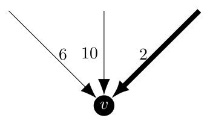
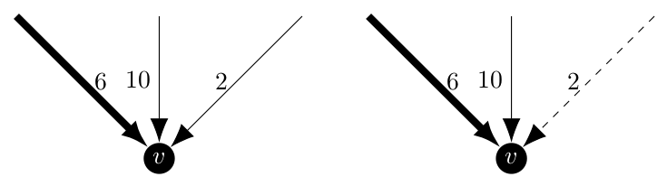
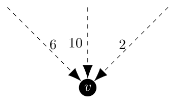
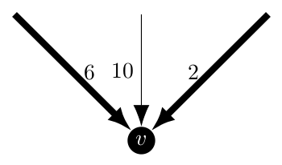

There is only one thing that I need to figure out before the first coding period for GSoC starts on Monday: how to find _all_ of the minimum arborescences of a graph.
This is the set $K(\pi)$ in the Held and Karp paper from 1970 which can be refined down to $K(\pi, d)$ or $K\_{X, Y}(\pi)$ as needed.
For more information as to why I need to do this, please see my last post [here](../a-closer-look-at-held-karp).

This is a place where my contributions to NetworkX to implement the Asadpour algorithm [1] for the directed traveling salesman problem will be useful to the rest of the NetworkX community (I hope).
The research paper that I am going to template this off of is [this](https://www.scielo.br/j/pope/a/XHswBwRwJyrfL88dmMwYNWp/?lang=en&format=pdf) 2005 paper by Sörensen and Janssens titled _An Algorithm to Generate all Spanning Trees of a Graph in Order of Increasing Cost_ [4].

The basic idea here is to implement their algorithm and then generate spanning trees until we find the first one with a cost that is greater than the first one generated, which we know is a minimum, so that we have found all of the minimum spanning trees.
I know what you guys are saying, "Matt, this paper discusses _spanning trees_, not spanning arborescences, how is this helpful?".
Well, the heart of this algorithm is to partition the vertices into either excluded edges which cannot appear in the tree, included edges which must appear in the tree and open edges which can be but are not required to be in the tree.
Once we have a partition, we need to be able to find a minimum spanning tree or minimum spanning arborescence that respects the partitioned edges.

In NetworkX, the minimum spanning arborescences are generated using Chu-Liu/Edmonds’ Algorithm developed by Yoeng-Jin Chu and Tseng-Hong Liu in 1965 and independently by Jack Edmonds in 1967.
I believe that Edmonds' Algorithm [2] can be modified to require an arc to be either included or excluded from the resulting spanning arborescence, thus allowing me to implement Sörensen and Janssens' algorithm for directed graphs.

First, let's explore whether the partition scheme discussed in the Sörensen and Janssens paper [4] will work for a directed graph.
The critical ideas for creating the partitions are given on pages 221 and 222 and are as follows:

> Given an MST of a partition, this partition can be split into a set of resulting partitions in such a way that the following statements hold:
>
> - the intersection of any two resulting partitions is the empty set,
> - the MST of the original partition is not an element of any of the resulting partitions,
> - the union of the resulting partitions is equal to the original partition, minus the MST of the original partition.

In order to achieve these conditions, they define the generation of the partitions using this definition for a minimum spanning tree

$$
s(P) = \{(i\_1, j\_1), \dots, (i\_r, j\_r), (t\_1, v\_1), \dots, (t\_{n-r-1}, v\_{n-r-1}\}
$$

where the $(i, j)$ edges are the included edges of the original partition and the $(t, v)$ are from the open edges of the original partition.
Now, to create the next set of partitions, take each of the $(t, v)$ edges sequentially and introduce them one at a time, make that edge an excluded edge in the first partition it appears in and an included edge in all subsequent partitions.
This will produce something to the effects of

$$
\begin{array}{l}
P\_1 = \{(i\_1, j\_1), \dots, (i\_r, j\_r), (\overline{m\_1, p\_1}), \dots, (\overline{m\_l, p\_l}), (\overline{t\_1, v\_1})\} \\\\\\
P\_2 = \{(i\_1, j\_1), \dots, (i\_r, j\_r), (t\_1, v\_1), (\overline{m\_1, p\_1}), \dots, (\overline{m\_l, p\_l}), (\overline{t\_2, v\_2})\} \\\\\\
P\_3 = \{(i\_1, j\_1), \dots, (i\_r, j\_r), (t\_1, v\_1), (t\_2, v\_2), (\overline{m\_1, p\_1}), \dots, (\overline{m\_l, p\_l}), (\overline{t\_3, v\_3})\} \\\\\\
\vdots \\\\\\
\begin{multline\*}
P\_{n-r-1} = \{(i\_1, j\_1), \dots, (i\_r, j\_r), (t\_1, v\_1), \dots, (t\_{n-r-2}, v\_{n-r-2}), (\overline{m\_1, p\_1}), \dots, (\overline{m\_l, p\_l}), \\\\\\
(\overline{t\_{n-r-1}, v\_{n-r-1}})\}
\end{multline\*} \\\\\\
\end{array}
$$

Now, if we extend this to a directed graph, our included and excluded edges become included and excluded arcs, but the definition of the spanning arborescence of a partition does not change.
Let $s_a(P)$ be the minimum spanning arborescence of a partition $P$.
Then

$$
s\_a(P) = \{(i\_1, j\_1), \dots, (i\_r, j\_r), (t\_1, v\_1), \dots, (t\_{n-r-1}, v\_{n-r-1}\}
$$

$s_a(P)$ is still constructed of all of the included arcs of the partition and a subset of the open arcs of that partition.
If we partition in the same manner as the Sörensen and Janssens paper [4], then their cannot be spanning trees which both include and exclude a given edge and this conflict exists for every combination of partitions.

Clearly the original arborescence, which includes all of the $(t_1, v_1), \dots, (t\_{n-r-1}, v\_{n-r-1})$ cannot be an element of any of the resulting partitions.

Finally, there is the claim that the union of the resulting partitions is the original partition minus the original minimum spanning tree.
Being honest here, this claim took a while for me to understand.
In fact, I had a whole paragraph talking about how this claim doesn't make sense before all of a sudden I realized that it does.
The important thing to remember here is that the union of all of the partitions isn't the union of the sets of included and excluded edges (which is where I went wrong the first time), it is a subset of spanning trees.
The original partition contains many spanning trees, one or more of which are minimum, but each tree in the partition is a unique subset of the edges of the original graph.
Now, because each of the resulting partitions cannot include one of the edges of the original partition's minimum spanning tree we know that the original minimum spanning tree is _not_ an element of the union of the resulting partitions.
However, because every other spanning tree in the original partition which was not the selected minimum one is different by at least one edge it is a member of at least one of the resulting partitions, specifically the one where that one edge of the selected minimum spanning tree which it does not contain is the excluded edge.

So now we know that this same partition scheme which works for undirected graphs will work for directed ones.
We need to modify Edmonds’ algorithm to mandate that certain arcs be included and others excluded.
To start, a review of this algorithm is in order.
The original description of the algorithm is given on pages 234 and 235 of Jack Edmonds' 1967 paper _Optimum Branchings_ [2] and roughly speaking it has three major steps.

1. For each vertex $v$, find the incoming arc with the smallest weight and place that arc in a bucket $E^i$ and the vertex in a bucket $D^i$.
   Repeat this step until either (a) $E^i$ no longer qualifies as a branching or (b) all vertices of the graph are in $D^i$.
   If (a) occurs, go to step 2, otherwise go to step 3.
2. If $E^i$ no longer qualifies as a branching then it must contain a cycle.
   Contract all of the vertices of the cycle into one new one, say $v_1^{i + 1}$.
   Every edge which has one endpoint in the cycle has that endpoint replaced with $v_1^{i + 1}$ and its cost updated.
   Using this new graph $G^{i + 1}$, create buckets $D^{i + 1}$ containing the nodes in both $G^{i + 1}$ and $D^i$ and $E^{i + 1}$ containing edges in both $G^{i + 1}$ and $E^i$
   (i.e. remove the edges and vertices which are affected by the creation of $G^{i + 1}$.)
   Return to step 1 and apply it to graph $G^{i + 1}$.
3. Once this step is reached, we have a smaller graph for which we have found a minimum spanning arborescence.
   Now we need to un-contract all of the cycles to return to the original graph.
   To do this, if the node $v_1^{i + 1}$ is the root of the arborescence or not.
   - $v_1^{i + 1}$ is the root: Remove the arc of maximum weight from the cycle represented by $v_1^{i + 1}$.
   - $v_1^{i + 1}$ is not the root: There is a single arc directed towards $v_1^{i + 1}$ which translates into an arc directed to one of the vertices in the cycle represented by $v_1^{i + 1}$.
     Because $v_1^{i + 1}$ represents a cycle, there is another arc wholly internal to the cycle which is directed into the same vertex as the incoming edge to the cycle.
     Delete the internal one to break the cycle.
     Repeat until the original graph has been restored.

Now that we are familiar with the minimum arborescence algorithm, we can discuss modifying it to force it to include certain edges or reject others.
The changes will be primarily located in step 1.
Under the normal operation of the algorithm, the consideration which happens at each vertex might look like this.

<center></center>

Where the bolded arrow is chosen by the algorithm as it is the incoming arc with minimum weight.
Now, if we were required to include a different edge, say the weight 6 arc, we would want this behavior even though it is strictly speaking not optimal.
In a similar case, if the arc of weight 2 was excluded we would also want to pick the arc of weight 6.
Below the excluded arc is a dashed line.

<center></center>

But realistically, these are routine cases that would not be difficult to implement.
A more interesting case would be if all of the arcs were excluded or if more than one are included.

<center></center>

Under this case, there is no spanning arborescence for the partition because the graph is not connected.
The Sörensen and Janssens paper characterize these as _empty_ partitions and they are ignored.

<center></center>

In this case, things start to get a bit tricky.
With two (or more) included arcs leading to this vertex, it is but definition not an arborescence as according to Edmonds on page 233

> A branching is a forest whose edges are directed so that each is directed toward a different node. An arborescence is a connected branching.

At first I thought that there was a case where because this case could result in the creation of a cycle that it was valid, but I realize now that in step 3 of Edmonds’ algorithm that one of those arcs would be removed anyways.
Thus, any partition with multiple included arcs leading to a single vertex is empty by definition.
While there are ways in which the algorithm can handle the inclusion of multiple arcs, one (or more) of them by definition of an arborescence will be deleted by the end of the algorithm.

I propose that these partitions are screened out before we hand off to Edmonds' algorithm to find the arborescences.
As such, Edmonds' algorithm will need to be modified for the cases of at most one included edge per vertex and any number of excluded edges per vertex.
The critical part of altering Edmonds' Algorithm is contained within the `desired_edge` function in the NetworkX implementation starting on line 391 in `algorithms.tree.branchings`.
The whole function is as follows.

```python
def desired_edge(v):
    """
    Find the edge directed toward v with maximal weight.

    """
    edge = None
    weight = -INF
    for u, _, key, data in G.in_edges(v, data=True, keys=True):
        new_weight = data[attr]
        if new_weight > weight:
            weight = new_weight
            edge = (u, v, key, new_weight)

    return edge, weight
```

The function would be changed to automatically return an included arc and then skip considering any excluded arcs.
Because this is an inner function, we can access parameters passed to the parent function such as something along the lines as `partition=None` where the value of `partition` is the edge attribute detailing `true` if the arc is included and `false` if it is excluded.
Open edges would not need this attribute or could use `None`.
The creation of an enum is also possible which would unify the language if I talk to my GSoC mentors about how it would fit into the NetworkX ecosystem.
A revised version of `desired_edge` using the `true` and `false` scheme would then look like this:

```python
def desired_edge(v):
    """
    Find the edge directed toward v with maximal weight.

    """
    edge = None
    weight = -INF
    for u, _, key, data in G.in_edges(v, data=True, keys=True):
        new_weight = data[attr]
        if data[partition]:
            return edge, data[attr]
        if new_weight > weight and not data[partition]:
            weight = new_weight
            edge = (u, v, key, new_weight)

    return edge, weight
```

And a version using the enum might look like

```python
def desired_edge(v):
    """
    Find the edge directed toward v with maximal weight.

    """
    edge = None
    weight = -INF
    for u, _, key, data in G.in_edges(v, data=True, keys=True):
        new_weight = data[attr]
        if data[partition] is Partition.INCLUDED:
            return edge, data[attr]
        if new_weight > weight and data[partition] is not Partition.EXCLUDED:
            weight = new_weight
            edge = (u, v, key, new_weight)

    return edge, weight
```

Once Edmonds' algorithm has been modified to be able to use partitions, the pseudocode from the Sörensen and Janssens paper would be applicable.

```
Input: Graph G(V, E) and weight function w
Output: Output_File (all spanning trees of G, sorted in order of increasing cost)

List = {A}
Calculate_MST(A)
while MST ≠ ∅ do
	Get partition Ps in List that contains the smallest spanning tree
	Write MST of Ps to Output_File
	Remove Ps from List
	Partition(Ps)
```

And the corresponding `Partition` function being

```
P1 = P2 = P
for each edge i in P do
	if i not included in P and not excluded from P then
		make i excluded from P1
		make i include in P2
		Calculate_MST(P1)
		if Connected(P1) then
			add P1 to List
		P1 = P2
```

I would need to change the format of the first code block as I would like it to be a Python iterator so that a `for` loop would be able to iterate through all of the spanning arborescences and then stop once the cost increases in order to limit it to only minimum spanning arborescences.

## References

[1] A. Asadpour, M. X. Goemans, A. Mardry, S. O. Ghran, and A. Saberi, _An o(log n / log log n)-approximation algorithm for the asymmetric traveling salesman problem_, Operations Research, 65 (2017), p. 1043-1061, [https://homes.cs.washington.edu/~shayan/atsp.pdf](https://homes.cs.washington.edu/~shayan/atsp.pdf).

[2] J. Edmonds, _Optimum Branchings_, Journal of Research of the National Bureau of Standards, 1967, Vol. 71B, p.233-240, [https://archive.org/details/jresv71Bn4p233](https://archive.org/details/jresv71Bn4p233)

[3] M. Held, R.M. Karp, _The traveling-salesman problem and minimum spanning trees_, Operations research, 1970-11-01, Vol.18 (6), p.1138-1162, [https://www.jstor.org/stable/169411](https://www.jstor.org/stable/169411)

[4] G.K. Janssens, K. Sörensen, _An algorithm to generate all spanning trees in order of increasing cost_, Pesquisa Operacional, 2005-08, Vol. 25 (2), p. 219-229, [https://www.scielo.br/j/pope/a/XHswBwRwJyrfL88dmMwYNWp/?lang=en](https://www.scielo.br/j/pope/a/XHswBwRwJyrfL88dmMwYNWp/?lang=en)
