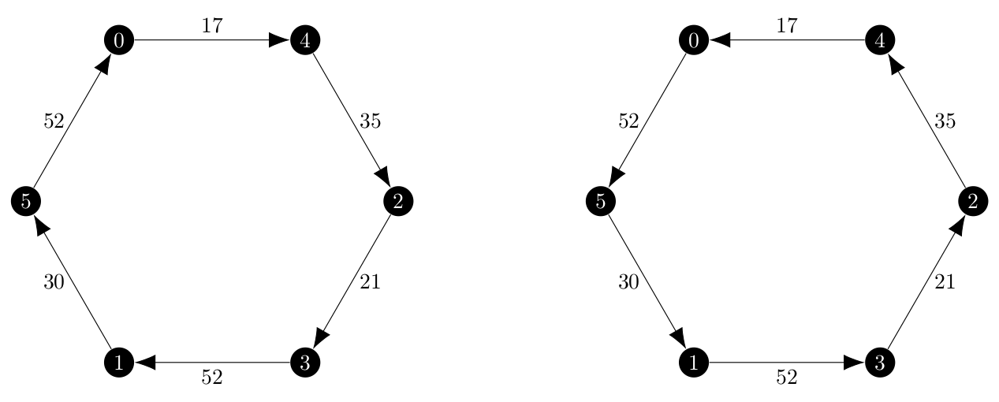

I have now completed my implementation of the ascent and the branch and bound method detailed in the 1970 paper _The Traveling-Salesman Problem and Minimum Spanning Trees_ by Micheal Held and Richard M. Karp.
In my last post, titled [Understanding the Ascent Method](../understanding-the-ascent-method), I completed the first iteration of the ascent method and found an important bug in the `find_epsilon()` method and found a more efficient way to determine substitutes in the graph.
However the solution being given was still not the optimal solution.

After discussing my options with my GSoC mentors, I decided to move onto the branch and bound method anyways with the hope that because the method is more human-computable and an example was given in the paper by Held and Karp that I would be able to find the remaining flaws.
Fortunately, this was indeed the case and I was able to correctly implement the branch and bound method and fix the last problem with the ascent method.

## Initial Implementation of the Branch and Bound Method

The branch and bound method follows from the ascent method, but tweaks how we determine the direction of ascent and simplifies the expression used for $\epsilon$.
As a reminder, we use the notion of an _out-of-kilter_ vertex to find directions of ascent which are unit vectors or negative unit vectors.
An out-of-kilter vertex is a vertex which is consistently not connected enough or connected too much in the set of minimum 1-arborescences of a graph.
The formal definition is given on page 1151 as

> Vertex $i$ is said to be _out-of-kilter high_ at the point $\pi$, if, for all $k \in K(\pi), v\_{ik} \geqq 1$;
> similarly, vertex $i$ is _out-of-kilter low_ at the point $\pi$ if, for all $k \in K(\pi), v\_{ik} = -1$.

Where $v\_{ik}$ is the degree of the vertex minus two.
First, I created a function called `direction_of_ascent_kilter()` which returns a direction of ascent based on whether a vertex is out-of-kilter.
However, I did not use the method mentioned on the paper by Held and Karp, which is to find a member of $K(\pi, u_i)$ where $u_i$ is the unit vector with 1 in the $i$th location and check if vertex $i$ had a degree of 1 or more than two.
Instead, I knew that I could find the elements of $K(\pi)$ with existing code and decided to check the value of $v\_{ik}$ for all $k \in K(\pi)$ and once it is determined that a vertex is out-of-kilter simply move on to the next vertex.

Once I have a mapping of all vertices to their kilter state, find one which is out-of-kilter and return the corresponding direction of ascent.

The changes to `find_epsilon()` were very minor, basically removing the denominator from the formula for $\epsilon$ and adding a check to see if we have a negative direction of ascent so that the crossover distances become positive and thus valid.

The brand new function which was needed was `branch()`, which well... branches according to the Held and Karp paper.
The first thing it does is run the linear program to form the ascent method to determine if a direction of ascent exists.
If the direction does exist, branch.
If not, search the set of minimum 1-arborescences for a tour and then branch if it does not exist.
The branch process itself is rather simple, find the first open edge (an edge not in the partition sets $X$ and $Y$) and then create two new configurations where that edges is either included or excluded respectively.

Finally the overall structure of the algorithm, written in pseudocode is

```
Initialize pi to be the zero vector.
Add the configuration (∅, ∅, pi, w(0)) to the configuration priority queue.
while configuration_queue is not empty:
    config = configuration_queue.get()
    dir_ascent = direction_of_ascent_kilter()
    if dir_ascent is None:
        branch()
        if solution returned by branch is not None
            return solution
    else:
        max_dist = find_epsilon()
        update pi
        update edge weights
        update config pi and bound value
```

## Debugging the Branch and Bound Method

My initial implementation of the branch and bound method returned the same, incorrect solution is the ascent method, but with different edge weights.
As a reminder, I wanted a solution which looked like this:

<center></center>

and I now had two algorithms returning this solution:

<center></center>

As I mentioned before, the branch and bound method is more human-computable than the ascent method, so I decided to follow the execution of my implementation with the one given in [1].
Below, the left side is the data from the Held and Karp paper and on the right my program's execution on the directed version.

| Undirected Graph                                                                                           | Directed Graph                                                                                             |
| ---------------------------------------------------------------------------------------------------------- | ---------------------------------------------------------------------------------------------------------- |
| Iteration 1:                                                                                               |
| Starting configuration: $(\emptyset, \emptyset, \begin{bmatrix} 0 & 0 & 0 & 0 & 0 & 0 \end{bmatrix}, 196)$ | Starting configuration: $(\emptyset, \emptyset, \begin{bmatrix} 0 & 0 & 0 & 0 & 0 & 0 \end{bmatrix}, 196)$ |
| Minimum 1-Trees:                                                                                           | Minimum 1-Arborescences:                                                                                   |
|                                                         |                                         |
| Vertex 3 out-of-kilter LOW                                                                                 | Vertex 3 out-of-kilter LOW                                                                                 |
| $d = \begin{bmatrix} 0 & 0 & 0 & -1 & 0 & 0 \end{bmatrix}$                                                 | $d = \begin{bmatrix} 0 & 0 & 0 & -1 & 0 & 0 \end{bmatrix}$                                                 |
| $\epsilon(\pi, d) = 5$                                                                                     | $\epsilon(\pi, d) = 5$                                                                                     |
| New configuration: $(\emptyset, \emptyset, \begin{bmatrix} 0 & 0 & 0 & -5 & 0 & 0 \end{bmatrix}, 201)$     | New configuration: $(\emptyset, \emptyset, \begin{bmatrix} 0 & 0 & 0 & -5 & 0 & 0 \end{bmatrix}, 212)$     |
|                                                                                                            |
| Iteration 2:                                                                                               |
| Minimum 1-Trees:                                                                                           | Minimum 1-Arborescences:                                                                                   |
|                                                         |                                         |

In order to get these results, I forbid the program from being able to choose to connect vertex 0 to the same other vertex for both the incoming and outgoing edge.
However, it is very clear that from the start, iteration two was not going to be the same.

I noticed that in the first iteration, there were twice as many 1-arborescences as 1-trees and that the difference was that the cycle can be traversed in both directions.
This creates a mapping between 1-trees and 1-arborescences.
In the second iteration, there is not as twice as many 1-arborescences and that mapping is not present.
Vertex 0 always connects to vertex 3 in the arborescences and vertex 5 in the trees.
Additionally, the cost of the 1-arborescences are higher than the costs of the 1-trees.

I knew that the choice of root node in the arborescences affects the total price from working on the ascent method.
I now wondered if a minimum 1-arborescence could come from a non-minimum spanning arborescence.
So it would be, the answer is yes.

In order to test this hypothesis, I created a simple python script using a modified version of `k_pi()`.
The entire thing is longer than I'd like to put here, but the gist was simple; iterate over _all_ of the spanning arborescences in the graph, tracking the minimum weight and then printing the minimum 1-arborescences that this program finds to compare to the ones that the unaltered one finds.

The output is below:

```
Adding arborescence with weight 212.0
Adding arborescence with weight 212.0
Adding arborescence with weight 212.0
Adding arborescence with weight 204.0
Adding arborescence with weight 204.0
Adding arborescence with weight 196.0
Adding arborescence with weight 196.0
Adding arborescence with weight 196.0
Adding arborescence with weight 196.0
Adding arborescence with weight 196.0
Adding arborescence with weight 196.0
Found 6 minimum 1-arborescences

(1, 5, 30)
(2, 1, 41)
(2, 3, 21)
(4, 2, 35)
(5, 0, 52)
(0, 4, 17)

(1, 2, 41)
(2, 3, 21)
(2, 4, 35)
(4, 0, 17)
(5, 1, 30)
(0, 5, 52)

(2, 3, 21)
(2, 4, 35)
(4, 0, 17)
(5, 1, 30)
(5, 2, 41)
(0, 5, 52)

(2, 4, 35)
(3, 2, 16)
(4, 0, 17)
(5, 1, 30)
(5, 3, 46)
(0, 5, 52)

(2, 3, 21)
(3, 5, 41)
(4, 2, 35)
(5, 1, 30)
(5, 0, 52)
(0, 4, 17)

(2, 3, 21)
(2, 5, 41)
(4, 2, 35)
(5, 1, 30)
(5, 0, 52)
(0, 4, 17)
```

This was very enlightening.
The 1-arborescences of weight 212 were the ones that my branch and bound method was using in the second iteration, but not the true minimum ones.
Graphically, those six 1-arborescences look like this:

<center></center>

And suddenly that mapping between the 1-trees and 1-arborescences is back!
But why can minimum 1-arborescences come from non-minimum spanning arborescences?
Remember that we create 1-arborescences by find spanning arborescences on the vertex set $\{2, 3, \dots, n\}$ and then connecting that missing vertex to the root of the spanning arborescence and the minimum weight incoming edge.

This means that even among the true minimum spanning arborescences, the final weight of the 1-arborescence can vary based on the cost of connecting 'vertex 1' to the root of the arborescence.
I already had to deal with this issue earlier in the implementation of the ascent method.
Now suppose that not every vertex in the graph is a root of an arborescence in the set of minimum spanning arborescences.
Let the _minimum_ root be the root vertex of the arborescence which is the cheapest to connect to and the _maximum_ root the root vertex which is the most expensive to connect to.
If we needed to, we could order the roots from minimum to maximum based on the weight of the edge from 'vertex 1' to that root.

Finally, suppose that the result of considering only the set of minimum spanning arborescences results in a set of minimum 1-arborescenes which do not use the minimum root and have a total cost $c$ more than the cost of the minimum spanning arborescence plus the cost of connecting to the minimum root.
Continue to consider spanning arborescences in increasing weight, such as the ones returned by the `ArborescenceIterator`.
Eventually the `ArborescenceIterator` will return a spanning arborescence which has the minimum root.
If the cost of the minimum spanning arborescence is $c\_{min}$ and the cost of this arborescence is less than $c\_{min} + c$ then a new minimum 1-arborescence has been found from a non-minimum spanning arborescence.

It is obviously impractical to consider all of the spanning arborescences in the graph, and because `ArborescenceIterator` returns arborescences in order of increasing weight, there is a weight after which it is impossible to produce a minimum 1-arborescence.

Let the cost of a minimum spanning arborescence be $c\_{min}$ and the total costs of connecting the roots range from $r\_{min}$ to $r\_{max}$.
The worst case cost of the minimum 1-arborescence is $c\_{min} + r\_{max}$ which would connect the minimum spanning arborescence to the most expensive root and the best case minimum 1-arborescence would be $c\_{min} + r\_{min}$.
With regard to the weight of the spanning arborescence itself, once it exceeds $c\_{min} + r\_{max} - r\_{min}$ we know that even if it uses the minimum root that the total weight will be greater than worst case minimum 1-arborescence so that is the bound which we use the `ArborescenceIterator` with.

After implementing this boundary for checking spanning arborescences to find minimum 1-arborescences, both methods executed successfully on the test graph.

## Next Steps

Now that both the ascent and branch and bound methods are working, they must be tested both for accuracy and performance.
Surprisingly, on the test graph I have been using, which is originally from the Held and Karp paper, the ascent method is between 2 and 3 times faster than the branch and bound method.
However, this six vertex graph is small and the branch and bound method may yet have better performance on larger graphs.
I will have to create larger test graphs and then select whichever method has better performance overall.

Additionally, this is an example where $f(\pi)$, the gap between a tour and 1-arborescence, converges to 0.
This is not always the case, so I will need to test on an example where the minimum gap is greater than 0.

Finally, the output of my Held Karp relaxation program is a tour.
This is just one part of the Asadpour asymmetric traveling salesperson problem and that algorithm takes a modified vector which is produced based on the final result of the relaxation.
I still need to convert the output to match the expectation of the overall algorithm I am seeking to implement this summer of code.

I hope to move onto the next step of the Asadpour algorithm on either June 30th or July 1st.

## References

[1] Held, M., Karp, R.M. _The traveling-salesman problem and minimum spanning trees_. Operations research, 1970-11-01, Vol.18 (6), p.1138-1162. [https://www.jstor.org/stable/169411](https://www.jstor.org/stable/169411)
