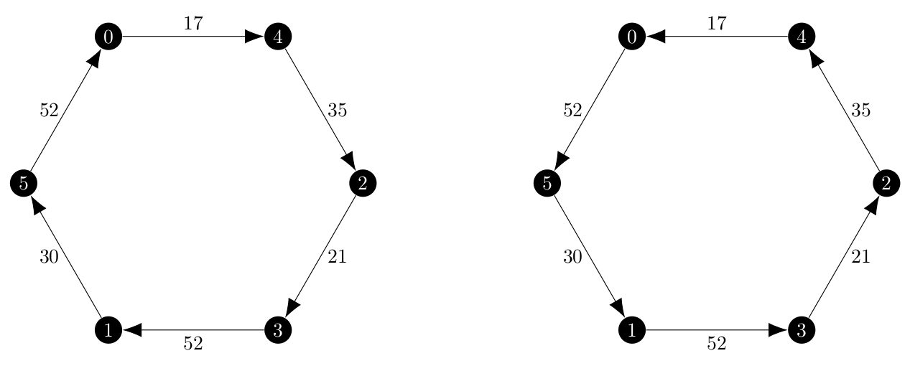
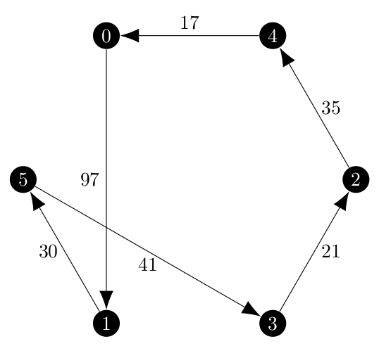
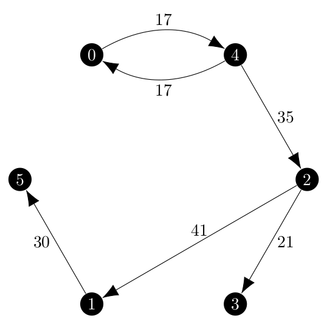

It has been far longer than I would have prefered since I wrote a blog post.
As I expected in my original GSoC proposal, the Held-Karp relaxation is proving to be quite difficult to implement.

My mentors and I agreed that the branch and bound method discussed in Held and Karp's 1970 paper _The Traveling-Salesman Problem and Minimum Spanning Trees_ which first required the implementation of the ascent method because it is used in the branch and bound method.
For the last week and a half I have been implementing and debugging the ascent method and wanted to take some time to reflect on what I have learned.

I will start by saying that as of the writing of this post, my version of the ascent method is not giving what I expect to be the optimal solution.
For my testing, I took the graph which Held and Karp use in their example of the branch and bound method, a weighted \\(\mathcal{K}\_6\\), and converted to a directed but symmetric version given in the following adjacency matrix.

\\[
\begin{bmatrix}
0 & 97 & 60 & 73 & 17 & 52 \\\\\\
97 & 0 & 41 & 52 & 90 & 30 \\\\\\
60 & 41 & 0 & 21 & 35 & 41 \\\\\\
73 & 52 & 21 & 0 & 95 & 46 \\\\\\
17 & 90 & 35 & 95 & 0 & 81 \\\\\\
52 & 30 & 41 & 46 & 81 & 0
\end{bmatrix}
\\]

The original solution is an undirected tour but in the directed version, the expected solutions depend on which way they are traversed.
Both of these cycles have a total weight of 207.

<center></center>

This is the cycle returned by the program, which has a total weight of 246.

<center></center>

All of this code goes into the function `_held_karp()` within `traveling_saleaman.py` in NetworkX and I tried to follow the algorithm outlined in the paper as closely as I could.
The `_held_karp()` function itself has three inner functions, `k_pi()`, `direction_of_ascent()` and `find_epsilon()` which represent the main three steps used in each iteration of the ascent method.

## `k_pi()`

`k_pi()` uses the `ArborescenceIterator` I implemented during the first week of coding for the Summer of Code to find all of the minimum 1-arborescences in the graph.
My original assessment of creating 1-arborescences was slightly incorrect.
I stated that

> In order to connect vertex 1, we would choose the outgoing arc with the smallest cost and the incoming arc with the smallest cost.

In reality, this method would produce graphs which are almost arborescences based solely on the fact that the outgoing arc would almost certainly create a vertex with two incoming arcs.
Instead, we need to connect vertex 1 with the incoming edge of lowest cost and the edge connecting to the root node of the arborescence on nodes \\(\{2, 3, \dots, n\}\\) that way the in-degree constraint is not violated.

For the test graph on the first iteration of the ascent method, `k_pi()` returned 10 1-arborescences but the costs were not all the same.
Notice that because we have no agency in choosing the outgoing edge of vertex 1 that the total cost of the 1-arborescence will vary by the difference between the cheapest root to connect to and the most expensive node to connect to.
My original writing of this function was not very efficient and it created the 1-arborescence from all of the minimum spanning arborescences and then iterated over them to delete all of the non-minimum ones.

Yesterday I re-wrote this function so that once a 1-arborescence of lower weight was found it would delete all of the current minimum ones in favor on the new one and not add any 1-arborescences it found with greater weight to the set of minimum 1-arborescences.

The real reason that I re-wrote the method was to try something new in hopes of pushing the program from a suboptimal solution to the optimal one.
As I mentioned early, the forced choice of connecting to the root node created 1-arborescences of different weight.
I suspected then that different choices of vertex 1 would be able to create 1-arborescences of even lower weight than just arbitrarily using the one returned by `next(G.__iter__())`.
So I wrapped all of `k_pi()` with a `for` loop over the vertices of the graph and found that the choice of vertex 1 made a difference.

```
Excluded node: 0, Total Weight: 161.0
Chosen incoming edge for node 0: (4, 0), chosen outgoing edge for node 0: (0, 4)
(2, 3, 21)
(2, 5, 41)
(4, 2, 35)
(4, 0, 17)
(5, 1, 30)
(0, 4, 17)

Excluded node: 0, Total Weight: 161.0
Chosen incoming edge for node 0: (4, 0), chosen outgoing edge for node 0: (0, 4)
(1, 5, 30)
(2, 1, 41)
(2, 3, 21)
(4, 2, 35)
(4, 0, 17)
(0, 4, 17)

Excluded node: 1, Total Weight: 174.0
Chosen incoming edge for node 1: (5, 1), chosen outgoing edge for node 1: (1, 5)
(2, 3, 21)
(2, 4, 35)
(4, 0, 17)
(5, 2, 41)
(5, 1, 30)
(1, 5, 30)

Excluded node: 2, Total Weight: 187.0
Chosen incoming edge for node 2: (3, 2), chosen outgoing edge for node 2: (2, 3)
(0, 4, 17)
(3, 5, 46)
(3, 2, 21)
(5, 0, 52)
(5, 1, 30)
(2, 3, 21)

Excluded node: 3, Total Weight: 165.0
Chosen incoming edge for node 3: (2, 3), chosen outgoing edge for node 3: (3, 2)
(1, 5, 30)
(2, 1, 41)
(2, 4, 35)
(2, 3, 21)
(4, 0, 17)
(3, 2, 21)

Excluded node: 3, Total Weight: 165.0
Chosen incoming edge for node 3: (2, 3), chosen outgoing edge for node 3: (3, 2)
(2, 4, 35)
(2, 5, 41)
(2, 3, 21)
(4, 0, 17)
(5, 1, 30)
(3, 2, 21)

Excluded node: 4, Total Weight: 178.0
Chosen incoming edge for node 4: (0, 4), chosen outgoing edge for node 4: (4, 0)
(0, 5, 52)
(0, 4, 17)
(1, 2, 41)
(2, 3, 21)
(5, 1, 30)
(4, 0, 17)

Excluded node: 4, Total Weight: 178.0
Chosen incoming edge for node 4: (0, 4), chosen outgoing edge for node 4: (4, 0)
(0, 5, 52)
(0, 4, 17)
(2, 3, 21)
(5, 1, 30)
(5, 2, 41)
(4, 0, 17)

Excluded node: 5, Total Weight: 174.0
Chosen incoming edge for node 5: (1, 5), chosen outgoing edge for node 5: (5, 1)
(1, 2, 41)
(1, 5, 30)
(2, 3, 21)
(2, 4, 35)
(4, 0, 17)
(5, 1, 30)
```

Note that because my test graph is symmetric it likes to make cycles with only two nodes.
The weights of these 1-arborescences range from 161 to 178, so I tried to run the test which had been taking about 300 ms using the new approach... and the program was non-terminating.
I created breakpoints in PyCharm after 200 iterations of the ascent method and found that the program was stuck in a loop where it alternated between two different minimum 1-arborescences.
This was a long shot, but it did not work out so I reverted the code to always pick the same vertex for vertex 1.

Either way, the fact that I had almost entirely re-written this function without a change in output suggests that this function is not the source of the problem.

## `direction_of_ascent()`

This was the one function which has pseudocode in the Held and Karp paper:

> 1. Set \\(d\\) equal to the zero \\(n\\)-vector.
> 2. Find a 1-tree \\(T^k\\) such that \\(k \in K(\pi, d)\\). [A method of executing Step 2 follows from the results of Section 6 (the greedy algorithm).]
> 3. If \\(\sum\_{i=1}^{i=n} d_i v\_{i k} > 0\\), STOP.
> 4. \\(d_i \rightarrow d_i + v\_{i k}\\), for \\(i = 2, 3, \dots, n\\)
> 5. GO TO 2.

Using this as a guide, the implementation of this function was simple until I got to the terminating condition, which is a linear program discussed on page 1149 as

> Thus, when failure to terminate is suspected, it is necessary to check whether no direction of ascent exists; by the Minkowski-Farkas lemma this is equivalent to the existence of nonnegative coefficients \\(\alpha_k\\) such that
>
> \\( \sum\_{k \in K(\pi)} \alpha_kv\_{i k} = 0, \quad i = 1, 2, \dots, n \\)
>
> This can be checked by linear programming.

While I was able to implement this without much issue, one _very_ important constraint of the linear program was not mentioned here, but rather the page before during a proof.
That constraint is

\\[
\sum\_{k \in K(\pi)} \alpha\_k = 1
\\]

Once I spent several hours trying to debug the original linear program and noticed the missing constraint. The linear program started to behave correctly, terminating the program when a tour is found.

## `find_epsilon()`

This function requires a completely different implementation compared to the one described in the Held and Karp paper.

The basic idea in both my implementation for directed graphs and the description for undirected graphs is finding edges which are substitutes for each other, or an edge outside the 1-arborescence which can replace an edge in the arborescence and will result in a 1-arborescence.

The undirected version uses the idea of fundamental cycles in the tree to find the substitutes, and I tried to use this idea as will with the [`find_cycle()`](https://networkx.org/documentation/stable/reference/algorithms/generated/networkx.algorithms.cycles.find_cycle.html) function in the NetworkX library.
I executed the first iteration of the ascent method by hand and noticed that what I computed for all of the possible values of \\(\epsilon\\) and what the program found did not match.
I had found several that it had missed and it found several that I missed.
For the example graph, I found that the following edge pairs are substitutes where the first edge is not in the 1-arborescence and the second one is the one in the 1-arborescence which it can replace using the below minimum 1-arborescence.

<center></center>

\\[
\begin{array}{l}
(0, 1) \rightarrow (2, 1) \text{ valid: } \epsilon = 56 \\\\\\
(0, 2) \rightarrow (4, 2) \text{ valid: } \epsilon = 25 \\\\\\
(0, 3) \rightarrow (2, 3) \text{ valid: } \epsilon = 52 \\\\\\
(0, 5) \rightarrow (1, 5) \text{ valid: } \epsilon = \frac{30 - 52}{0 - 0} \text{, not valid} \\\\\\
(1, 3) \rightarrow (2, 3) \text{ valid: } \epsilon = 15.5 \\\\\\
(2, 5) \rightarrow (1, 5) \text{ valid: } \epsilon = 5.5 \\\\\\
(3, 1) \rightarrow (2, 1) \text{ valid: } \epsilon = 5.5 \\\\\\
(3, 5) \rightarrow (1, 5) \text{ valid: } \epsilon = \frac{30 - 46}{-1 + 1} \text{, not valid} \\\\\\
(4, 1) \rightarrow (2, 1) \text{ valid: } \epsilon = \frac{41 - 90}{1 - 1} \text{, not valid} \\\\\\
(4, 3) \rightarrow (2, 3) \text{ valid: } \epsilon = \frac{30 - 95}{1 - 1} \text{, not valid} \\\\\\
(4, 5) \rightarrow (1, 5) \text{ valid: } \epsilon = -25.5 \text{, not valid (negative }\epsilon) \\\\\\
(5, 3) \rightarrow (2, 3) \text{ valid: } \epsilon = 25 \\\\\\
\end{array}
\\]

I missed the following substitutes which the program did find.

\\[
\begin{array}{l}
(1, 0) \rightarrow (4, 0) \text{ valid: } \epsilon = 80 \\\\\\
(1, 4) \rightarrow (0, 4) \text{ valid: } \epsilon = 73 \\\\\\
(2, 0) \rightarrow (4, 0) \text{ valid: } \epsilon = \frac{17 - 60}{1 - 1} \text{, not valid} \\\\\\
(2, 4) \rightarrow (0, 4) \text{ valid: } \epsilon = -18 \text{, not valid (negative }\epsilon) \\\\\\
(3, 0) \rightarrow (4, 0) \text{ valid: } \epsilon = 28 \\\\\\
(3, 4) \rightarrow (0, 4) \text{ valid: } \epsilon = 78 \\\\\\
(5, 0) \rightarrow (4, 0) \text{ valid: } \epsilon = 35 \\\\\\
(5, 4) \rightarrow (0, 4) \text{ valid: } \epsilon = \frac{17 - 81}{0 - 0} \text{, not valid} \\\\\\
\end{array}
\\]

Notice that some substitutions do not cross over if we move in the direction of ascent, which are the pairs which have a zero as the denominator.
Additionally, \\(\epsilon\\) is a distance, and the concept of a negative distance does not make sense.
Interpreting a negative distance as a positive distance in the opposite direction, if we needed to move in that direction, the direction of ascent vector would be pointing the other way.

The reason that my list did not match the list of the program was because `find_cycle()` did not always return the fundamental cycle containing the new edge.
If I called `find_cycle()` on a vertex in the other cycle in the graph (in this case \\(\{(0, 4), (4, 0)\}\\)), it would return that rather than the true fundamental cycle.

This prompted me to think about what really determines if edges in a 1-arborescence are substitutes for each other.
In every case where a substitute was valid, both of those edges lead to the same vertex.
If they did not, then the degree constraint of the arborescence would be violated because we did not replace the edge leading into a node with another edge leading into the same node.
This is true regardless of if the edges are part of the same fundamental cycle or not.

Thus, `find_epsilon()` now takes every edge in the graph but not the chosen 1-arborescence \\(k \in K(\pi, d)\\) and find the other edge in \\(k\\) pointing to the same vertex, swaps them and then checks that the degree constraint is not violated, it has the correct number of edges and it is still connected.
This is a more efficient method to use, and it found more valid substitutions as well so I was hopeful that it would finally bring the returned solution down to the optimal solution, perhaps because it was missing the correct value of \\(\epsilon\\) on even just one of the iterations.

It did not.

## Next Steps

At this point I have no real course forward, but two unappealing options.

- I found the problem with `find_epsilon()` by executing the first iteration of the ascent method by hand. It took about 90 minutes.
  I could try to continue this process and hope that while iteration 1 is executing correctly I find some other bug in the code, but I doubt that I will ever reach the 9 iterations the program needs
  to find the faulty solution.
- Move on to the branch and bound part of the Held-Karp relaxation.
  My hope is that because Held and Karp give a complete execution of the branch and bound method that I will be able to use that to trace a complete execution of the relaxation and find the flaw in
  the ascent method that way.

I will be discussing the next steps with my GSoC mentors soon.

## References

Held, M., Karp, R.M. _The traveling-salesman problem and minimum spanning trees_. Operations research, 1970-11-01, Vol.18 (6), p.1138-1162. [https://www.jstor.org/stable/169411](https://www.jstor.org/stable/169411)
