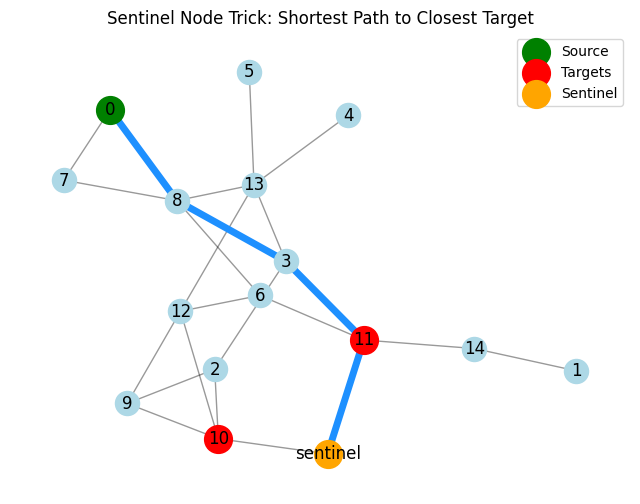
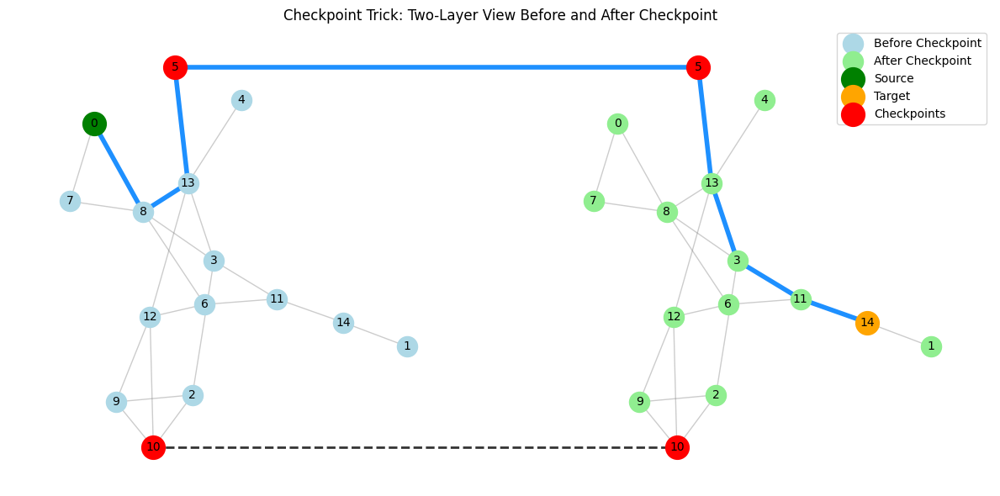

Many **real-world shortest path problems** include constraints that classic algorithms don’t directly handle. [NetworkX](https://networkx.org/) provides robust, optimized implementations of [algorithms](https://networkx.org/documentation/latest/reference/algorithms/shortest_paths.html) like Dijkstra’s, Bellman-Ford, and A\*. But what if your problem doesn’t fit the classic shortest path formulation?

Instead of designing a new algorithm from scratch, a powerful approach is to **transform your problem into a standard shortest path query by modifying the input graph**. This lets you **leverage existing, well-tested tools**.

In this post, I’ll present a few common “tricks” to encode more complex shortest-path-like problems using simple graph modifications. Each trick includes a real-world example and can be implemented with just a few lines of NetworkX code.

### Trick 1: Multiple Targets with a "Sentinel" Node

**Problem**: Find the shortest path from a source node to the closest of several target nodes:

$$
\min_{\substack{p \in \mathcal{P}(s, t) \\ t \in \text{targets}}} \mathrm{length}(p)
$$

**Classic scenario**: You're part of an emergency response team trying to reach the closest hospital. You know the locations of several hospitals across the city, and you want to get to the nearest one as quickly as possible.

**Solution**: Add a new sentinel (or sink) node and connect it to each target node. Then, compute the shortest path from the source to the sentinel. The path will transit through the closest original target (at its second to last hop).

#### Example:

```python
import networkx as nx

# Create your city map (graph)
# This Erdős-Rényi model generates random graphs for demonstration.
G = nx.erdos_renyi_graph(n=15, p=0.2, seed=111)

ambulance_location = 0
hospitals = [1, 11]

# Add sentinel node
G.add_node("sentinel")
for h in hospitals:
    G.add_edge(h, "sentinel")

# Find shortest path from ambulance to the closest hospital (via sentinel)
path = nx.shortest_path(G, source=ambulance_location, target="sentinel")
print("Route to closest hospital:", path[:-1])
```

**Output:**

```
Route to closest hospital: [0, 8, 3, 11]
```

By adding just a single sentinel node and a few zero-weight edges, you can turn a multi-target search into a single-target shortest path problem.



While it’s possible to modify Dijkstra’s algorithm to support multiple targets directly—by stopping as soon as one is reached—doing so requires reimplementing logic already handled efficiently by libraries like NetworkX. In contrast, the sentinel trick keeps your code simple and makes use of preexisting tools.

### Trick 2: Forced Detours — Pass Through a Set of Nodes

**Problem**: You want the shortest path from a source to a target, but the path must pass through at least one node from a specific set $C$ (checkpoints):

$$
\min_{\substack{p \in \mathcal{P}(s, t) \\ p \cap C \ne \emptyset}} \mathrm{length}(p)
$$

**Scenario**: You're heading home but need to stop at any one of several nearby convenience stores to pick up a specific item. You want the shortest overall route home that includes at least one store stop.

**Solution**: Create **two versions of each original node**: one for the **before checkpoint** state and one for **after checkpoint**. Edges from the original graph are duplicated within each state. Next, add the state transition edges: connect the pre-checkpoint version of each checkpoint node to its post-checkpoint version with an edge.

This effectively models the constraint into the graph’s structure. The solution to the problem is equivalent to finding the shortest path from source ("before checkpoint") to target ("after checkpoint").

#### Example:

```python
import networkx as nx
from itertools import groupby

# Create your city map (graph)
# This Erdős-Rényi model generates random graphs for demonstration.
G = nx.erdos_renyi_graph(n=15, p=0.2, seed=111)

checkpoints = [5, 10]
source, target = 0, 14

G2 = nx.Graph()

# For each edge in the original graph G,
# add corresponding edges in the expanded graph G2 for both states:
# - (node, False): before visiting a checkpoint
# - (node, True): after visiting a checkpoint
for u, v in G.edges():
    G2.add_edge((u, False), (v, False))
    G2.add_edge((u, True), (v, True))

# Checkpoints allow you to transition from "before checkpoint" to "after checkpoint"
for checkpoint in checkpoints:
    G2.add_edge((checkpoint, False), (checkpoint, True))

# Start from (source, False), end at (target, True)
path_with_state = nx.shortest_path(G2, source=(source, False), target=(target, True))

# We remove the state and use `groupby` to drop duplicated consecutive locations
# because the path in the stateful graph includes the checkpoint location twice
# with different states (e.g., before and after visiting a checkpoint).
# This collapses consecutive duplicates to produce a cleaner path over original nodes.
path = [node for node, _ in groupby(path_with_state, lambda x: x[0])]

print("Shortest Path through checkpoint:", path)
```

**Output:**

```
Shortest Path through checkpoint: [0, 8, 13, 5, 13, 3, 11, 14]
```

The shortest path from node $0$ to node $14$ that passes through at least one checkpoint ($5$ or $10$) is $0, 8, 13, 5, 13, 3, 11, 14$. In the graph below, blue nodes represent the states before visiting a checkpoint, while green nodes represent the states after visiting a checkpoint. Checkpoint nodes are colored red and are the only ones that allow transitions from "before checkpoint" to "after checkpoint" states.



The path begins in the "before checkpoint" state, moving from node $0$ to $5$ via $8$ and $13$. Upon reaching checkpoint $5$, the state transitions to "after checkpoint", allowing the rest of the path to continue from $5$ through $13$, $3$, $11$, and finally $14$.

**Note:** the resulting path is not loop-free: it traverses over $13$ twice, which is allowed in this state-expanded graph because the location is visited in different contexts—before and after satisfying the checkpoint constraint.

### Generalization: Modeling Arbitrary State

The previous approach introduces the idea of stateful graphs, where **each node encodes not just a location but a context—like "before or after checkpoint"**. And once you start thinking in terms of state, a whole new world of graph transformations opens up.

You can extend this framework even further. The same idea applies for more complex types of states, it's just a matter of encoding the context. For example, you could model:

- **Multiple types of checkpoints**. e.g. before getting home, you need to stop at a grocery store, a pharmacy and a coffee shop.
- **Weight-changing nodes**. e.g. you can stop by the mechanic, upgrade your car so it becomes 2x faster.
- **A budget of fuel or money**. e.g. each edge consumes a given amount of fuel, you can stop at service stations to recharge.

All of these can be modeled by attaching a state to each node and adjusting the graph accordingly. Therefore turning the specific shortest path problem into a shortest path over an expanded state-space graph, but **the underlying algorithm (e.g., Dijkstra’s) remains untouched**.

For example, to model a budget of $5$ coins where each edge has a cost, you can construct a stateful graph in which each node is labeled with its location and remaining budget. So a node $A$ with $5$ coins becomes $(A, 5)$, and an edge of cost $1$ from $A$ to $B$ corresponds to a transition from $(A, 5)$ to $(B, 4)$. Edges are only added if the cost does not exceed the current budget, ensuring that invalid paths are automatically excluded.

#### Limitations

One key limitation of this approach is that **modifying the input graph to encode additional constraints can lead to a significant increase in its size**. For example, when enforcing multiple checkpoint requirements by duplicating nodes, the graph can grow **exponentially** in the number of constraints.

This size explosion impacts **both memory and runtime performance**. Even if the underlying shortest path algorithm is efficient (e.g., Dijkstra's or A\*), it now operates on a much larger graph, potentially becoming impractical for large scenarios.

**Pruning strategies** may mitigate this to some extent but there is a **trade-off between how accurate we can express constraints vs. the size of the transformed graph**.

For instance, in our node-budget state graph example, modeling all different possible budget values can make the stateful graph **explode**. One possible pruning strategy could be considering only budgets that are multiple of ten. Which reduces the size of the graph by **sacrificing accuracy** in the final result (the solution becomes an approximation).

#### Wrapping Up: Transform the Input, Reuse the Algorithm

**Transforming your input data to encode constraints for problem variations is a powerful technique that extends far beyond shortest path problems.** By modifying the input structure you can solve more complex challenges while reusing well-established, efficient algorithms.

This approach simplifies development, and can lead to cleaner, more maintainable code.

So next time you encounter a “non-standard” problem, ask yourself: **can I modify the input to fit a classic algorithm instead of creating a new one from scratch?** This mindset opens up a broad toolbox of solutions across many algorithmic domains.
