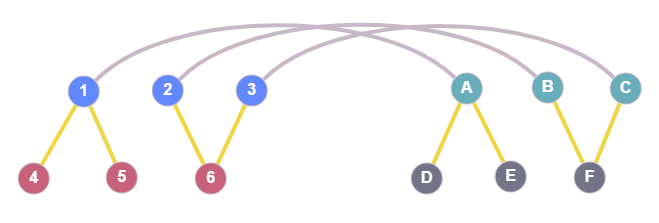

This post includes all the major updates since the last post about VF2++. Each section is dedicated to a different
sub-problem and presents the progress on it so far. General progress, milestones and related issues can be
[found here](https://github.com/kpetridis24/networkx/milestone/1).

## Node ordering

The node ordering is one major modification that **VF2++** proposes. Basically the nodes are examined in an order that
makes the matching faster, by firstly examining nodes that are more likely to match. This part of the algorithm has been
implemented, however there is an issue. The existence of detached nodes (not connected to the rest of the graph) causes
the code to crash. Fixing this bug will be a top priority during the next steps. The ordering implementation is described
by the following pseudocode.

> ---
>
> **Matching Order**
>
> ---
>
> 1. **Set** $M = \varnothing$.
> 2. **Set** $\bar{V1}$ : nodes not in order yet
> 3. **while** $\bar{V1}$ not empty **do**
>    - $rareNodes=\[$nodes from $V_1$ with the rarest labels$\]$
>    - $maxNode=argmax_{degree}\(rareNodes\)$
>    - $T=$ BFSTree with $maxNode$ as root
>    - **for** every level in $T$ **do**
>      - $V_d=\[$nodes of the $d^{th}$ level$\]$
>      - $\bar{V_1} \setminus V_d$
>      - $ProcessLevel(V_d)$
> 4. Output $M$: the matching order of the nodes.

> ---
>
> **Process Level**
>
> ---
>
> 1. **while** $V_d$ not empty **do**
>    - $S=\[$nodes from $V_d$ with the most neighbors in M$\]$
>    - $maxNodes=argmax_{degree}\(S\)$
>    - $rarestNode=\[$node from $maxNodes$ with the rarest label$\]$
>    - $V_d \setminus m$
>    - Append m to M

## $T_i$ and $\tilde{T_i}$

According to the VF2++ paper notation:

$$T_1=\(u\in V_1 \setminus m: \exists \tilde{u} \in m: (u,\tilde{u}\in E_1)\)$$

where $V_1$ and $E_1$ contain all the nodes and edges of the first graph respectively, and $m$ is a dictionary, mapping
every node of the first graph to a node of the second graph. Now if we interpet the above equation, we conclude that
$T_1$ contains uncovered neighbors of covered nodes. In simple terms, it includes all the nodes that do not belong in
the mapping $m$ yet, but are neighbors of nodes that are in the mapping. In addition,

$$\tilde{T_1}=\(V_1 \setminus m \setminus T_1\)$$

The following figure is meant to provide some visual explanation of what exactly $T_i$ is.

The blue nodes 1,2,3 are nodes from graph G1 and the green nodes A,B,C belong to the graph G2. The grey lines connecting
those two indicate that in this current state, node 1 is mapped to node A, node 2 is mapped to node B etc. The yellow
edges are just the neighbors of the covered (mapped) nodes. Here, $T_1$ contains the red nodes (4,5,6) which are
neighbors of the covered nodes 1,2,3, and $T_2$ contains the grey ones (D,E,F). None of the nodes depicted would be
included in $\tilde{T_1}$ or $\tilde{T_2}$. The latters would contain all the remaining nodes from the two graphs.

Regarding the computation of these sets, it's not practical to use the brute force method and iterate over all nodes in
every step of the algorithm to find the desired nodes and compute $T_i$ and $\tilde{T_i}$. We use the following
observations to implement an incremental computation of $T_i$ and $\tilde{T_i}$ and make VF2++ more efficient.

- $T_i$ is empty in the beggining, since there are no mapped nodes ($m=\varnothing$) and therefore no neighbors of
  mapped nodes.
- $\tilde{T_i}$ initially contains all the nodes from graph $G_i, i=1,2$ which can be realized directly from the
  notation if we consider both $m$ and $T_1$ empty sets.
- Every step of the algorithm either adds one node $u$ to the mapping or pops one from it.

We can conclude that in every step, $T_i$ and $\tilde{T_i}$ can be incrementally updated. This method avoids a ton of
redundant operations and results in significant performance improvement.
