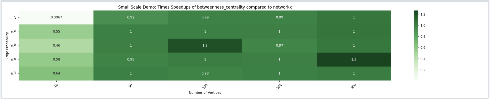
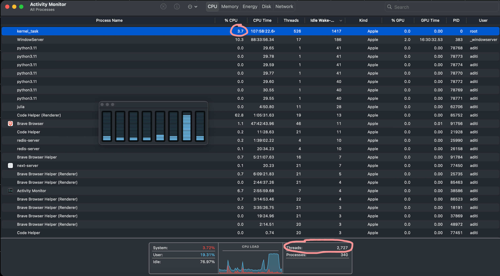
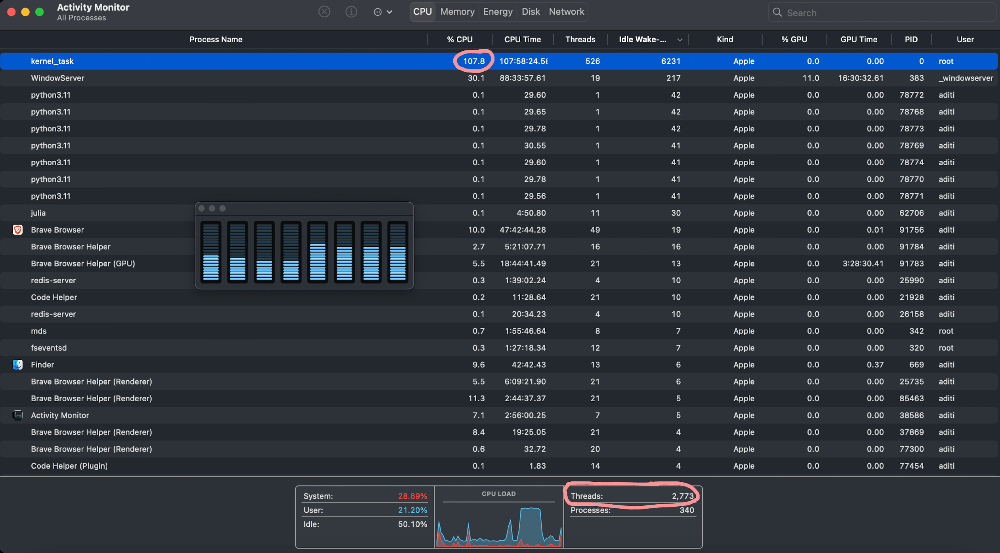
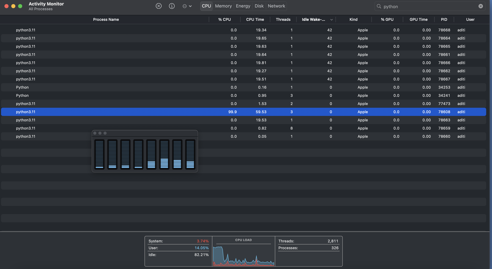
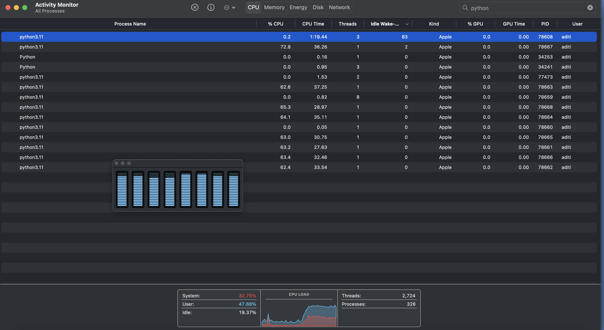
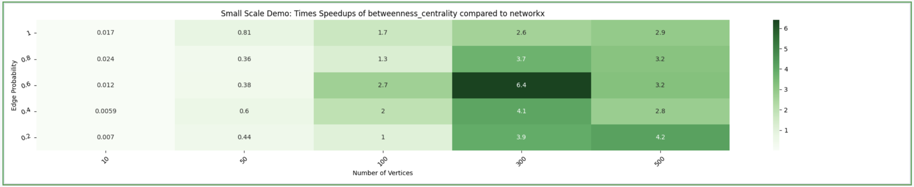

I started contributing to the [NetworkX repository](https://github.com/networkx/networkx) in October'23 as part of the contributing stage of Outreachy's December 2023 cohort. I chose to contribute to the NetworkX project because after reading through the project details I felt like it was one of the very few projects that seemed interesting to me and I felt like I'll be able to complete it during the 10-11 weeks of the internship. The project was to add 2-3 parallel implementations of NetworkX algorithms in the [nx-parallel repository](https://github.com/networkx/nx-parallel). In this blog, I'll walk you through my first 2.5-3 months of contribution journey with NetworkX.

## TSP-related PRs

I started by exploring the TSP section of the repo (because I looove TSP!). After quickly going through all the TSP-related docs and code. I searched through all the issues, PRs, and discussions with the "TSP" keyword, and I ended up creating two documentation changes thereby closing two issues. I also went through some of the [GSoC blogs by Matt Schwennesen](https://blog.scientific-python.org/tags/traveling-salesman-problem/) on the Scientific Python Blog website. At the end of week 2, I also wrote a [blog](https://schefflera-arboricola.github.io/Schefflera-Arboricola/TSP-approximation-algorithms) on TSP approximation algorithms.

One of the TSP-related [issues](https://github.com/networkx/networkx/issues/6748) was about getting unexplained outputs while running the `nx.approximation.traveling_salesman_problem` algorithm, for the case when the edge weights in a graph are such that they don't fulfill the triangle inequality condition. I proposed 3 possible fixes for it, first to add a note in the documentation about how the Networkx API currently handles it, second was to add a warning when a graph having a triangle inequality is passed and the third(proposed by the issue's author) was to raise an error and not accept the triangle inequality case at all. But, in [the PR](https://github.com/networkx/networkx/pull/6995) I only implemented the first one as it felt best at the moment because it didn't change the NetworkX API but rather explained what the API did. This PR took a long while to get merged, so if you are also starting out, just be patient and keep contributing. The [other TSP-related PR](https://github.com/networkx/networkx/pull/7013) was a very small documentation change.

## Parallelizing algorithms and contributing to nx-parallel

There were 5 initial tasks that our mentor([@MridulS](https://github.com/MridulS)) wanted us to do as Outreachy's potential interns, to get familiar with the codebase and set up the development environment. One of the tasks was to run the [timing_individual_function.py](https://github.com/networkx/nx-parallel/blob/main/timing/timing_individual_function.py) script in nx-parallel, and generate a heatmap depicting how much faster the nx-parallel implementations are as compared to the standard, sequential networkx implementations for the `betweenness_centrality` function. [At first](https://github.com/networkx/outreachy/pull/206), I wasn't able to observe any speedup values greater than 1 in my heatmap, which led me to explore how the timing script was working and dig deeper into how the repository was set up.

    
    
heatmap for betweenness_centality algorithm with negligible speedups

While trying to figure this out, I enjoyed observing and playing around with all the stats in the Activity Monitor(in Mac). At the time I didn't know how the parallel implementation worked so when I observed the number of threads increase and the CPU% increase for the `kernel_task` process, I thought that maybe parallel implementation does threading. And it made sense because I was running the timing script through my terminal and I had heard people refer terminal as a kernel sometimes.

    
    
While sequential implementation (low % CPU for kernel_task)

    
    
While parallel implementation (number of threads and %CPU for kernel_task increases)

But later, when I looked at the code, I discovered that the default backend(`loky`) of `joblib.Parallel` creates parallel processes and not threads, and then I did see there were also new python3.11 processes getting formed. I also observed the usage of all the CPU cores (ref. the small window in the screenshots).

    
    
Only one python3.11 process with 99.9% CPU while sequential implementation

    
    
8 more python3.11 processes using CPU while parallel implementation is running

But, later I figured there were no speedups because I didn't set up the development environment properly. And, I also ended up [fixing a bug](https://github.com/networkx/nx-parallel/pull/13) in the timing script, related to edge probability. Here is the final heatmap:

    
    
heatmap for betweenness_centality algorithm with speedups

### 1. Parallelizing `all_pairs_bellman_ford_path` algorithm [ref. [PR](https://github.com/networkx/nx-parallel/pull/14)]

I was going through the discussions and there was [this discussion](https://github.com/networkx/networkx/discussions/7000) that felt like I could answer, about shortest paths and multigraphs. While I was going down the rabbit hole of functions to figure out what happens to the `weights` when the shortest path function is called on a multigraph, I encountered this comment `#TODO This can be trivially parallelized.` in the `all_pairs_bellman_ford_path` algorithm. It felt very much related to the internship project and I thought it was an issue. I later discovered there are several of these comments all over the codebase and also several issues/PRs related to parallelization - 2 main ones were [issue 4064](https://github.com/networkx/networkx/issues/4064) and [PR 6306](https://github.com/networkx/networkx/pull/6306). I started working on this "issue" and I implemented a skeleton parallel implementation and made my first significant PR in nx-parallel, which got merged around the start of my internship(end of Dec 23). By working on this, I got a deeper understanding of how generators work and learned about [how to implement embarrassingly parallel algorithms using `joblib.Parallel`](https://joblib.readthedocs.io/en/latest/parallel.html), and about how we can parallelize the functions that return generators.

### 2. ASV benchmarking [ref. [PR](https://github.com/networkx/nx-parallel/pull/24)]

While I was exploring the nx-parallel repository, there was only [this one issue](https://github.com/networkx/nx-parallel/issues/12) about building a benchmarking infrastructure, so I started working on it at the start of week 2 of the contribution stage, and by the end of week 3, I made a PR with a skeleton benchmarking infrastructure for the nx-parallel repo. Setting up the config file for benchmarks took me some time because I was quite new to how projects are set up so I didn't know much about it. And, in hindsight, I think I should have probably asked about it from my mentor. But, this helped me get a better understanding of the nx-parallel project, and things like hatch-build, wheels, understanding the NetworkX backend architecture and dispatching, learning about tests and workflows and Sphinx docs, etc.

While configuring and structuring the benchmarks I also enjoyed exploring how the benchmarks were configured and structured in other projects like networkx, numpy, scipy, pandas, etc. By the end of Dec'23, I had implemented benchmarks for almost all the algorithms that were present in the nx-parallel repository. I used the backend, number of nodes, and edge probability as the benchmarking parameters.

While working on both of the PRs and communicating with my mentors, I got a better understanding of how the project needs to proceed and how to implement things so that they could be scaled in the future.

## Some maintenance and documentation PRs

I was looking for things to contribute to I guess... I was mostly just worried I hadn't made a PR in a week because I was working on the benchmarking and I didn't feel like I was making any progress on that, so I made [this PR](https://github.com/networkx/networkx/pull/7027) to update the algorithms in `core.py` (btw, if you are looking for somewhere to start contributing, there are a lot of places in networkx which require some kind of maintenance), but I started actively working on it after I was satisfied by my work on the benchmarking PR. I later made a [similar PR](https://github.com/networkx/networkx/pull/7110) updating documentation and tests of most of the functions in `similarity.py` and `link_prediction.py`. I also made [another PR](https://github.com/networkx/networkx/pull/7121) for deprecating behavior of functions in `core.py` which gave me insights into the depreciation process of NetworkX, and again if you are looking for somewhere to start, then depreciating things from this [deprecations.rst](https://github.com/networkx/networkx/blob/main/doc/developer/deprecations.rst) would be usually pretty straightforward and easy to implement. I opened some documentation PRs as well, while I was exploring the codebase. [Here](https://github.com/networkx/networkx/pulls?q=is%3Apr+author%3ASchefflera-Arboricola+is%3Aclosed) are all my PRs.

## Drafting the Final Application

I went through all the algorithms in the NetworkX repo and all the past commits in the nx-parallel repo (there were only 30 commits) to get an idea about where the project was going. I went through a few papers on parallel graph algorithms. I don't think [my proposal](https://docs.google.com/document/d/1xLr4_kqxWU3dB2GB5AAsSvr3VDtKMssQs5iYoxJhffg/edit?usp=sharing) was "perfect", but I think contributing and communicating with my mentor throughout was what mattered more and built trust, in my case. Also, I had a hard time making a week-wise timeline. And Mridul was fine with what I proposed but I wasn't, and I kept updating my own personal timeline as the internship progressed. I would add more ideas and how much time they will take. But, I think the more I understood things the better I got at estimating how much time they'll take. I'm still learning I guess to get better at it.

Some of the resources I found useful during the initial application and while writing a proposal:

1. [Outreachy's website (Applicant's guide)](https://www.outreachy.org/docs/applicant/)
2. [Outreachy Blogs by Princiya](https://princiya.com/blog/ace-your-outreachy-application/)
3. [Vani Chitkara's blogs](https://vanichitkara.wordpress.com/blog/)
4. [A walkthrough of an Outreachy proposal](https://youtu.be/Mr5lFGlB8d0?si=lVYmXU-SPoUmTFGF)

## After the Final Application

I continued contributing to my PRs after submitting the proposal. I didn't know this, but you can keep adding new contributions to the projects on the Outreachy website even a few days after the final proposal deadline. And I also discovered these [blogs by @20kavishs](https://github.com/20kavishs/GSOCBlogNetworkX/blob/main/index.md) (the person working on nx-parallel before me). They also gave some more context. After the results were announced, I wasn't feeling very... great. But, still, I sent an email to my mentor asking for feedback on my performance and how I could have been better. And, in the reply, I got to know that I wasn't selected because I wasn't eligible for Dec'23 cohort as I was a student at a university in the northern hemisphere. My mentor also informed me that they(NetworkX) might be interested in hiring me as an intern outside of Outreachy, but nothing for sure. So, it was a bit uncertain for a few days. However, I decided to keep on contributing because I felt like I was getting value out of it and learning something, and I didn't want to abandon my open PRs. And around one week later, I got an email from Mridul to discuss further about the NetworkX Internship. And, after some discussions, I filled out the Independent Contractor form, the W8-BEN form and signed the ICA with NumFOCUS (NetworkX's fiscal sponsor) to primarily work on nx-parallel, and NetworkX in general, starting 1st Jan'24. I was paid from NetworkX's CZI grant funds, and my primary mentors were [Dan Schult](https://github.com/dschult) and [Mridul Seth](https://github.com/MridulS). Yay!

## A few extra points/tips

- **Exploit ChatGPT as much as you can**: Sometimes as a beginner, going through 2-3 issues in which you are bombarded with a ton of words you don't understand can seem overwhelming so what I used to do was that I used to copy-paste all the conversations under an issue/PR into ChatGPT and tell it to summarise or explain it to me, and then once I have an overview of the discussion I'd then start reading through the actual conversations. It might also come in handy while understanding the codebase, or understanding legal documents, financial terms etc. Perplexity is better when trying to understand the latest developments and also better for understanding very large code files(bcoz you can upload code files in it). Also, there is a limit to the number of co-pilot queries you can make, so use that wisely! Perplexity's results are based on the search results of your query and you can also see the resources it referred and those can lead you to somewhere good as well. To me, it was very useful in understanding the things that people were discussing in the NetworkX's dispatching meets as those things were really new and perplexity could refer me to the specific meeting notes and the discussions on the NetworkX's discourse. And, I think it's good to ask things, from something like ChatGPT or perplexity, before you ask them from your mentor unless it's a thing on which you need an experienced human's perspective.

- **Outreachy specific**:
  - I wrote my essays and submitted my initial application just 1-2 minutes before the deadline because I "knew" I wouldn't get selected because I was applying for the first time and I barely had any experience or a good background. And I didn't even check Outreachy's website for selected organizations or organizations of past cohorts. But, when I got the email that I'd been selected then I didn't waste any time because it was the first good thing that had happened to me in ages and I didn't want to lose it. Having said that, there were times when I just didn't feel good enough to be able to make it into the final internship, but then I just thought there was someone at Outreachy who believed that I could, so I just didn't want to let them down and I just tried to be better. But now I think it's better if I'm that person for myself and not rely on others too much. Anyways, in the first 2-3 days I went through all the projects and listed 4-5 projects I was interested in. I categorized all the projects into 3 categories - "Not Interested", "Interested but not skilled enough", and "Interested and skilled". And concentrated on the projects in the last category. So, to sum it up, JUST APPLY... even if you think that you really really really can't get selected, because you might, and even if you don't, you will at least learn how "not" to do it :) All the best!
  - One of the points mentioned by Mridul in the "Mentoring Style" section on the project page was to give weekly updates on the work. So, I started emailing him my work updates in the contribution stage and it also helped me ask him all my questions at the end of each week. So, you can also try to follow your mentor's mentoring style if it doesn't annoy them too much. And just try to understand what's really expected out of you, other than what's written on the project page, by communicating with your mentor and the community members. And I didn't know this, but in the case of NetworkX (or any other project in the Scientific Python Ecosystem), you can also join the [weekly community meetings](https://scientific-python.org/calendars/), if you like (or go through the meeting notes, if you are meeting-shy!), just to get an idea about what's happening and how things work in the community. They are open to all :)
  - Outreachy requires all organizations to secure funding for at least one intern. So, if you were contributing through Outreachy and later on got hired by the organization instead, like in my case, then you should probably get paid that secured amount. (ref. [Outerachy - intern funding](https://www.outreachy.org/docs/community/#intern-funding))

[All of my involvements in networkx](https://github.com/search?q=repo%3Anetworkx%2Fnetworkx+involves%3ASchefflera-Arboricola&type=issues)!

Check out the next blog - [NetworkX Internship - Working on nx-parallel](../networkx_internship/)!

Thank you :)
