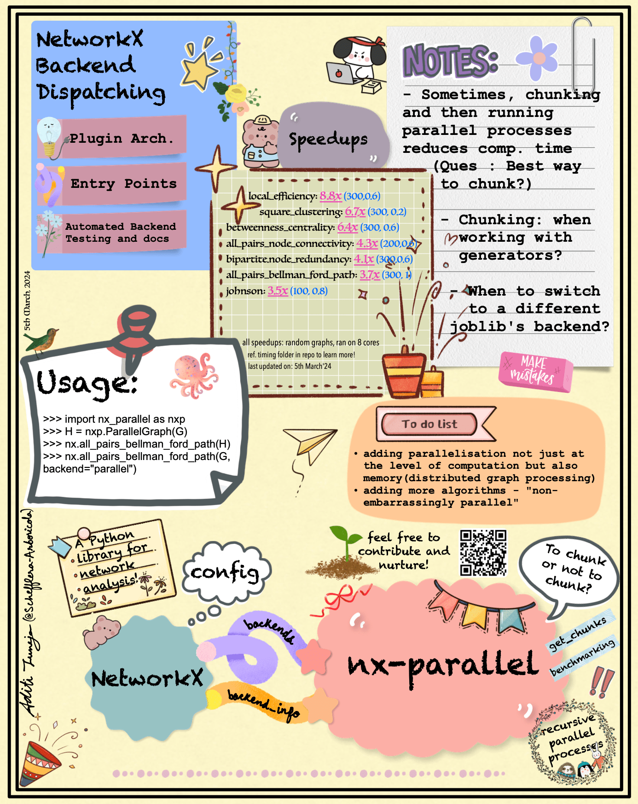

In the [last blog](https://blog.scientific-python.org/networkx/contri_phase_outreachy/), I walked you through my journey of contributing to NetworkX as an open-source newbie. In this blog, I’ll share with you my journey of working primarily on [nx-parallel](https://github.com/networkx/nx-parallel) and NetworkX in general, during the NetworkX Internship as an Independent Contractor. I hope you will find this blog helpful if you are someone thinking of contributing to nx-parallel in the future.

I won't be concentrating too much on the details of the work I did in this blog, but I will be sharing the resources I found helpful, the problems I faced, the solutions I came up with, the things I learned, and the future todos for nx-parallel. If you are interested in the exact work that I did, then going through these [internship meeting notes](https://hackmd.io/@Schefflera-Arboricola/HkHl6IPaa) (weekly work updates included) might be insightful.

## Docs and backend configurations

In the first week, I started off with maintenance and documentation stuff. I also added `n_jobs` and other joblib-related kwargs (ref. [`joblib.Parallel` docs](https://joblib.readthedocs.io/en/latest/generated/joblib.Parallel.html)), which would let the user decide things like how many CPU cores to use, which joblib `backend` to use, enable `verbose`(lets you see logs) etc. I started off by digging into how joblib's `Parallel` class and [sklearn](https://scikit-learn.org/stable/computing/parallelism.html) do it. I initially implemented to take these arguments from the user in the function call and then pass them in `joblib.Parallel` call. But, having them as backend configurations rather than keyword arguments(as suggested by Mridul) made more sense (to me) because that way we wouldn’t be populating all the function headers (and calls) with the same arguments, and instead there would be a global variable or file for storing all the backend configurations. We also decided that in the future when we will add this config dictionary we wouldn’t allow the user to change certain joblib-related kwargs that can potentially break the API, like `return_as`.(ref. [PR](https://github.com/networkx/networkx/pull/7225) - adds `config` for nx backends)

For the nx-parallel website, I started looking into [how the docs were set up for nx-guides](https://github.com/networkx/nx-guides/pull/21) and the configs in the `doc` folder in networkx. But, we decided that we can have a separate website for nx-parallel once a good number of algorithms are added, and until then we can just have a few lines about the parallel implementation and any additional parameters on the main NetworkX docs in the "Additional Backend implementation" box at the end of algorithm's docs page, something like this:

<div style="text-align: center;">
    
    <p>ref. <a href="https://networkx.org/documentation/stable/reference/algorithms/generated/networkx.algorithms.cluster.square_clustering.html">nx.square_clustering</a></p>
</div>

For that I updated the docstrings and added a `get_info` function to the `backend_info` [entry point](https://packaging.python.org/en/latest/specifications/entry-points/#entry-points) that would automatically extract the additional docs and parameters from an algorithm's docstring. (ref. [PR](https://github.com/networkx/nx-parallel/pull/27)).

And initially, I created one PR for all these things and then I had to split it into 4-5 different PRs. So, it's better to discuss first and then implement, and not to create one PR for different things just because they seem like "small" changes at the moment because they might become quite big and hard to review later on.

## Chunking and adding more algorithms

Over the past two months, I implemented around 15 parallel algorithms in nx-parallel. Out of which three of them (`global_reaching_centrality`, `local_reaching_centrality` and `all_pairs_shortest_path_length`) didn't show any speedups, even after increasing the graph's size (ref. [PR](https://github.com/networkx/nx-parallel/pull/44), [PR](https://github.com/networkx/nx-parallel/pull/33)). Now, before going into why they didn't show any speedups, let us just take a step back and understand what "chunking" is, and even before that let's quickly see how we can use joblib to create and run parallel processes.

So, joblib is a high-level parallel computing library and it's really easy to parallelize a simple `for` loop with independent iterations, like this:

```.py
>>> from joblib import Parallel, delayed
>>> num = [1, 2, 3, 4, 5, 6, 7, 8]
>>> squares = Parallel(n_jobs=-1)(delayed(lambda x: x ** 2)(n) for n in num)
>>> squares
[1, 4, 9, 16, 25, 36, 49, 64]
```

here, `n_jobs=-1` indicates that we want to use all the available CPU cores. And `Parallel(n_jobs=-1)` creates an object of [`Parallel` class in joblib](https://github.com/joblib/joblib/blob/master/joblib/parallel.py#L937). And `(delayed(lambda x: x ** 2)(n) for n in num)` is a generator that is passed into the `Parallel` object. The `delayed` is a decorator function provided by joblib that captures the arguments of a function, (ref. [1](https://stackoverflow.com/questions/42220458/what-does-the-delayed-function-do-when-used-with-joblib-in-python), [2](https://github.com/joblib/joblib/blob/master/joblib/parallel.py#L654C7-L654C7), [3](https://joblib.readthedocs.io/en/latest/parallel.html#joblib.delayed)). From the docs: "<i>The delayed function is a simple trick to be able to create a tuple (function, args, kwargs) with a function-call syntax.</i>". So, the `delayed` function delays the execution of the lambda function until it is called by the `Parallel` when running the tasks in parallel.

Now, often in parallel computing, we "chunk" the data before putting it into any kind of parallel machinery (like `joblib.Parallel`), like this:

```.py
>>> l_chunks = [[1, 2], [3, 4], [5, 6], [7, 8]]
>>> square_chunks = Parallel(n_jobs=-1)(delayed(lambda chunk: [n**2 for n in chunk])(chunk) for chunk in l_chunks)
>>> squares = [square for chunk in square_chunks for square in chunk]
>>> squares
[1, 4, 9, 16, 25, 36, 49, 64]
```

And chunking seems to usually improve the speedups. I only saw chunking in nx-parallel so I didn't know how [usual](https://docs.python.org/3/library/multiprocessing.html#multiprocessing.pool.Pool.map) it was. So, I started looking into why chunking was improving speedups and when it wasn't (ref. [PR](https://github.com/networkx/nx-parallel/pull/42)). The main takeaway was that chunking usually improves the speedups probably because it reduces the overhead of managing and creating parallel processes. And sometimes when the processing time of chunks is too small (like in `number_of_isolates`) or the processing time of a chunk is too large (like in `all_pairs_node_connectivity`), then chunking might not improve the speedups. In the case of `all_pairs_node_connectivity`, changing the default chunking and reducing the size of the default chunk helped in getting speedups (ref. [PR](https://github.com/networkx/nx-parallel/pull/33)). But, all these conclusions were based on experimenting and benchmarking on the random graphs generated by the `nx.fast_gnp_random_graph(num, p, seed=42)` function, so I added `get_chunks` kwarg to most of the algorithms which would let the user define the chunks according to their specific needs, like if the user knows (based on some other centrality measure) that calculating the `betweenness_centrality` for some particular nodes would take a lot of time then they can make sure that those nodes are not populated in one chunk by defining the chunks using `get_chunks` kwarg (ref. [PR](https://github.com/networkx/nx-parallel/pull/29)).

Now, the reason for `global_reaching_centrality` and `local_reaching_centrality` not having speedups might be that I've not tried using chunking them, yet. Another reason that I think for `global_reaching_centrality` might be that it uses the parallel implementation of the `local_reaching_centrality` algorithm and that was probably creating a lot of parallel processes and hence increasing the overhead of managing the parallel processes (<i>A little side note</i>: this one got me curious about what happens when we recursively creating chunks and run them parallelly, so I played around with that a little bit (ref. [1](https://stackoverflow.com/questions/78016770/why-does-recursively-running-joblib-parallel-increases-the-computation-time))). Also, I might get speedups for `all_pairs_shortest_path_length` (and also `local_reaching_centrality`) by using even bigger chunks, because their sequential implementation is already pretty fast.

### Chunking in functions that `yield` instead of `return`

Many `all_pairs_` functions in networkx `yield` results instead of returning a dictionary and `joblib.Parallel` has a kwarg `return_as` which when set to `generator` returns a generator object instead of a list. So, in the very first `all_pairs_` algorithm ([all_pairs_bellman_ford_path](https://github.com/networkx/nx-parallel/pull/14)) that I implemented, I didn't use any chunking and just returned the generator object returned by `joblib.Parallel`. But, when I was playing around with chunking (ref. [PR](https://github.com/networkx/nx-parallel/pull/42)) it took me a while to figure out how I could implement chunking with generators. I finally did something like this:

```.py
paths_chunk_generator = (
    delayed(_process_node_chunk)(node_chunk) for node_chunk in node_chunks
)

for path_chunk in Parallel(n_jobs=-1)(paths_chunk_generator):
    for path in path_chunk:
        yield path
```

So, first, we created a generator expression that generates delayed function calls to `_process_node_chunk` for each `node_chunk`. The `delayed` defers the execution of `_process_node_chunk` until later. The generator expression `paths_chunk_generator` is then passed as input to `Parallel`, which executes the delayed function calls in parallel and then yields each `path` using a simple `for` loop. The `_process_node_chunk` function returns a list of shortest paths for all the nodes in the given chunk:

```.py
def _process_node_chunk(node_chunk):
    return [
        (node, single_source_bellman_ford_path(G, node, weight=weight))
        for node in node_chunk
    ]
```

Yielding instead of returning a generator object and adding chunking both improved the speedups (ref. [PR](https://github.com/networkx/nx-parallel/pull/49)). I also added the `get_chunks` kwarg to the `all_pairs_bellman_ford_path` algorithm and improved all the other `all_pairs_` algorithms similarly. (ref. [PR](https://github.com/networkx/nx-parallel/pull/33)).

While working on nx-parallel, I found [this playlist/course](https://youtube.com/playlist?list=PLp6ek2hDcoNBAyEJmxsOowMYNTKsUmTZ8&si=-JYAMYM0pC4NJRye) helpful for understanding many of the theoretical concepts in parallel computing. It's a bit old but the concepts are still the same and I used to refer to it sometimes.

## Future todos for nx-parallel

- Right now, for all the algorithms in nx-parallel, joblib's default backend `loky` is being used. A potential issue with that is that when some `n` parallel processes are created then `n` copies of the same graph(and all other variables in the namespace) are also created because all processes run independently. So, it won't be very memory efficient when the graph is really huge. So, using a different joblib's backend like dask or ray, etc., and having something like distributed graph algorithms, whenever possible, might be helpful. Also, then having something like a [MapReduce model](https://en.wikipedia.org/wiki/MapReduce) in nx-parallel would make sense, as proposed in [this PR](https://github.com/networkx/nx-parallel/pull/7). Implementing a distributed algorithm for `number_of_isolates` might be an easy starting point.
- running all benchmarks for specific commits (ref. [PR](https://github.com/networkx/networkx/pull/7268))
- cleaning up processes once the algorithm is done running and seeing if that improves the performance in any way. (ref. [issue](https://github.com/joblib/joblib/issues/945))
- Issue: even though the `backend_info` entry point was added in nx-parallel, the additional docs were not showing up on Networkx's docs website.
- add `config` to nx-parallel once [this PR](https://github.com/networkx/networkx/pull/7225) gets merged in the networkx repository (and also adding `config`-related tests and benchmarks). This will let the user play around with a lot of stuff using nx-parallel!
- [Erik](https://github.com/eriknw) brought it up in one of the meetings that using `bellman-ford` as the `method` (instead of the default `dijkstra`) in the `all_pairs_all_shortest_paths` algorithm improves speedups in nx-cugraphs. So, I wanted to try and see if that's also the case in nx-parallel.
- Having a decorator or something else for automatic graph conversion, instead of checking and converting the graph in all the functions:

```.py
if hasattr(G, "graph_object"):
    G = G.graph_object
```

- Question: should we keep the algorithms whose sequential implementation is already really fast and that doesn't show any speedups for the random graphs we use in the current timing script(like `number_of_isolates`, `all_pairs_shortest_path_length`, etc.) in nx-parallel?
- having consistent heatmaps and improving the timing script (ref. [issue](https://github.com/networkx/nx-parallel/issues/51))
- benchmarking on SNAP datasets, on how good an approximation is for approximation algorithms, benchmarks based on memory usage, etc.
- experiment and try to get speedups in `global_reaching_centrality` and `local_reaching_centrality` algorithms.
- Having a website with one main page on usage and installation, separate pages for specific algorithms (if needed), avoiding redundancy in docs (using external links and/or drop-downs as needed), a few gallery examples, etc. I have a [PR](https://github.com/networkx/nx-parallel/pull/46) that adds a contributing guide and updates readme, and that broadly covers most of these things.
- and obviously, adding more algorithms, and a lot more :)

## A few other contributions

While I was working on the nx-parallel, I also worked on and reviewed a few PRs in networkx as well. For details, refer to the meeting notes above, but the two PRs that I think are worth mentioning here are [adding and updating the "Backend" section docs](https://github.com/networkx/networkx/pull/7305) and [adding `sort_neighbors` to DFS functions](https://github.com/networkx/networkx/pull/7196). The first one was quite fun and the second one was quite simple. Also, various tests were failing in nx-parallel because nx-parallel uses a different `os` while running the workflow tests, so I created some issues/PRs related to those as well (most of them got fixed by adding a `seed` value). I also created some issues/PRs in other projects like joblib, asv, etc. related to issues I was working with in nx-parallel.

[All of my involvements in nx-parallel](https://github.com/search?q=repo%3Anetworkx%2Fnx-parallel+involves%3ASchefflera-Arboricola&type=issues).

<br>

**A quick side note**: One thing that you do as an Independent Contractor that you don't do as an Outreachy intern is that you have to keep track of your hours of service and submit them at the end of the month in an invoice document through [Open Collective](https://opencollective.com/how-it-works). It can be challenging at times to determine what constitutes a "service" when you're learning most things on the go. To simplify things, I organize my work items such that each week represents one work item, and the number of hours was an estimate of the average hours I worked that week. While creating the invoice document, I would add more details to the weekly work updates that I was already emailing to my mentors. But, I don't think that it was the best way to do it because the invoice document is not visible to everyone and it would have been nicer if I had added the exact work items instead of just 4 work items (work done in week1, week2, week3, week4). But, I've all my work updates in [these meeting notes](https://hackmd.io/@Schefflera-Arboricola/HkHl6IPaa), if you want to see them.

## An illustration by [Aditi Juneja](https://github.com/Schefflera-Arboricola)(me) summarising nx-parallel (so far) :)

<center></center>

Thank you :)
