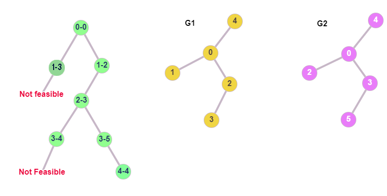

The previous post can be found [here](), be sure to check it out so you
can
follow the process step by step. Since then, another two very significant features of the algorithm have been
implemented and tested: **node pair candidate selection** and **feasibility checks**.

## Introduction

As previously described, in the ISO problem we are basically trying to create a **mapping** such that, every node
from the first graph is matched to a node from the second graph. This searching for "feasible pairs" can be visualized
by a tree, where each node is the candidate pair that we should examine. This can become much clearer if we take a look
at the below figure.

<center></center>

In order to check if the graphs $G_1$, $G_2$ are isomorphic, we check every candidate pair of nodes and if it is
feasible, we extend the mapping and go deeper into the tree of pairs. If it's not feasible, we climb up and follow a
different branch, until every node in $G_1$ is mapped to a node $G_2$. In our example, we start by examining node 0 from G1, with
node 0 of G2. After some checks (details below), we decide that the
nodes 0 and 0 are matching, so we go deeper to map the remaining nodes. The next pair is 1-3, which fails the
feasibility check, so we have to examine a different branch as shown. The new branch is 1-2, which is feasible, so we
continue on using the same logic until all the nodes are mapped.

## Candidate Pair Selection

Although in our example we use a random candidate pair of nodes, in the actual implementation we are able to target
specific pairs that are more likely to be matched, hence boost the performance of the algorithm. The idea is that, in
every step of the algorithm, **given a candidate**

$$u\in V_1$$

**we compute the candidates**

$$v\in V_2$$

where $V_1$ and $V_2$ are the nodes of $G_1$ and $G_2$ respectively. Now this is a puzzle that does not require a lot of
specific knowledge on graphs or the algorithm itself. Keep up with me, and you will realize it yourself. First, let $M$
be the mapping so far, which includes all the "covered nodes" until this point. There are actually **three** different
types of $u$ nodes that we might encounter.

### Case 1

Node $u$ has no neighbors (degree of $u$ equals to zero). It would be redundant to test
as candidates for $u$, nodes from $G_2$ that have more than zero neighbors. That said, we eliminate most of the possible
candidates and keep those that have the same degree as $u$ (in this case, zero). Pretty easy right?

### Case 2

Node $u$ has neighbors, but none of them belong to the mapping. This situation is illustrated in the following figure.

<center></center>

The grey lines indicate that the nodes of $G_1$ (left 1,2) are mapped to the nodes of $G_2$ (right 1,2). They are basically
the mapping. Again, given $u$, we make the observation that candidates $v$ of u, should also have no neighbors in the
mapping, and also have the same degree as $u$ (as in the figure). Notice how if we add a neighbor to $v$, or if we place
one of its neighbors inside the mapping, there is no point examining the pair $u-v$ for matching.

### Case 3

Node $u$ has neighbors and some of them belong to the mapping. This scenario is also depicted in the below figure.

<center></center>

In this case, to obtain the candidates for $u$, we must look into the neighborhoods of nodes from $G_2$, which map back
to the covered neighbors of $u$. In our example, $u$ has one covered neighbor (1), and 1 from $G_1$ maps to 1 from $G_2$,
which has $v$ as neighbor. Also, for v to be considered as candidate, it should have the same degree as $u$, obviously.
Notice how every node that is not in the neighborhood of 1 (in $G_2$) cannot be matched to $u$ without breaking the
isomorphism.

## ISO Feasibility Rules

Let's assume that given a node $u$, we obtained its candidate $v$ following the process described in the previous section.
At this point, the **Feasibility Rules** are going to determine whether the mapping should be extended by the pair $u-v$
or if we should try another candidate. The **feasibility** of a pair $u-v$ is examined by **consistency** and
**cutting** checks.

### Consistency rules

At, first I am going to present the mathematical expression of the consistency check. It may seem complicated at first,
but it's going to be made simple by using a visual illustration. Using the notation $nbh_i(u)$ for the neighborhood of u
in graph $G_i$, the consistency rule is:

$$\forall\tilde{v}\in nbh_2(v)\cap M:(u, M^{-1}(\tilde{v}))\in E_1) \wedge \forall\tilde{u}\in nbh_1(u)\cap M:(u, M(\tilde{u}))\in E_2)$$

We are going to use the following simple figure to demystify the above equation.

<center></center>

The mapping is depicted as grey lines between the nodes that are already mapped, meaning that 1 maps to A and 2 to B.
What is implied by the equation is that, for two nodes $u$ and $v$ to pass the consistency check, the neighbors of $u$
that belong in the mapping, should map to neighbors of $v$ (and backwards). This could be checked by code as simple
as:

```python
for neighbor in G1[u]:
    if neighbor in mapping:
        if mapping[neighbor] not in G2[v]:
            return False
        elif G1.number_of_edges(u, neighbor) != G2.number_of_edges(
            v, mapping[neighbor]
        ):
            return False
```

where the final two lines also check the number of edges between node $u$ and its neighbor $\tilde{u}$, which should be
the same as those between $v$ and its neighbor which $\tilde{u}$ maps to. At a very high level, we could describe this
check as a 1-look-ahead check.

### Cutting rules

We have previously discussed what $T_i$ and $\tilde{T_i}$ represent (see previous post). These sets are used in the
cutting checks as follows: the number of neighbors of $u$ that belong to $T_1$, should be equal to the number of
neighbors of $v$ that belong to $T_2$. Take a moment to observe the below figure.

<center></center>

Once again, node 1 maps to A and 2 to B. The red nodes (4,5,6) are basically $T_1$ and the yellow ones (C,D,E) are $T_2$.
Notice that in order for $u-v$ to be feasible, $u$ should have the same number of neighbors, inside $T_1$,
as $v$ in $T_2$. In every other case, the two graphs are not isomorphic, which can be verified visually. For this
example, both nodes have 2 of their neighbors (4,6 and C,E) in $T_1$ and $T_2$ respectively. Careful! If we delete the
$V-E$ edge and connect $V$ to $D$, the cutting condition is still satisfied. However, the feasibility is going to fail,
by the consistency checks of the previous section. A simple code to apply the cutting check would be:

```python
if len(T1.intersection(G1[u])) != len(T2.intersection(G2[v])) or len(
    T1out.intersection(G1[u])
) != len(T2out.intersection(G2[v])):
    return False
```

where `T1out` and `T2out` correspond to $\tilde{T_1}$ and $\tilde{T_2}$ respectively. And yes, we have to check for
those as well, however we skipped them in the above explanation for simplicity.

## Conclusion

At this point, we have successfully implemented and tested all the major components of the algorithm **VF2++**,

- **Node Ordering**
- **$T_i/\tilde{T_i}$ Updating**
- **Feasibility Rules**
- **Candidate Selection**

This means that, in the next post, hopefully, we are going to discuss our first, full and functional implementation of
**VF2++**.
