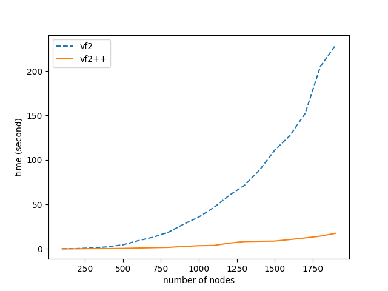
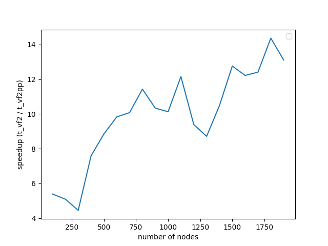

The last and final post discussing the **VF2++ helpers** can be found [here]().
Now that we've figured out how to solve all the sub-problems that **VF2++** consists of, we are ready to combine our
implemented functionalities to create the final solver for the **Graph Isomorphism** problem.

## Introduction

We should quickly remind at this point, that the individual functionalities already implemented are:

- **Node ordering** which finds the optimal order to access the nodes, such that those that are more likely to match are placed first in the order. This reduces the possibility of infeasible searches taking place first.
- **Candidate selection** such that, given a node $u$ from $G_1$, we obtain the candidate nodes $v$ from $G_2$.
- **Feasibility rules** introducing easy-to-check cutting and consistency conditions which, if satisfied by a candidate pair of nodes $u$ from $G_1$ and $v$ from $G_2$, the mapping is extended.
- **$T_i$ updating** which updates the $T_i$ and $\tilde{T}_i$, $i=1,2$ parameters in case that a new pair is added to the mapping, and restores them when a pair is popped from it.

We are going to use all these functionalities to form our **Isomorphism solver**.

## VF2++

First of all, let's describe the algorithm in simple terms, before presenting the pseudocode. The algorithm will look something like this:

1. Check if all **preconditions** are satisfied before calling the actual solver. For example there's no point examining two graphs with different number of nodes for isomorphism.
2. Initialize all the necessary **parameters** ($T_i$, $\tilde{T}_i$, $i=1,2$) and maybe cache some information that is going to be used later.
3. Take the next unexamined node $u$ from the ordering.
4. Find its candidates and check if there's a candidate $v$ such that the pair $u-v$ satisfies the **feasibility rules**
5. if there's any, extend the mapping and **go to 3**.
6. if not, pop the last pair $\hat{u}-\hat{v}$ from the mapping and try a different candidate $\hat{v}$, from the remaining candidates of $\hat{u}$
7. The two graphs are **isomorphic** if the number of **mapped nodes** equals the number of nodes of the two graphs.
8. The two graphs are **not isomorphic** if there are no remaining candidates for the first node of the ordering (root).

The pseudocode for the **VF2++** is presented below.

> ---
>
> **VF2++**
>
> ---
>
> 1. **Set** Check if the number of nodes and degree sequence is the same for both graphs.
> 2. **Set** $T_1, T_2, \tilde{T}_1, \tilde{T}_2$ to default
> 3. **Set** $m = m^{-1} = \{\}$
> 4. $order=\def\textsc#1{\dosc#1\csod}{matchingOrder()}$
> 5. $root=order\[0\]$
> 6. **Set** $stack=\[\(root, \def\textsc#1{\dosc#1\csod}{findCandidates(root)}\)\]$
> 7. **while** $stack$ **do**
>    - $n,nc=stack.peek()$
>    - **if** $nc$ is empty **do**
>      - $stack.pop()$
>      - $\def\textsc#1{\dosc#1\csod}{restoreState()}$
>      - $continue$
>    - **if** $\def\textsc#1{\dosc#1\csod}{feasibility(n, nc.pop())}$ **do**
>      - **if** len(m) equals len(G1) **return True**
>      - $\def\textsc#1{\dosc#1\csod}{updateState()}$
>      - $nextNode=order.next()$
>      - $stack.append\(\(nextNode, \def\textsc#1{\dosc#1\csod}{findCandidates(nextNode)}\)\)$

## Performance

This section is dedicated to the performance comparison between **VF2** and **VF2++**. The comparison was performed in
**random graphs** without labels, for number of nodes anywhere between the range $\(100-2000\)$. The results are depicted
in the two following diagrams.

<center></center>
<center></center>

We notice that the maximum speedup achieved is **14x**, and it keeps increasing gradually, as the number of nodes increase.
It is also highly prominent that the increase in number of nodes, doesn't seem to affect the performance of **VF2++** to
a significant extent, when compared to the drastic impact on the performance of **VF2**. Our results are almost identical
to those presented in the original **VF2++ paper**, verifying the theoretical analysis and premises of the literature.

## Optimizations

The achieved boost is due to some key improvements and optimizations, and more specifically:

- **Optimal node ordering**, which avoids following unfruitful branches that will result in infeasible states. We make sure that the nodes that have the biggest possibility to match are accessed first.
- **Implementation in a non-recursive manner**, which saves both time and space.
- **Caching** of both node degrees and nodes per degree in the beginning, so that we don't have to access those features in every degree check. For example, instead of doing

```python
res = []
for node in G2.nodes():
    if G1.degree[u] == G2.degree[node]:
        res.append(node)
# do stuff with res ...
```

to get the nodes of same degree as u (which happens a lot of times in the implementation), we just do:

```python
res = G2_nodes_of_degree[G1.degree[u]]
# do stuff with res ...
```

where "G2_nodes_of_degree" stores set of nodes for a given degree. The same is done with node labels.

- **Extra shrinking of the candidate set for each node** by adding more checks in the candidate selection method and removing some from the feasibility checks. In simple terms, instead of checking a lot of conditions on a larger set of candidates, we check fewer conditions but on a more targeted and significantly smaller set of candidates.
  For example, in this code:

```python
candidates = set(G2.nodes())
for candidate in candidates:
    if feasibility(u, candidate):
        do_stuff()
```

we take a huge set of candidates, which results in poor performance due to maximizing calls of "feasibility", thus performing
the feasibility checks in a very large set. Now compare that to the following alternative:

```python
candidates = [
    n
    for n in G2_nodes_of_degree[G1.degree[u]].intersection(
        G2_nodes_of_label[G1_labels[u]]
    )
]
for candidate in candidates:
    if feasibility(u, candidate):
        do_stuff()
```

Immediately we have drastically reduced the number of checks performed and calls to the function, as now we only apply them to nodes of the same degree and label as $u$. This is a simplification for demonstration purposes. In the actual implementation there are more checks and extra shrinking of the candidate set.
