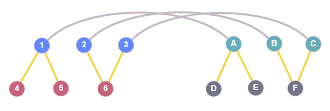
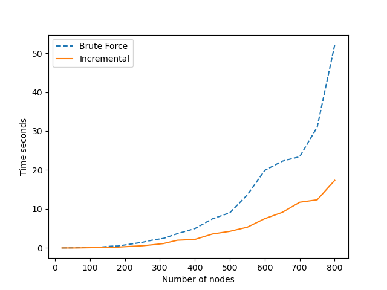

This post includes all the major updates since the [last post]() about VF2++. Each section
is dedicated to a different sub-problem and presents the progress on it so far. General progress, milestones and related
issues can be [found here](https://github.com/kpetridis24/networkx/milestone/1).

## Node ordering

The node ordering is one major modification that **VF2++** proposes. Basically, the nodes are examined in an order that
makes the matching faster by first examining nodes that are more likely to match. This part of the algorithm has been
implemented, however there is an issue. The existence of detached nodes (not connected to the rest of the graph) causes
the code to crash. Fixing this bug will be a top priority during the next steps. The ordering implementation is described
by the following pseudocode.

> ---
>
> **Matching Order**
>
> ---
>
> 1. **Set** $M = \varnothing$.
> 2. **Set** $\bar{V1}$ : nodes not in order yet
> 3. **while** $\bar{V1}$ not empty **do**
>    - $rareNodes=\[$nodes from $V_1$ with the rarest labels$\]$
>    - $maxNode=argmax_{degree}\(rareNodes\)$
>    - $T=$ BFSTree with $maxNode$ as root
>    - **for** every level in $T$ **do**
>      - $V_d=\[$nodes of the $d^{th}$ level$\]$
>      - $\bar{V_1} \setminus V_d$
>      - $ProcessLevel(V_d)$
> 4. Output $M$: the matching order of the nodes.

> ---
>
> **Process Level**
>
> ---
>
> 1. **while** $V_d$ not empty **do**
>    - $S=\[$nodes from $V_d$ with the most neighbors in M$\]$
>    - $maxNodes=argmax_{degree}\(S\)$
>    - $rarestNode=\[$node from $maxNodes$ with the rarest label$\]$
>    - $V_d \setminus m$
>    - Append m to M

## $T_i$ and $\tilde{T_i}$

According to the VF2++ paper notation:

$$T_1=\(u\in V_1 \setminus m: \exists \tilde{u} \in m: (u,\tilde{u}\in E_1)\)$$

where $V_1$ and $E_1$ contain all the nodes and edges of the first graph respectively, and $m$ is a dictionary, mapping
every node of the first graph to a node of the second graph. Now if we interpret the above equation, we conclude that
$T_1$ contains uncovered neighbors of covered nodes. In simple terms, it includes all the nodes that do not belong in
the mapping $m$ yet, but are neighbors of nodes that are in the mapping. In addition,

$$\tilde{T_1}=\(V_1 \setminus m \setminus T_1\)$$

The following figure is meant to provide some visual explanation of what exactly $T_i$ is.



The blue nodes 1,2,3 are nodes from graph G1 and the green nodes A,B,C belong to the graph G2. The grey lines connecting
those two indicate that in this current state, node 1 is mapped to node A, node 2 is mapped to node B, etc. The yellow
edges are just the neighbors of the covered (mapped) nodes. Here, $T_1$ contains the red nodes (4,5,6) which are
neighbors of the covered nodes 1,2,3, and $T_2$ contains the grey ones (D,E,F). None of the nodes depicted would be
included in $\tilde{T_1}$ or $\tilde{T_2}$. The latter sets would contain all the remaining nodes from the two graphs.

Regarding the computation of these sets, it's not practical to use the brute force method and iterate over all nodes in
every step of the algorithm to find the desired nodes and compute $T_i$ and $\tilde{T_i}$. We use the following
observations to implement an incremental computation of $T_i$ and $\tilde{T_i}$ and make VF2++ more efficient.

- $T_i$ is empty in the beginning, since there are no mapped nodes ($m=\varnothing$) and therefore no neighbors of
  mapped nodes.
- $\tilde{T_i}$ initially contains all the nodes from graph $G_i, i=1,2$ which can be realized directly from the
  notation if we consider both $m$ and $T_1$ empty sets.
- Every step of the algorithm either adds one node $u$ to the mapping or pops one from it.

We can conclude that in every step, $T_i$ and $\tilde{T_i}$ can be incrementally updated. This method avoids a ton of
redundant operations and results in significant performance improvement.



The above graph shows the difference in performance between using the exhaustive brute force and incrementally updating
$T_i$ and $\tilde{T_i}$. The graph used to obtain these measurements was a regular
[GNP Graph](https://en.wikipedia.org/wiki/Erd%C5%91s%E2%80%93R%C3%A9nyi_model) with a probability for an edge equal to
$0.7$. It can clearly be seen that execution time of the brute force
method increases much more rapidly with the number of nodes/edges than
the incremental update method, as expected.
The brute force method looks like this:

```python
def compute_Ti(G1, G2, mapping, reverse_mapping):
    T1 = {nbr for node in mapping for nbr in G1[node] if nbr not in mapping}
    T2 = {
        nbr
        for node in reverse_mapping
        for nbr in G2[node]
        if nbr not in reverse_mapping
    }

    T1_out = {n1 for n1 in G1.nodes() if n1 not in mapping and n1 not in T1}
    T2_out = {n2 for n2 in G2.nodes() if n2 not in reverse_mapping and n2 not in T2}
    return T1, T2, T1_out, T2_out
```

If we assume that G1 and G2 have the same number of nodes (N), the average number of nodes in the mapping is $N_m$, and
the average node degree of the graphs is $D$, then the time complexity of this function is:

$$O(2N_mD + 2N) = O(N_mD + N)$$

in which we have excluded the lookup times in $T_i$, $mapping$ and $reverse\\_mapping$ as they are all $O(1)$. Our
incremental method works like this:

```python
def update_Tinout(
    G1, G2, T1, T2, T1_out, T2_out, new_node1, new_node2, mapping, reverse_mapping
):
    # This function should be called right after the feasibility is established and node1 is mapped to node2.
    uncovered_neighbors_G1 = {nbr for nbr in G1[new_node1] if nbr not in mapping}
    uncovered_neighbors_G2 = {
        nbr for nbr in G2[new_node2] if nbr not in reverse_mapping
    }

    # Add the uncovered neighbors of node1 and node2 in T1 and T2 respectively
    T1.discard(new_node1)
    T2.discard(new_node2)
    T1 = T1.union(uncovered_neighbors_G1)
    T2 = T2.union(uncovered_neighbors_G2)

    # todo: maybe check this twice just to make sure
    T1_out.discard(new_node1)
    T2_out.discard(new_node2)
    T1_out = T1_out - uncovered_neighbors_G1
    T2_out = T2_out - uncovered_neighbors_G2

    return T1, T2, T1_out, T2_out
```

which based on the previous notation, is:

$$O(2D + 2(D + M_{T_1}) + 2D) = O(D + M_{T_1})$$

where $M_{T_1}$ is the expected (average) number of elements in $T_1$.

Certainly, the complexity is much better in this
case, as $D$ and $M_{T_1}$ are significantly smaller than $N_mD$ and $N$.

In this post we investigated how node ordering works at a high level, and also
how we are able to calculate some important parameters so that the space and
time complexity are reduced.
The next post will continue with examining two more significant components of
the VF2++ algorithm: the **candidate node pair selection** and the
**cutting/consistency** rules that decide when the mapping should or shouldn't
be extended.
Stay tuned!
