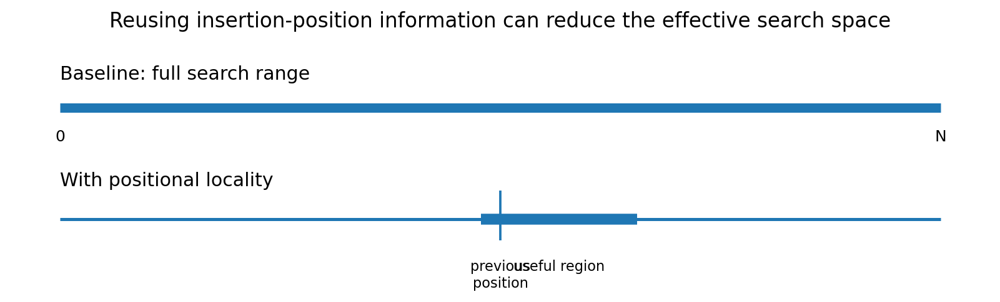
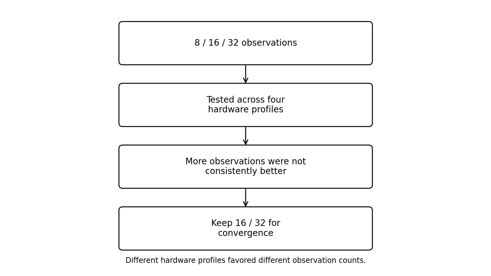
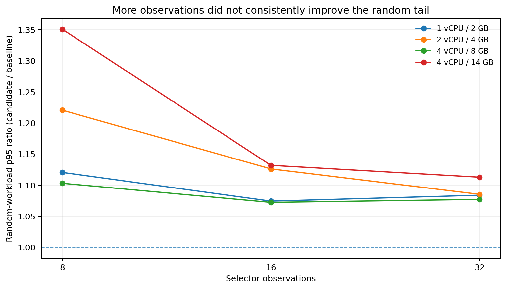
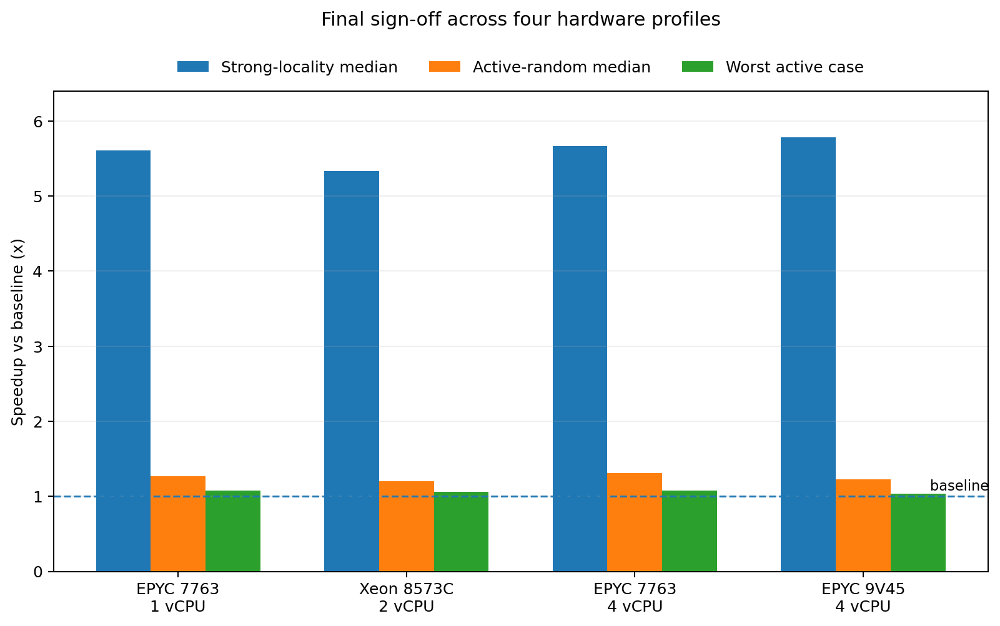
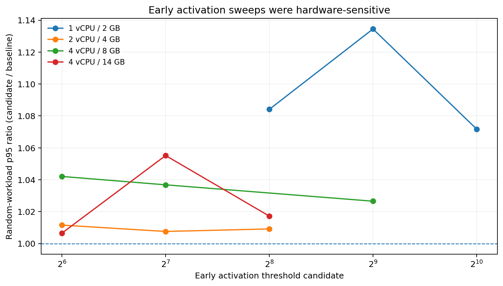
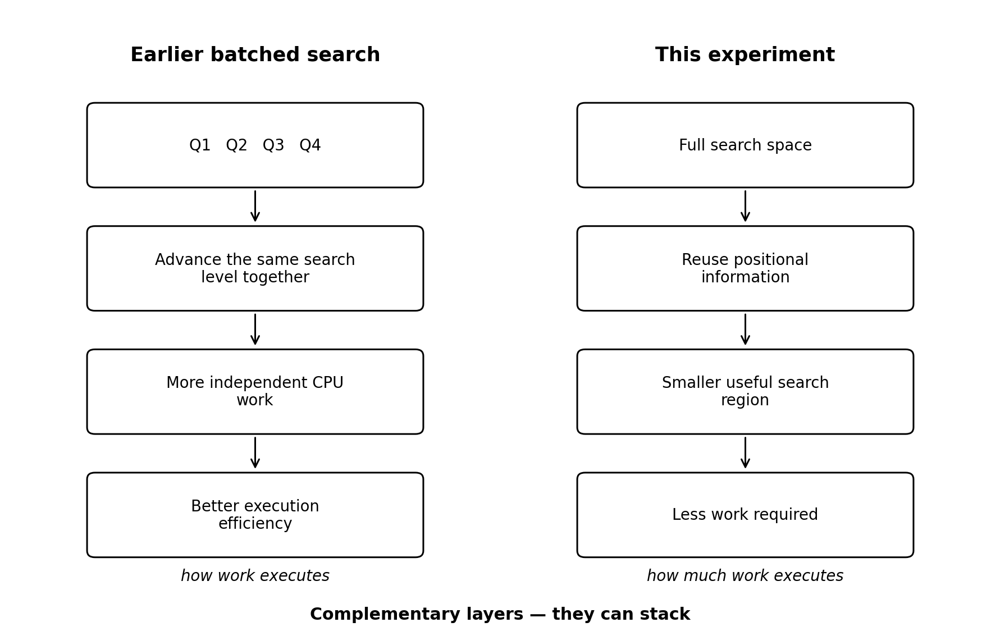

I did not start from `np.searchsorted`.

The idea came from a broader question I had been exploring in my own infrastructure work:

**Has the system already paid for information that we are about to compute again?**

In my [CoreFoundry project](https://github.com/Johnny-Kao/CoreFoundry-Project), one recurring principle was simple: before adding more hardware or parallelism, first remove work that never needed to happen.

That same question eventually led me to `np.searchsorted`.

## Reusing information that already exists

`np.searchsorted` finds insertion positions in a sorted array.

Conceptually, every query can begin with the entire search space:

```text
0                                                     N
|-----------------------------------------------------|
```

But suppose several nearby queries produce insertion positions like:

```text
500000
500004
500009
500013
500018
```

After the first search, the next one is no longer starting with zero information.

The previous insertion position is not only an output. When the workload has positional locality, it also contains information about where the next search is likely to land.

```text
0                         p                           N
|-------------------------|---------------------------|
                          [---- useful region ----]
```

That became the basic idea of the experiment: reuse information already produced by the search to reduce the amount of subsequent search work.

There was one important constraint.

Detecting locality should not require another full pass over the query array. An additional $O(Q)$ scan just to decide whether an optimization should run could easily consume the performance benefit.

Instead, the implementation uses intermediate position information already produced by the existing batched search.



_Figure 1. Positional locality can reduce the effective search space without adding a separate scan of the query array._

## Knowing when to use it

The optimization itself was relatively simple.

Deciding when to use it was harder.

Compare these two workloads:

```text
Strong locality

100001
100004
100009
100013
100018
```

and:

```text
Random movement

100001
870003
2401
650002
12000
```

Both have previous insertion positions.

Only the first has previous positions that provide useful information about the next search.

So the problem became: **how much locality is enough to justify a different search path?**

I tested different selector configurations across multiple hardware profiles.

One focused experiment compared **8, 16, and 32 observations** across four hardware profiles.

The important result was simple: more observations were not consistently better. Some systems favored 16, while others favored 32.



_Figure 2. The observation-count experiment narrowed the later search space: 8 was dropped, while 16 and 32 were carried forward for convergence testing._

Those later experiments produced another useful result: once the basic selector was already rejecting random workloads reliably, adding more decision rules did not help. More complicated policies mainly rejected useful local cases.

At that point, the remaining problem was no longer classification.

It was overhead.



_Figure 3. Focused selector experiment at level 4. Lower is better; the best observation count varies by hardware profile, so increasing from 16 to 32 was not uniformly beneficial._

## What the benchmarks showed

The final sign-off covered four logical resource profiles and 72 workload cases per profile, for 288 case/profile combinations.

The matrix included:

- `int32`, `int64`, and `float64`
- `side="left"` and `side="right"`
- dense and duplicate-heavy arrays
- strong-locality workloads
- random workloads
- reversal-heavy patterns
- cases above and below the activation threshold

Across the final profiles, strong-locality workloads showed median speedups of roughly **5.3–5.8x**.

| Runner                             | Strong-locality median | Active-random median | Worst active case |
| ---------------------------------- | ---------------------: | -------------------: | ----------------: |
| AMD EPYC 7763 / 1 vCPU             |                  5.61x |                1.27x |             1.08x |
| Intel Xeon Platinum 8573C / 2 vCPU |                  5.33x |                1.20x |             1.06x |
| AMD EPYC 7763 / 4 vCPU             |                  5.67x |                1.31x |             1.08x |
| AMD EPYC 9V45 / 4 vCPU             |                  5.78x |                1.23x |             1.04x |



_Figure 4. Final sign-off results. Strong-locality workloads gained more than 5x across all four profiles, while active random workloads and the worst active cases remained above baseline._

Earlier matrices showed the same pattern from another angle:

- dense workloads at roughly `0.16-0.19x` baseline runtime
- duplicate-heavy workloads at roughly `0.13-0.15x`
- medium-locality workloads at roughly `0.38-0.47x`

The important result was not simply the largest speedup.

For a general-purpose numerical library, improving one workload while causing unpredictable regressions elsewhere is not a good trade.

The more useful result was that the local path could produce large gains while unrelated workloads remained on, or close to, the existing execution path.

## Why the threshold exists

Initially, I expected locality alone to determine whether the optimization should run.

The benchmarks showed otherwise.

Even when locality exists, the workload has to be large enough to amortize the cost of observation, selection, branching, and path management.

At smaller query counts, it is possible to remove search work while still increasing wall-clock time.

This led to a separate activation gate.

For the final validation, I used

$Q \ge 2^{20}$

as a conservative activation gate.

There is nothing mathematically special about $2^{20}$. Earlier activation sweeps already showed why a portable gate needed to be conservative: three tested profiles could converge on a low activation candidate in that experimental setup, while the 1-vCPU / 2-GB profile failed the second-stage stability gate entirely.



_Figure 5. Early activation sweeps were hardware-sensitive. Three profiles converged on low candidates in this experiment, while the 1-vCPU / 2-GB profile failed the second-stage stability gate. This exploratory sweep motivated a more conservative portable policy; it does not directly define the final $2^{20}$ gate._

The exact crossover therefore depends on the machine and on the surrounding selector design. The final validation gate was intentionally more conservative than those early exploratory thresholds.

A useful reminder from this experiment: **a cheaper algorithmic path is not automatically a faster CPU path.**

## Then I found the earlier NumPy optimization

Only after implementing and validating this work did I come across [NumPy PR #30517](https://github.com/numpy/numpy/pull/30517) and the Scientific Python article [Making `np.searchsorted` up to 25x Faster in NumPy 2.5](https://blog.scientific-python.org/numpy/searchsorted/).

What was interesting was that the earlier work and this experiment were optimizing different layers of the same problem.



_Figure 6. The earlier batched-search work improves execution efficiency; this experiment reduces the amount of work. The two approaches are complementary and can stack._

The earlier work improves **how the searches execute**. This experiment focuses on **how much searching is necessary**.

## A second layer of optimization

This was the part of the experiment I found most useful beyond `searchsorted`.

Performance work often begins with: **How can this computation execute faster?**

But there is another question worth asking: **Does all of this computation still need to happen?**

Modern CPUs can gain substantially from batching, overlapping independent work, and improving memory behavior.

But after making execution more efficient, another opportunity may remain: use information the program has already produced to remove work entirely.

In this case, insertion positions were not just outputs.

They were structure.

And reusing that structure exposed another layer of performance.

A NumPy implementation of this experiment is currently under review in [PR #32895](https://github.com/numpy/numpy/pull/32895). The results discussed here describe the performance experiment itself rather than the outcome of that review.

The code and related experiments are available through [my GitHub profile](https://github.com/Johnny-Kao).
