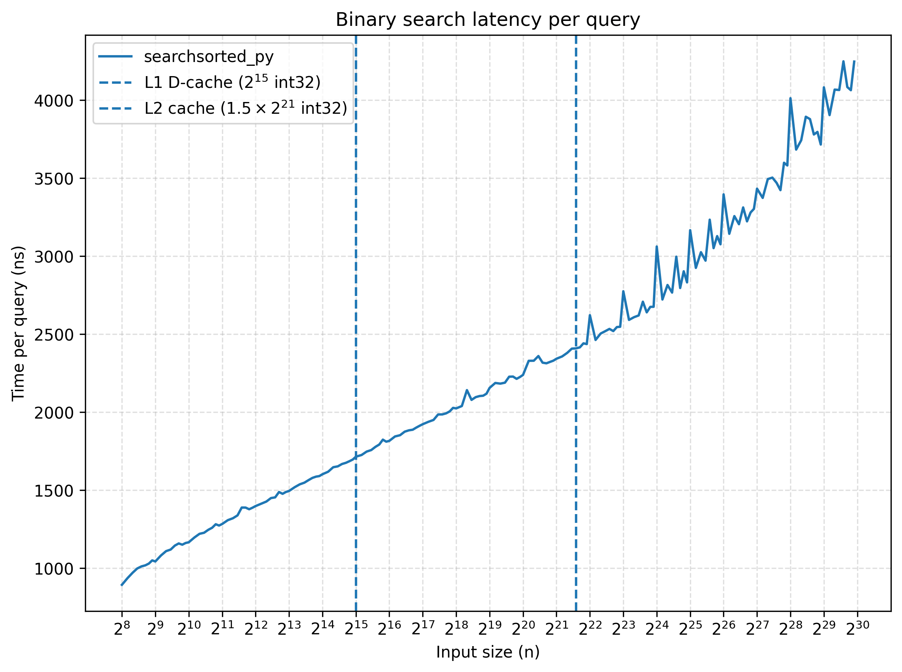
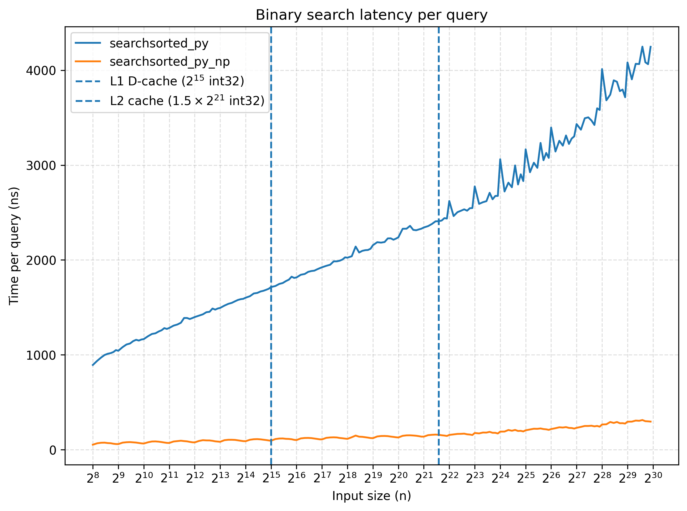
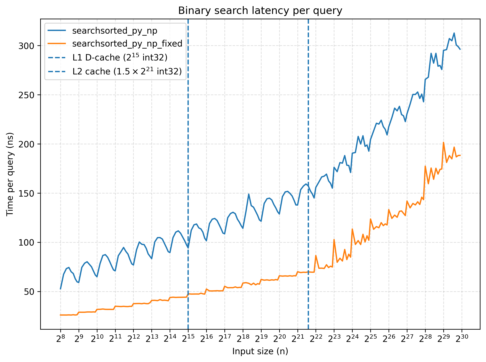
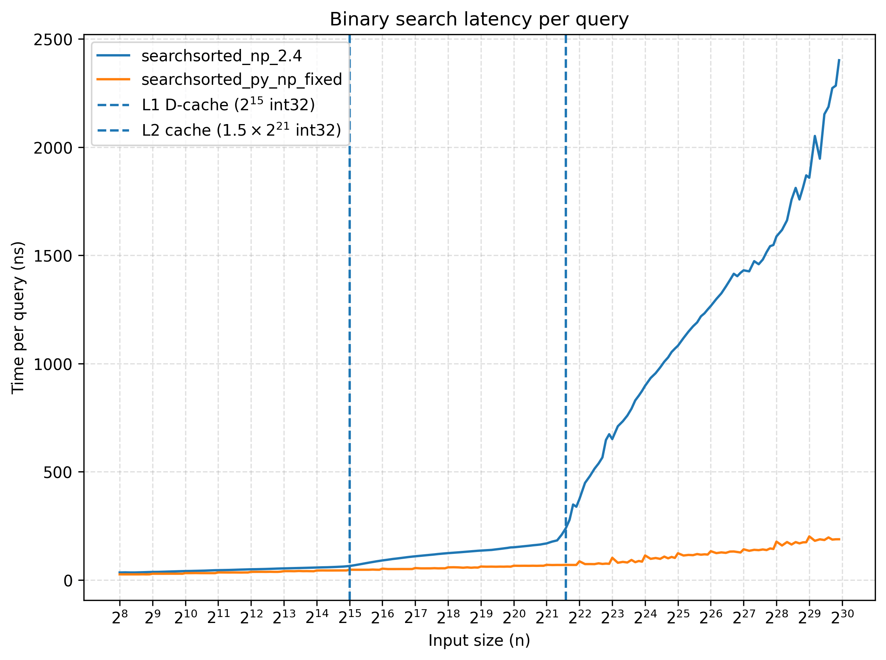
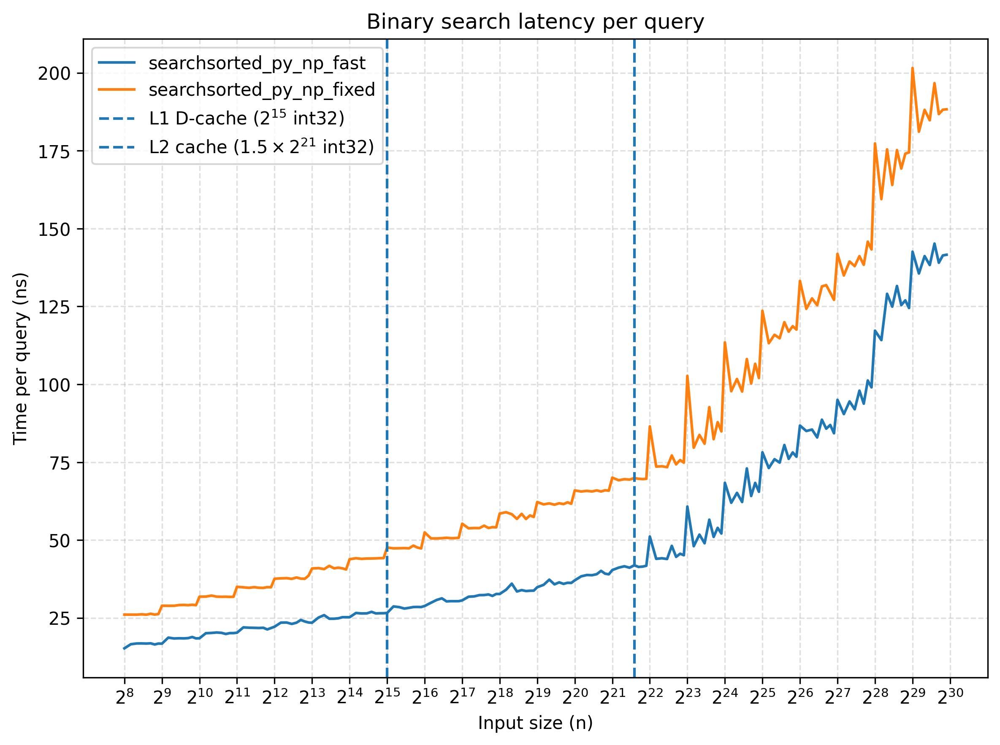
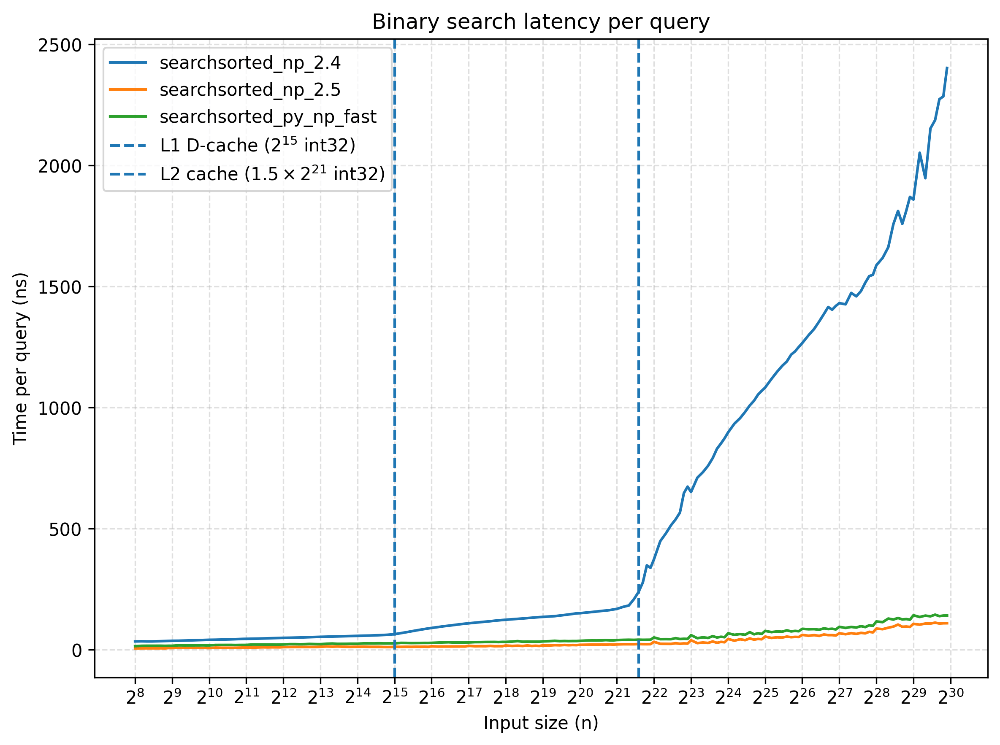
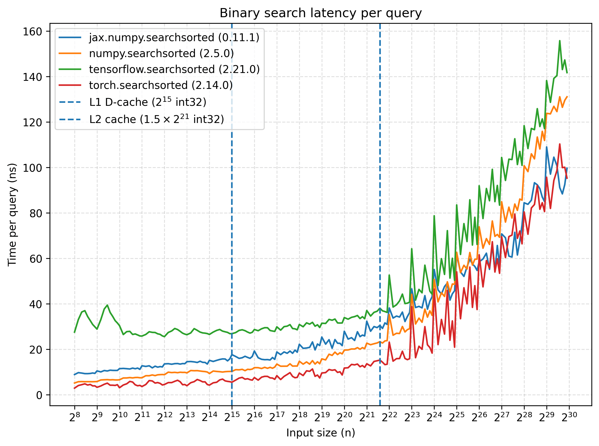
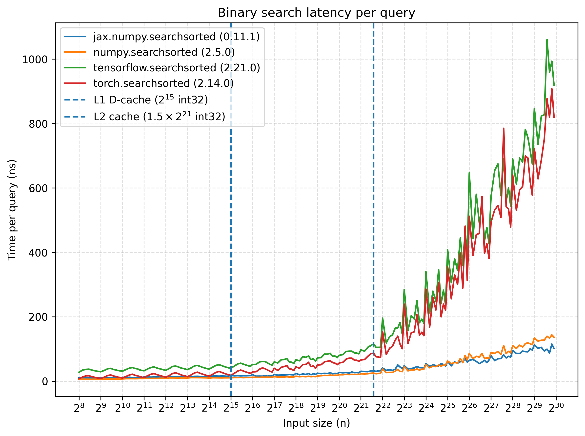

`np.searchsorted` is NumPy's implementation of the binary search algorithm. This is one of the fundamental search algorithms and is used in the Python scientific ecosystem for functionality such as histogram computation and interval lookups. Any optimization benefits libraries like SciPy, scikit-learn, and much of the Python scientific ecosystem.

Several case studies such as [Binary search variants and the effects of batching](https://curiouscoding.nl/posts/binsearch/) and [Algorithmica's Binary Search case study](https://en.algorithmica.org/hpc/data-structures/binary-search/) explore techniques such as branch elimination, batching, and cache-friendly data layouts to make binary search faster on modern processors. In this post we explore how those ideas can be expressed using NumPy's vectorized primitives.

We will derive a vectorized formulation that outperforms NumPy 2.4's searchsorted implementation, and then port the resulting algorithm back into NumPy. The change was included in NumPy 2.5, achieving up to a 25× speedup in our benchmarks.

`searchsorted` is also part of the [Python Array API Standard](https://data-apis.org/array-api/latest/API_specification/generated/array_api.searchsorted.html#array_api.searchsorted). This allows us to compare how different array libraries implement the same operation and exploit parallelism.

## Problem definition

Given a static sorted array and a sequence of query keys, find the insertion position of each key in the array.

A classic pure-Python implementation runs one binary search per key:

```python
def searchsorted_py(a, xs):
    res = np.empty(len(xs), dtype=np.int32)

    for i, x in enumerate(xs):
        lo = 0
        hi = len(a)

        while lo < hi:
            mid = (lo + hi) // 2
            if a[mid] < x:
                lo = mid + 1
            else:
                hi = mid

        res[i] = lo

    return res
```



Running time per query grows logarithmically as the input size grows (note the log scale of X-axis).

For benchmarking, we generated two random arrays of uniformly distributed `np.int32` integers. The keys (i.e. the elements being searched) had a fixed length of 10,000, while we vary the length of the values up to $2^{30}$ ($4\ GiB$). Both keys and values arrays are contiguous in memory. Each benchmark was repeated 50 times, and we report the minimum execution time.

The benchmarks were run on a MacBook Pro with an Apple M1 Pro and 32 GB of memory. The M1 Pro has 128 KB of L1 data cache per performance core, enough to hold $2^{15}$ 32-bit integers, and a 12 MB L2 cache shared by its performance cores, enough to hold $1.5 * 2^{21}$ 32-bit integers.

## Can we make this faster? Batching with NumPy arrays

The baseline implementation performs one binary search per query. Each search is independent, but executed sequentially in Python. We can adapt the algorithm so multiple binary searches make progress together in batches. For that we can represent the state of all searches as arrays and update them simultaneously using vectorized operations.

In NumPy, operations on arrays are executed in compiled C++ loops. This removes Python overhead and allows the CPU to efficiently process large batches of independent work.

## Let's vectorize our binary search

To vectorize the algorithm, we reinterpret scalar variables as array state. Instead of a single `lo` and `hi`, we maintain one value per query. In our original implementation, the state consists of `lo`, `hi`, and `res`. Since `lo` ends up containing the final result, we can focus on tracking just `lo` and `hi`.

This is our first vectorized attempt, which is a direct translation of the previous implementation.

```python
def searchsorted_py_np(a, xs):
    lo = np.zeros(xs.shape, dtype=np.int32)
    hi = np.full(xs.shape, len(a), dtype=np.int32)

    while True:
        # True for each element position where lo_i < hi_i
        active = lo < hi
        if not np.any(active):
            # this is basically `while lo < hi:` in pure-python version
            break

        mid = (lo + hi) // 2

        # only index where active, so we don't break already computed positions
        mid_a = mid[active]
        xs_a = xs[active]

        mask = a[mid_a] < xs_a

        lo[active] = np.where(mask, mid_a + 1, lo[active])
        hi[active] = np.where(mask, hi[active], mid_a)

    return lo
```



In this implementation, different queries can shrink their search intervals at different rates, so they may require different number of iterations to converge to the final answer.

For example, when searching for the keys `[-1, 2]` in the array `[0, 1]`. For the query `2`, the first iteration computes `mid = 1`, and the update immediately sets `lo = mid + 1 = 2`, so the interval becomes `[2, 2)` and the search converges in one step. For the query `-1`, the update instead keeps shrinking the upper bound `(hi = mid = 1)`, resulting in a remaining interval `[0, 1)` after the first step. This requires an additional iteration before it fully collapses to `[0, 0)`.

Because the queries can converge at different times, we need to keep track of which queries are still active. The active mask identifies the queries whose search intervals have not yet converged, allowing us to update only those queries.

### Making all searches take the same number of steps

The important observation is that binary search does not actually need to terminate independently for each key. We can tweak each iteration update in a way that, once a search has converged, subsequent iterations can leave its interval unchanged.

We maintain the invariant that the insertion position lies in `[lo, hi)`. At each iteration, every interval is reduced to roughly half its previous size. After `np.ceil(np.log2(n))` iterations, every interval has collapsed to a single position.

For simplicity, this implementation assumes a is non-empty.

```python
def searchsorted_py_np_fixed(a, xs):
    n = len(a)
    lo = np.zeros(xs.shape, dtype=np.int32)
    hi = np.full(xs.shape, n, dtype=np.int32)

    for _ in range(int(np.ceil(np.log2(n)))):
        mid = (lo + hi) // 2
        go_left = xs <= a[mid]

        # for each position i:
        # if go_left_i is True, we keep the `lo_i` value and `hi_i` is updated to `mid_i`
        # if go_left_i is False, we keep the `hi_I` value and `lo_i` is updated to `mid_i`
        lo = np.where(go_left, lo, mid)
        hi = np.where(go_left, mid, hi)

    return hi
```

Removing the `active` tracker makes it up to 2x faster.



This implementation can already be found in the Python ecosystem. Note the similarity to [JAX’s scan-based implementation](https://github.com/jax-ml/jax/blob/a6e4a8b95a731269bdf23e5b3e30da2f8494bb28/jax/_src/numpy/hijax.py#L330)

```python
...


def body_fun(state, _):
    low, high = state
    mid = low + (high - low) // 2  # use this form to avoid overflow
    go_left = op(query, sorted_arr[mid])
    return (lax.select(go_left, low, mid), lax.select(go_left, mid, high)), ()


n_levels = int(np.ceil(np.log2(n + 1)))
...
```

### Can NumPy beat NumPy?

Let’s compare the performance of this vectorized implementation with NumPy’s native `searchsorted` (using NumPy 2.4).



We can see that our vectorized Python implementation can be an order of magnitude faster than the native one for inputs with several keys. To understand why, let's take a look at `NumPy 2.4` implementation:

```cpp
template <class Tag, side_t side>
static void
binsearch(const char *arr, const char *key, char *ret, npy_intp arr_len,
          npy_intp key_len, npy_intp arr_str, npy_intp key_str,
          npy_intp ret_str, PyArrayObject *)
{
    using T = typename Tag::type;
    auto cmp = side_to_cmp<Tag, side>::value;
    npy_intp min_idx = 0;
    npy_intp max_idx = arr_len;
    T last_key_val;

    if (key_len == 0) {
        return;
    }
    last_key_val = *(const T *)key;

    for (; key_len > 0; key_len--, key += key_str, ret += ret_str) {
        const T key_val = *(const T *)key;
        /*
         * Updating only one of the indices based on the previous key
         * gives the search a big boost when keys are sorted, but slightly
         * slows down things for purely random ones.
         */
        if (cmp(last_key_val, key_val)) {
            max_idx = arr_len;
        }
        else {
            min_idx = 0;
            max_idx = (max_idx < arr_len) ? (max_idx + 1) : arr_len;
        }

        last_key_val = key_val;

        while (min_idx < max_idx) {
            const npy_intp mid_idx = min_idx + ((max_idx - min_idx) >> 1);
            const T mid_val = *(const T *)(arr + mid_idx * arr_str);
            if (cmp(mid_val, key_val)) {
                min_idx = mid_idx + 1;
            }
            else {
                max_idx = mid_idx;
            }
        }
        *(npy_intp *)ret = min_idx;
    }
}
```

Ignoring pointer arithmetic details, the core algorithm is a classic binary search executed independently for each key. There is also an optimization that reuses previous search bounds when the input keys are sorted.

This implementation performs one binary search per key, where each search is a fully sequential process. Each iteration of the binary search depends on the result of the previous one (the midpoint determines which part of the array is inspected next). This creates a dependency chain within each search: the next memory access depends on the result of the previous comparison.

For large arrays, binary-search reads also tend to be cache-unfriendly, since each step may require a read at different cache-lines. The sequential implementation is hit harder by cache misses, given that each step is blocked awaiting for previous step read.

The vectorized implementation performs the same logical step across all queries at once (all queries advance each step together). With multiple independent searches, the CPU can have several memory accesses in flight at once. This aligns with the observed running time once array size exceed L1 and L2 cache sizes.

### Can we optimize NumPy?

The previous vectorized implementation maintains two arrays, `lo` and `hi`, to represent the search interval for each query. If we were to port this exact implementation into NumPy natively, it would require using $O(K)$ extra memory where `K` is the number of queries. Even though potentially faster, this is unacceptable for memory-sensitive workloads.

To reduce the state required, we can reinterpret binary search in terms of interval boundaries. Instead of tracking both `lo` and `hi` for each query, we describe each interval using its left boundary and its length.

The key observation is that if we structure the algorithm so that all queries shrink their intervals at the same rate, then every interval has the same length at each iteration. This means we do not need to store a separate `hi` per query: it can be reconstructed from a single array `lo` and a global length. Note that this still needs $O(K)$ space for the output, but it requires only $O(1)$ memory beyond that output.

This gives us this Python implementation:

```python
def searchsorted_py_np_fast_where(arr, keys):
    K = keys.shape[0]
    length = arr.shape[0]

    base = np.zeros(K, dtype=np.intp)

    # Invariant: the insertion index lies in [base, base + length]
    while length > 1:
        half = length >> 1
        mid = base + half
        base = np.where(keys > arr[mid], mid, base)
        length -= half

    # Final step: result is either base and base + 1
    base = np.where(keys > arr[base], base + 1, base)

    return base
```

Only a single array base is needed to store the per-query state, while length is shared across all queries. The output is written directly into base, so no additional state array is required (though a temporary `mid` array is still allocated each iteration to hold mid, this can be avoided in C++ port).

This is closely related to the branchless binary search approach, as you can see in [Algorithmica's case study](https://en.algorithmica.org/hpc/data-structures/binary-search/#removing-branches). Note that `np.searchsorted` computes the insertion position, so the invariant range is `[base, base + length]`. A final step is then required when `length = 1` to resolve whether the insertion point falls to the left or right of `base`.

Let's evaluate its performance:



It’s faster!

### Porting it into C++

The performance results show the benefit of reducing the per-query state. We can now translate it almost directly into C++ with $O(1)$ extra memory.

```cpp
template <class Tag, side_t side>
static void
binsearch(const char *arr, const char *key, char *ret, npy_intp arr_len,
          npy_intp key_len, npy_intp arr_str, npy_intp key_str,
          npy_intp ret_str, PyArrayObject *)
{
    using T = typename Tag::type;
    auto cmp = side_to_cmp<Tag, side>::value;

    // If the array length is 0 we return all 0s
    if (arr_len <= 0) {
        for (npy_intp i = 0; i < key_len; ++i) {
            *(npy_intp *)(ret + i * ret_str) = 0;
        }
        return;
    }

    /*
    base = np.zeros(K, dtype=np.intp)

    We unroll the first iteration for the following reasons:
        1. ret is not initialized with the bases, so we save |keys| writes
        by not having to initialize it with 0s.
        2. By assuming the initial base for every key is 0, we also save
        |keys| reads.
        3. In the first iteration, all elements are compared against the
        median. So we can store it in a variable and use it for all keys.

    This initial block replaces the initialization loop that is used for the
    arr_len==0 case. Note that when arr_len = 1, then half is 0 so the
    following block initializes the array as with 0s.
    */
    npy_intp interval_length = arr_len;
    npy_intp half = interval_length >> 1;
    interval_length -= half; // length -> ceil(length / 2)

    npy_intp base = 0;
    const T mid_val = *(const T *)(arr + (base + half) * arr_str);

    for (npy_intp i = 0; i < key_len; ++i) {
        const T key_val = *(const T *)(key + i * key_str);
        *(npy_intp *)(ret + i * ret_str) = cmp(mid_val, key_val) * half;
    }

    /*
        while length > 1:
            half = length >> 1
            length -= half
            mid = base + half
            base = np.where(keys > arr[mid], mid, base)
    */
    while (interval_length > 1) {
        npy_intp half = interval_length >> 1;
        interval_length -= half;

        for (npy_intp i = 0; i < key_len; ++i) {
            npy_intp &base = *(npy_intp *)(ret + i * ret_str);
            const T mid_val = *(const T *)(arr + (base + half) * arr_str);
            const T key_val = *(const T *)(key + i * key_str);
            base += cmp(mid_val, key_val) * half;
        }
    }

    // base = np.where(keys > arr[base], base + 1, base)
    for (npy_intp i = 0; i < key_len; ++i) {
        npy_intp &base = *(npy_intp *)(ret + i * ret_str);
        const T key_val = *(const T *)(key + i * key_str);
        base += cmp(*(const T *)(arr + base * arr_str), key_val);
    }
}
```

Note that we exploited a property of the first iteration of the binary search. Because the initial value of every result entry is implicitly zero, we can skip writing and reading those values during the first iteration. Moreover, in the first iteration all elements are compared against the same median, so we can read its value once instead of `K` times.

This implementation was ported directly into NumPy as part of PR [#30517](https://github.com/numpy/numpy/pull/30517), which was included as part of [2.5 release](https://numpy.org/devdocs/release/2.5.0-notes.html#improved-performance-of-numpy-searchsorted).

Now let's do a final comparison between both 2.4 and 2.5 releases and our vectorized Python implementation:



The native 2.5 version is slightly faster than the vectorized Python one and up to 25 times faster than 2.4 release!

### Ecosystem Comparison

We can compare our optimized NumPy 2.5 against other libraries in the ecosystem. For this experiment we picked Python libraries JAX, Tensorflow, and PyTorch.

Libraries Tensorflow and PyTorch follow a different approach than JAX and NumPy. While JAX and NumPy leverage vectorized/batched operations to hide memory latency, Tensorflow and PyTorch parallelize independent searches across CPU threads. Search keys are partitioned in batches that are processed by different threads. For more details, see [PyTorch](https://github.com/pytorch/pytorch/blob/b1bb860d3c812371b89a9725407230216e7369b5/aten/src/ATen/native/Bucketization.cpp#L88) and [Tensorflow](https://github.com/tensorflow/tensorflow/blob/bb8d3f2443d70ec8c2aae1288fbf5782c771aa60/tensorflow/core/kernels/searchsorted_op.cc#L67) implementations.

In the benchmarks, we limited parallelism to up to 8 cores and we increased the amount of keys to search in from 10,000 to 20,000 to allow multi-threaded implementations to fully leverage parallelism. This gives the multithreaded implementations enough independent work to amortize thread scheduling overhead.



We can see that NumPy is competitive with respect to the selected libraries in our benchmarks. All implementations exhibit similar behavior once the search array grows beyond the CPU cache.

If we disable multithreading, the performance of PyTorch and Tensorflow degrades and present a similar trend as our previous Numpy 2.4 implementation. Once the search array grows beyond the CPU cache, the cost of memory accesses dominates.



It would be worth benchmarking whether both techniques could be combined: batching binary searches within each thread. However, once the memory subsystem becomes saturated, additional cores might compete for the same memory bandwidth. At that point, improving the memory access patterns may be a more promising direction, for example by using a different layout such as the Eytzinger layout (discussed in detail in the [Algorithmica book](https://en.algorithmica.org/hpc/data-structures/binary-search/#eytzinger-layout)).

### Conclusion

We made `np.searchsorted` up to 25 times faster in our benchmarks. Given NumPy's reach in the Python ecosystem, this optimization will benefit several libraries that depend on it. Other libraries in the Python ecosystem with their own binary search implementation may also benefit from adopting a similar batched implementation.

Interestingly, we used NumPy array primitives to derive an initial Python implementation that was able to outperform NumPy 2.4 implementation. This shows how powerful NumPy's array primitives can be to implement highly performant algorithms. A vectorized NumPy implementation in Python can outperform a scalar C++ one when leveraging independent work.

Cache-friendly layouts such as the Eytzinger layout are another interesting direction for making `searchsorted` faster. It would be interesting to explore whether array APIs could expose such layouts through an interface like `searchsorted(arr, keys, layout="eytzinger")`, although this would require carefully defining the API semantics since the Eytzinger representation is not sorted.
