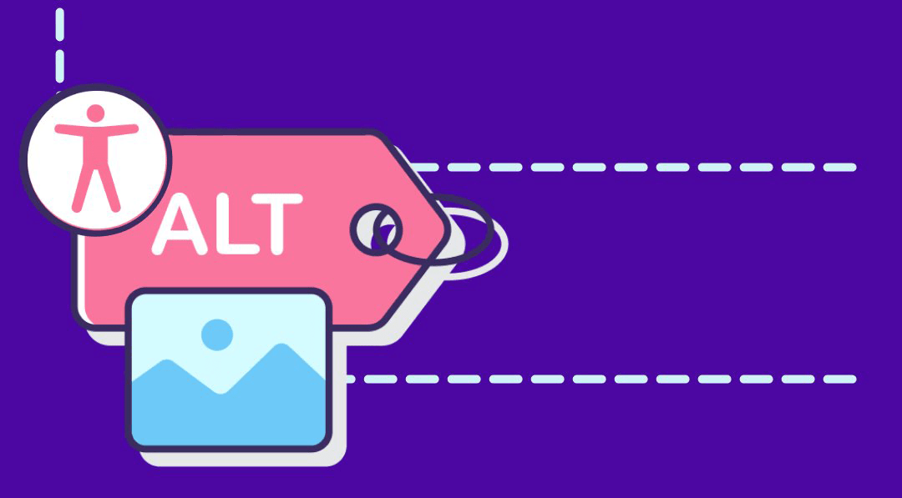

The Scientific Python blog has just gotten a little more accessible! If you 
didn't catch our [invite on Twitter](https://twitter.com/scientific_py/status/1523733881651834880) 
or run into the problem firsthand, there's a good chance you might not have 
noticed the new descriptions for a number of blog post images.

Since it's not a flashy improvement, we wanted to make a point to highlight 
the community effort to to make a more accessible blog--and internet as a 
whole--last week.

## What did we do?

In the spirit of [Scientific Python's mission to build community-developed and 
inclusive spaces](https://scientific-python.org/about/), the project had its 
first image description workshop on May 13, 2022. We gathered to learn about 
and practice writing about images from the ground up. Image descriptions--
[often called `alt text`](https://developer.mozilla.org/en-US/docs/Web/API/HTMLImageElement/alt)--
are one of many accessibility considerations that people making content are 
responsible for. 
[Missing alt text is among the most common culprits of inaccessible content on the internet](https://webaim.org/projects/million/#alttext). 
Fortunately, missing alt text has a clear fix even for those new to with 
accessibility: describe the image based on its context.

During this event, thirteen people wrote 23 image descriptions to improve 11 
blog posts in one hour (plus the time for post-event feedback 😉). Wow! The 
images covered range from illustrative additions, to creative tutorials, to 
charts that carry the message of the blog post, so it provides great set of 
examples on how to consider 
[writing alt text in different situations](https://www.w3.org/WAI/tutorials/images/decision-tree/).

That's not even counting the many questions, discussions, and ephiphanies that 
happened during out work time. Learning can't be captured as easily by a 
number, but a taste of our less quantifiable wins can be found on 
[the workshop recording](https://youtu.be/Zn-zyU2lS0k).

## Want to learn more?

If you want to further explore the experience and relive the joy, you can find 
resources on the [event agenda](https://hackmd.io/bfhftUCiTRqx2S8CTGUt6g?view), 
discussions on the [working pull request](https://github.com/MarsBarLee/blog.scientific-python.org/pull/1), 
and the final steps needed to make change on the [contributing pull request](https://github.com/scientific-python/blog.scientific-python.org/pull/71).

But wait, there's more! While the community made great progress on improving 
the blog, the work to add or imporve alt text on Scientific Python's blog, 
website, and documentation is ongoing. You can continue these efforts by

- Contributing as an individual! There's no reason you can't write some image descriptions for your favorite blog post to make it even better. (👀 This is a great excuse to find a new favorite blog post.)
- Contributing as a group! Collect your friends, co-workers, neighbors, local book club attendees, or others to team up and write alt text. (Help for duplicating the process of our group PR can be found [on the draft event documentation](https://github.com/isabela-pf/a11y-events/tree/main/workshop-resources/alt-text).)
- Staying in touch for annoucements of future contributing events on the [Scientific Python Twitter](https://twitter.com/scientific_py).

---

*This image description event has been run across multiple open-source projects in the scientific computing ecosystem. [Reach out via issue](https://github.com/alt-text-task-force) if you are interested in running a similar event on a project you are part of.* ❤️