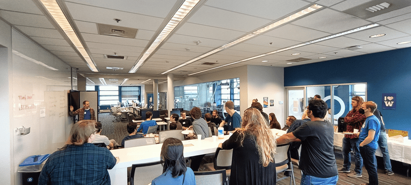
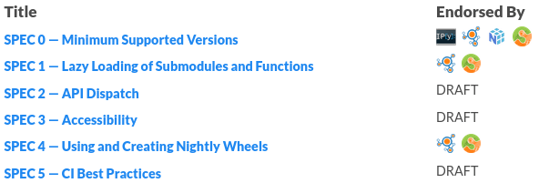
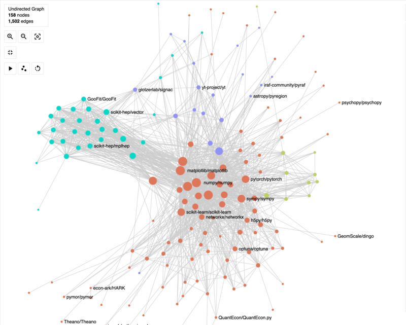

The first [Scientific Python Developer Summit](https://scientific-python.org/summits/developer/2023/) (May 22-26, 2023) brought together 34 developers at the eScience Institute at the University of Washington to develop shared infrastructure, documentation, tools, and recommendations for libraries in the Scientific Python ecosystem.

## Pre-summit planning

Prior to the summit we held several hour-long planning meetings:

- [General (2023-02-27)](https://scientific-python.org/summits/developer/2023/general-planning/)
- [May 15, Package metrics, DevStats](https://hackmd.io/UNwG2BjJSxOUJ0M1iWI-nQ)
- [May 15, SPECs](https://hackmd.io/MmbP4VTATyG129_U56xdJQ)
- [May 18, Community & Documentation](https://hackmd.io/YL5DNtsaSsS-1ZU3Pxkrxg)
- [May 19, Build Systems & CI Infrastructure](https://hackmd.io/0M1Yh7KwTnaXSsU14BiyQw)
- [May 19, PyTest plugins & Sphinx extentions](https://hackmd.io/JL5slkxORA-q7VRN79v1sA)

## Summit execution

At the summit, we had a brief check-in and then split into several groups based on each developers time and interests. Raw work progress and log have been collected in a [document](https://hackmd.io/iEtdfbxfSbGwOAJTXmqyIQ?both), we highlight just a few of things we accomplished below:

### Sparse arrays

Almost a quarter of the group worked on [sparse arrays](https://scientific-python.org/summits/sparse/) for the entire week.
This work is part of a larger, [multi-year effort](https://scientific-python.org/grants/sparse_arrays/) to improve and expand SciPy's
[sparse array API](https://github.com/scipy/scipy/pull/14822), which will eventually
involve removing the sparse matrix API and eventually `np.matrix`.

More details can be found in the [Developer Summit 1: Sparse](https://blog.scientific-python.org/scientific-python/dev-summit-1-sparse/) blog post.

### Scientific Python Ecosystem Coordination documents

We made significant progress on several [SPECs](https://scientific-python.org/specs/), which had been drafted during previous sprints.

[SPEC 0---Minimum Supported Versions ](https://scientific-python.org/specs/spec-0000), an updated and expanded recommendation similar to
the [NEP 29](https://numpy.org/neps/nep-0029-deprecation_policy.html), was discussed and endorsed by several
[core projects](https://scientific-python.org/specs/core-projects/).

[SPEC 1---Lazy Loading of Submodules and Functions](https://scientific-python.org/specs/spec-0001/) was discussed and endorsed by
two [core projects](https://scientific-python.org/specs/core-projects/).

[SPEC 2---API Dispatch](https://scientific-python.org/specs/spec-0002/) was discussed (in a follow-up video meeting just after the summit)
and is in the process of being marked as `withdrawn` or something similar.

[SPEC 3---Accessibility](https://scientific-python.org/specs/spec-0003/) was discussed and updated. We hope to see it endorsed by
several core projects in the near future.

[SPEC 4---Using a creating nightly wheels](https://scientific-python.org/specs/spec-0004/) was rewritten, a helper GitHub action
[upload-nightly-action](https://github.com/scientific-python/upload-nightly-action) was created, and PRs to update the various
projects to use the new [nightly wheels location](https://anaconda.org/scientific-python-nightly-wheels/) were made. The updates
are now complete and the SPEC was endorsed by two core projects.

We anticipate several more core projects to endorse the existing SPECs over the coming months and we are now holding regular
SPEC steering committee meetings to continue developing and expanding the SPECs.

### Community building

We created a comprehensive [community guide](https://learn.scientific-python.org/community/) to empower projects in fostering their communities. This guide includes essential information on the role of community managers, along with practical strategies for community meetings, outreach, onboarding, and project management.

### Development Documentation

We created a [development guide](https://learn.scientific-python.org/development/),
a [new project template](https://github.com/scientific-python/cookie),
and [existing project review](https://learn.scientific-python.org/development/guides/repo-review/).

### Serendipitous Collaboration

One of the fun things that happens at summits like these are the chance encounters of people from different projects.
For example, a couple of attendees worked on creating a co-collaboration network across the broader scientific python ecosystem.
This gave us the opportunity to look at how contributors collaborate across projects.
We could see how the bigger projects were all clustered together as there are multiple contributors who share maintenance duties for multiple projects.
We could also, for example, see how the Scikit-HEP cluster was a bit further away from the usual scientific Python cluster.
An action item for us :) We need more collaboration!!

### Pytest plugins/Sphinx extensions

Several attendees worked on pytest plugins and Sphinx extensions:

- [pytest-regex](https://github.com/tylerjereddy/pytest-regex) was created to support selecting tests with regular expressions.

- [pytest-doctestplus](https://github.com/scientific-python/pytest-doctestplus) was moved upstream into the Scientific Python organization.
  The summit provided new momentum to develop new features (e.g. produce updated docstring), and to use it for the NumPy documentation testing.

- sphinx-scientific-python, a new extension as a home for various features from the ecosystem, e.g.,
  we agreed on bringing existing extensions from MNE tools to this extension.

- pydata-sphinx-theme updates

<!--

### SciPy release management progress

-->

<!--

### Lecture notes
-->

### Package metrics

We factored out a general [developer statistics package](https://github.com/scientific-python/devstats)
from our prototype [developer statistics website](https://devstats.scientific-python.org/).

<!--

## Post-summit implementation

We are still in the process of
-->
