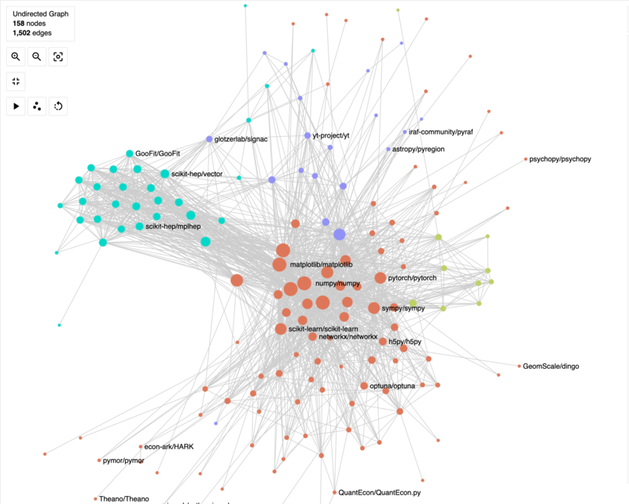

The first [Scientific Python Developer Summit](https://scientific-python.org/summits/developer/2023/) (May 22-26, 2023) brought together 34 developers at the eScience Institute at the University of Washington to develop shared infrastructure, documentation, tools, and recommendations for libraries in the Scientific Python ecosystem.

## Pre-summit planning

Prior to the summit we held several hour-long planning meetings:

- [General (2023-02-27)](https://scientific-python.org/summits/developer/2023/general-planning/)
- [May 15, Package metrics, DevStats](https://hackmd.io/UNwG2BjJSxOUJ0M1iWI-nQ)
- [May 15, SPECs](https://hackmd.io/MmbP4VTATyG129_U56xdJQ)
- [May 18, Community & Documentation](https://hackmd.io/YL5DNtsaSsS-1ZU3Pxkrxg)
- [May 19, Build Systems & CI Infrastructure](https://hackmd.io/0M1Yh7KwTnaXSsU14BiyQw)
- [May 19, PyTest plugins & Sphinx extentions](https://hackmd.io/JL5slkxORA-q7VRN79v1sA)

## Summit execution

At the summit, we had a brief check-in and then split into several groups based on each developers time and interests.

### Sparse arrays

Almost a quarter of the group worked on [sparse arrays](https://scientific-python.org/summits/sparse/) for the entire week.
This work is part of a larger, [multi-year effort](https://scientific-python.org/grants/sparse_arrays/) to improve and expand SciPy's
[sparse array API](https://github.com/scipy/scipy/pull/14822), which will eventually
involve removing the sparse matrix API and eventually `np.matrix`.
Stay tuned for a future blog post focused on the sparse work at the summit as well as more detailed roadmap for this project.

### CI Infrastructure

We made significant progress on several SPECs, which had been drafted during previous sprints.

- [SPEC 4---Using a creating nightly wheels](https://scientific-python.org/specs/spec-0004/)
- [upload-nightly-action](https://github.com/scientific-python/upload-nightly-action)
- [nightly wheels](https://anaconda.org/scientific-python-nightly-wheels/)

- [reverse-dependency-testing](https://github.com/scientific-python/reverse-dependency-testing)

### Community building

### Documentation

Henry Schreiner from scikit-hep and Dan Allan from Brookhaven National Laboratory
contributed a [development guide](https://learn.scientific-python.org/development/),
a [new project template](https://github.com/scientific-python/cookie),
and [existing project review](https://learn.scientific-python.org/development/guides/repo-review/).

### Serendipitous Collaboration

One of the fun things that happens at summits like these are the chance encounters of people from different projects. Jim Pivarski from Scikit-HEP and Mridul Seth from NetworkX worked on creating a co-collaboration network across the broader scientific python ecosystem. This gave us the opportunity to look at how contributors collaborate across projects. We could see how the bigger projects were all clustered together as there are multiple contributors who share maintenance duties for multiple projects. We could also see how the Scikit-HEP cluster was a bit further away from the usual scientific python cluster. An action item for us :) We need more collaboration!!

### Pytest plugins/Sphinx extensions

- [pytest-doctestplus](https://github.com/scientific-python/pytest-doctestplus)

### SciPy release management progress

### Lecture notes

### Package metrics

We factored out a general [developer statistics package](https://github.com/scientific-python/devstats)
from our prototype [developer statistics website](https://devstats.scientific-python.org/).

## Post-summit implementation

We are still in the process of
