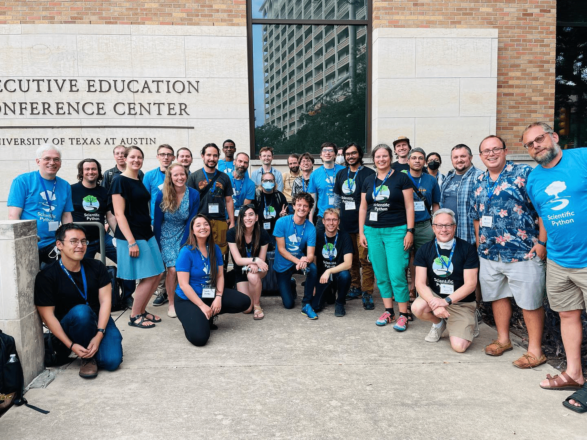

The Scientific Python project is an initiative to better coordinate and support the scientific Python ecosystem of libraries and to grow the surrounding community.
It aims to improve communication between ecosystem projects, to better plan for their joint future, and to make that future a reality.

## Why is this important?

Initially, the Scientific Python developer community was small, so that it was easy to discuss important ecosystem-wide decisions at events like the annual SciPy conference.
But with the rapid growth of the community, number of libraries, as well as geographical diversification, this was no longer possible.
Scientific Python is a loose federation of somewhat independent community projects, and while this configuration is robust, it also tends to favor reinvention of the wheel and decisions that focus on project needs, instead of being strategically aligned with the entire ecosystem.
Ultimately, the different projects depend on one another, so that it makes sense to have close coordination between them.

## How are we doing this?

### SPECs

The [SPECs](https://scientific-python.org/specs/), or Scientific Python Ecosystem Coordination documents, provide a mechanism through which the community can establish cross-project policies.
They function similarly to PEPs, NEPs, SKIPs, or any of the other enhancement proposals—except that they are relevant to multiple projects in the ecosystem.

These documents will be recommendations written up by the community, and their authority will derive from endorsement by popular libraries.
Some of them are already in progress and many are on the way!

SPECs are short and concise, and are endorsed by core projects in the ecosystem once they are adopted.

### Shared infrastructure

We provide common engineering infrastructure to help maintainers.
Some tools we currently work on include
[a Hugo web theme](https://github.com/scientific-python/scientific-python-hugo-theme) for project websites,
a self-hosted privacy-friendly web analytics platform,
a [shared discussion forum](https://discuss.scientific-python.org),
the [devpy](https://github.com/scientific-python/devpy) developer CLI,
[this blog](https://blog.scientific-python.org),
and a [project development statistics dashboard](https://devstats.scientific-python.org).

### Developer events

We organize virtual "domain summits" where developers can meet to discuss relevant cross-project topics.
These will be recorded and shared on our [YouTube channel](https://www.youtube.com/@scientific-python).
Thus far, we've organized four such events on: API dispatching, alt-text for improved accessibility, domain stacks, and sparse arrays.

We also organize an annual in-person developer summit: a week of intense collaboration, with work scheduled ahead of time, during which we address as many cross-project concerns as we can.

### Documentation

We work on documentation for new contributors and maintainers.
Our YouTube channel hosts onboarding videos, that show how to get started contributing to a scientific Python project, as well as developer interviews.
Over the next year, we also plan to unify several disparate community resources into a maintainer guide.

### Community outreach

We love to reach out to and connect with our growing community of users and developers!
Platforms we are present on include
[Twitter](https://twitter.com/scientific_py), [Facebook](https://www.facebook.com/scientific.python), [Instagram](https://www.instagram.com/scientific.python), and [TikTok](https://www.tiktok.com/@scientific.python).

## Who is behind this?

The short answer: anyone who wants to be.
The long answer: we are a community of volunteers from different scientific Python ecosystem packages.
There are several teams working on the different aspects of the project, such as our [community managers & leaders](https://scientific-python.org/about/), the [SPEC steering committee](https://scientific-python.org/about/), and [blog content reviewers and editors](https://blog.scientific-python.org/about/).
The project is led by Jarrod Millman and Stéfan van der Walt, both long-term community members who care deeply about the success of the ecosystem and its developers.

Currently there are eight [projects](https://scientific-python.org/specs/core-projects/) that endorse the SPECs: IPython, Matplotlib, NetworkX, NumPy, pandas, scikit-image, scikit-learn, and SciPy.
However, contributors from many more projects participate on our discussion forum, write blogs, and contribute to the community in other ways.
We welcome everyone to become part of the community and to contribute however they can!

## What am I doing here?

For the past couple of months I have been a community manager for the project.
This includes recording documentation videos for the website, recording developer interviews for our YouTube channel, presenting talks at conferences, hosting developer events, creating content for our Instagram, Facebook, TikTok, and Twitter channels, and many other things that I never thought I would do.

Why? Because I believe in this.
Jarrod and Stéfan reached out to me last year, inviting me to be part of this amazing idea and I was honored and very grateful.
I wasn't sure that I could do it, but now I find myself here and I know that this is the right place for me.
Not because I have a lot of experience in these things (I had actually never even used TikTok before joining the project), but because I care.
I have learned the importance of building community and while the Scientific Python tools are amazing, what makes the difference is the community around them and I'm greatful to be able to help make this community great.

I have learned a lot from the Scientific Python ecosystem by being a community manager, I have met a lot of wonderful people and I have seen what people can do with the tools that the ecosystem offers.
So, my take: The Scientific Python project is a great bet.
Open source Scientific Python is about much more than coding, it is about collaborating, teaching, and communicating.
So unifying the community and promoting the integration of the projects sounds like the perfect path to follow in order to get the most out of the ecosystem.
