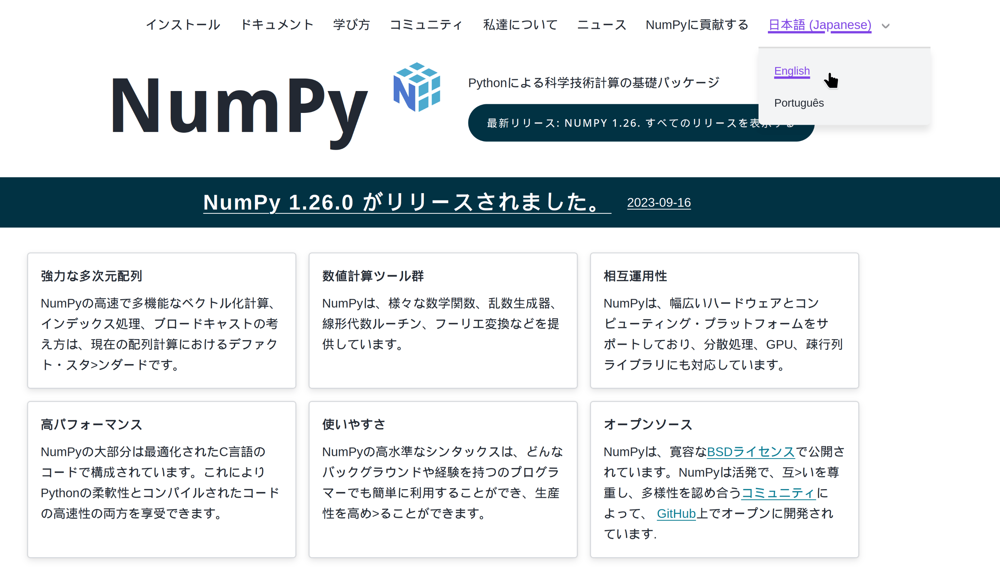

In November 2022, [the Chan Zuckerberg Initiative (CZI) awarded the Scientific Python project with a grant to improve communications infrastructure and accessibility](https://blog.scientific-python.org/scientific-python/2022-czi-grant/). This proposal involves several key areas to improve sustainability, inclusivity and accessibility of the Scientific Python ecosystem. One of these areas is making software documentation and user interfaces available in multiple languages. We are happy to announce that we have organized the necessary infrastructure and processes to allow volunteers to start translating multiple project websites.

In this blog post, we will discuss how we set up manage translations for Scientific Python projects, and how you can participate in the translation and localization effort. The work described here was done by Quansight Labs.

## Why translations are important

Accessibility and inclusion are important aspects of building a healthy community around open source software development. By providing translations of our websites, documentation and user interfaces in multiple languages, we can reach a wider global audience, thereby making our projects more inclusive and increasing the diversity of contributions and ideas. This is especially important for scientific software projects, which are used by researchers and scientists from around the world with a wide range of language proficiencies and backgrounds.

Recently, machine translation tools have made it easier to translate content into multiple languages. While such tools are improving, they often fall short in the context of technical documentation. In addition, without a human in the loop, maintainers can never be sure if translated content is correct for languages they are not familiar with. For this reason, we chose to work with a group of volunteers to help us translate selective subsets of project websites and documentation.

## Setting up translations workflow

You may have seen that translations into some languages are already available for [numpy.org](https://numpy.org), with a version switcher in the top right corner.

A number of core projects have also joined this effort and are set up to start with translations. At the moment, we are targeting [NumPy](https://numpy.org), [SciPy](https://scipy.org), [NetworkX](https://networkx.org), [Xarray](https://xarray.dev), and [pandas](https://pandas.org). We're offering to help other core projects integrate something similar into their websites, and we aim to accomplish this in a way that requires minimal effort from the core project maintainers, using [Crowdin](https://scientific-python.crowdin.com). 

For the moment, our scope is to translate only the projects' websites—the landing pages you see when you check out the links above—and **not** full documentation. We are intentionally starting small with the goal of completing this first phase and then potentially expanding once the translations team is established.

## Translations team

For new contributors who are looking to get involved in the projects they already use and depend on, joining the translations team can be a great way to get started. Because of how the translations infrastructure is set up in Crowdin, this workflow is particularly well-suited for new contributors who are not yet familiar with GitHub or other development tools—they can work entirely on the Crowdin web platform.

One advantage of setting this up at the Scientific Python level, and not on a per-project basis, is that the translations team can work on multiple projects, and knowledge and experience can be shared. This also helps to ensure that translations are consistent across projects.

The translations team will be responsible for:
- Translating (and reviewing) content into multiple languages;
- Ensuring that translations are accurate and up-to-date;
- Engaging with the community to help maintain and improve translations.

Once the translations are complete and reviewed, a maintainer for each project can merge the translations and publish them to the project website. After the initial setup, the translations team will be able to manage the translations workflow independently, with minimal input from the project maintainers.

For more information on the infrastructure and team working on the translations, and how to join as a translator, see https://scientific-python-translations.github.io/. You can also join the `#translation` channel at the [Scientific Python Discord server](https://discord.gg/vur45CbwMz).
