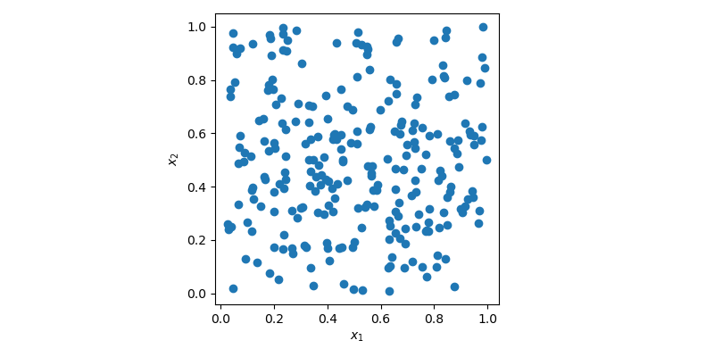
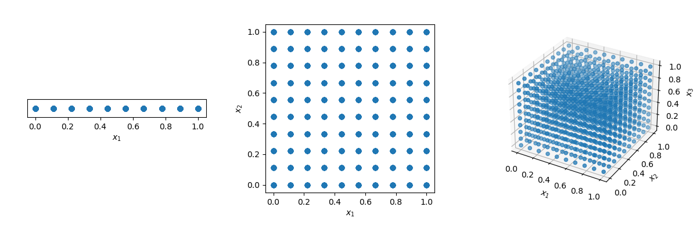
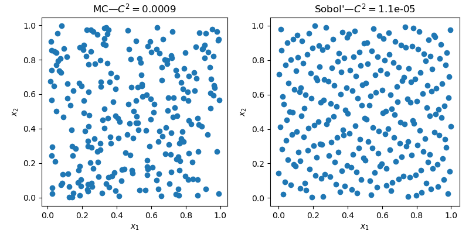
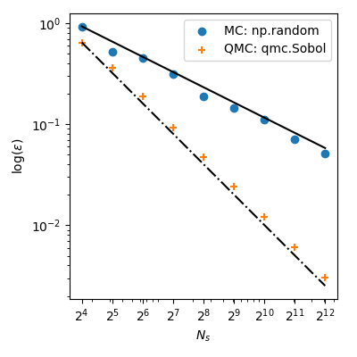

At the end of this article, my goal is to convince you that: if you need to
use random numbers, you _should_ consider using
[`scipy.stats.qmc`](https://scipy.github.io/devdocs/reference/stats.qmc.html)
instead of
[`np.random`](https://numpy.org/doc/stable/reference/random/index.html).

In the following, we assume that _SciPy_, _NumPy_ and _Matplotlib_ are
installed and imported:

```python
import numpy as np
from scipy.stats import qmc
import matplotlib.pyplot as plt
```

> Note that no seeding is used in these examples. This will be the topic
> of another article: seeding should **only** be used for testing purposes.

**So what are Monte Carlo (MC) and Quasi-Monte Carlo (QMC)?**

## Monte Carlo (MC)

> MC methods are a broad class of computational algorithms that rely on
> repeated random sampling to obtain numerical results.
> The underlying concept is to use randomness to solve problems that might be
> deterministic in principle. They are often used in physical and mathematical
> problems and are most useful when it is difficult or impossible to use other
> approaches. MC methods are mainly used in three classes of problem:
> optimization, numerical integration, and generating draws from a probability
> distribution.

Put simply, this is how you would usually generate a _sample_ of points using
MC:

```python
rng = np.random.default_rng()
sample = rng.random(size=(256, 2))
```

In this case, `sample` is a 2-dimensional array with 256 points which can be
visualized using a 2D scatter plot.



In the plot above, points are generated randomly without any
knowledge about previously drawn points. It is clear that some regions of the
space are left unexplored while other regions have clusters. In an optimization
problem, it could mean that you would need to generate more sample to find the
optimum. Or in a regression problem, you could also overfit a model due to
some cluster of points.

Generating random numbers is a more complex problem than it sounds. Simple MC
methods are designed to sample points to be independent and identically
distributed (IID).

One could think that the solution is just to use a grid! But look what
happens if we have a distance of 0.1 between points in the unit-hypercube (
with all bounds ranging from 0 to 1).

```python
disc = 10
x1 = np.linspace(0, 1, disc)
x2 = np.linspace(0, 1, disc)
x3 = np.linspace(0, 1, disc)
x1, x2, x3 = np.meshgrid(x1, x2, x3)
```

The number of points required to fill the unit interval would be 10.
In a 2-dimensional hypercube the same spacing would require 100, and in 3
dimensions 1,000 points. As the number of dimensions grows, the number of
samples which is required to fill the space rises exponentially as the
dimensionality of the space increases. This exponential growth is called
the _curse of dimensionality_.



## Quasi-Monte Carlo (QMC)

To mitigate the _curse of dimensionality_, you could decide to randomly
remove points from the sample or randomly sample in n-dimension. In both
cases, this **will** need to empty regions and clusters of points elsewhere.

Quasi-Monte Carlo (QMC) methods have been created specifically to answer this
problem. As opposed to MC methods, QMC methods are deterministic. Which means
that the points are not IID, but each new point knows about previous points.
The result is that we can construct samples with good coverage of the space.

> Deterministic does **not** mean that samples are always the same.
> the sequences can be scrambled.

Starting with version 1.7, SciPy provides QMC methods in
[`scipy.stats.qmc`](https://scipy.github.io/devdocs/reference/stats.qmc.html).

Let's generate 2 samples with MC and a QMC method named _Sobol'_.

```python
n, d = 256, 2

rng = np.random.default_rng()
sample_mc = rng.random(size=(n, d))

qrng = qmc.Sobol(d=d)
sample_qmc = qrng.random(n=n)
```

A very similar interface, but as seen below, with radically different results.



The 2D space clearly exhibit less empty areas and less clusters with the QMC
sample.

## Quality?

Beyond the visual improvement of _quality_, there are metrics to assess the
quality of a sample. Geometrical criteria are commonly used, one can
compute the distance (L1, L2, etc.) between all pairs of points. But there
are also statistical criteria such as: the
[discrepancy](https://scipy.github.io/devdocs/reference/generated/scipy.stats.qmc.discrepancy.html).

```python
qmc.discrepancy(sample_mc)
# 0.0009
qmc.discrepancy(sample_qmc)
# 1.1e-05
```

The lower the value, the better the quality.

## Convergence

If this still does not convince you, let's look at a concrete example:
integrating a function. Let's look at the mean of the squared sum in
5 dimensions:

$$f(\mathbf{x}) = \left( \sum_{j=1}^{5}x_j \right)^2,$$

with $x_j \sim \mathcal{U}(0,1)$. It has a known mean value,
$\mu = 5/3+5(5-1)/4$. By sampling points, we can compute that mean numerically.

> The samplings are done 99 times and averaged. The variance is not reported
> for simplicity, just know that it's guaranteed to be lower with QMC than with
> MC.

```python
dim = 5
ref = 5 / 3 + 5 * (5 - 1) / 4
n_conv = 99
ns_gen = 2 ** np.arange(4, 13)


def func(sample):
    # dim 5, true value 5/3 + 5*(5 - 1)/4
    return np.sum(sample, axis=1) ** 2


def conv_method(sampler, func, n_samples, n_conv, ref):
    samples = [sampler(n_samples) for _ in range(n_conv)]
    samples = np.array(samples)

    evals = [np.sum(func(sample)) / n_samples for sample in samples]
    squared_errors = (ref - np.array(evals)) ** 2
    rmse = (np.sum(squared_errors) / n_conv) ** 0.5

    return rmse


# Analysis
sample_mc_rmse = []
sample_sobol_rmse = []
rng = np.random.default_rng()

for ns in ns_gen:
    # Monte Carlo
    sampler_mc = lambda x: rng.random((x, dim))
    conv_res = conv_method(sampler_mc, func, ns, n_conv, ref)
    sample_mc_rmse.append(conv_res)

    # Sobol'
    engine = qmc.Sobol(d=dim)
    conv_res = conv_method(engine.random, func, ns, 1, ref)
    sample_sobol_rmse.append(conv_res)

sample_mc_rmse = np.array(sample_mc_rmse)
sample_sobol_rmse = np.array(sample_sobol_rmse)

# Plot
fig, ax = plt.subplots(figsize=(4, 4))
ax.set_aspect("equal")

# MC
ratio = sample_mc_rmse[0] / ns_gen[0] ** (-1 / 2)
ax.plot(ns_gen, ns_gen ** (-1 / 2) * ratio, ls="-", c="k")

ax.scatter(ns_gen, sample_mc_rmse, label="MC: np.random")

# Sobol'
ratio = sample_sobol_rmse[0] / ns_gen[0] ** (-2 / 2)
ax.plot(ns_gen, ns_gen ** (-2 / 2) * ratio, ls="-", c="k")

ax.scatter(ns_gen, sample_sobol_rmse, label="QMC: qmc.Sobol")

ax.set_xlabel(r"$N_s$")
ax.set_xscale("log")
ax.set_xticks(ns_gen)
ax.set_xticklabels([rf"$2^{{{ns}}}$" for ns in np.arange(4, 13)])

ax.set_ylabel(r"$\log (\epsilon)$")
ax.set_yscale("log")

ax.legend(loc="upper right")
fig.tight_layout()
plt.show()
```



With MC the approximation error follows a theoretical rate of $O(n^{-1/2})$.
But, QMC methods have better rates of convergence and achieve $O(n^{-1})$
for this function–and even better rates on very smooth functions.

This means that using $2^8=256$ points from _Sobol'_ leads to a lower
error than using $2^{12}=4096$ points from MC! When the function evaluation
is costly, it can bring huge computational savings.

## Sampling from any distribution (advanced)

But there is more! Another great use of QMC is to sample arbitrary
distributions. In SciPy 1.8, there are new classes of
[samplers](https://scipy.github.io/devdocs/reference/stats.sampling.html)
that allow you to sample from any custom distribution. And some of
these methods can use QMC with a `qrvs` method:

- [NumericalInversePolynomial](https://scipy.github.io/devdocs/reference/generated/scipy.stats.sampling.NumericalInversePolynomial.html)
- [NumericalInverseHermite](https://scipy.github.io/devdocs/reference/generated/scipy.stats.sampling.NumericalInverseHermite.html)

Here is an example with a distribution from SciPy: _fisk_. We generate
a MC sample from the distribution (either directly from the distribution with
`fisk.rvs` or using `NumericalInverseHermite.rvs`) and another sample with
QMC using `NumericalInverseHermite.qrvs`.

```python
import scipy.stats as stats
from scipy.stats import sampling

# Any distribution
c = 3.9
dist = stats.fisk(c)

# MC
rng = np.random.default_rng()
sample_mc = dist.rvs(128, random_state=rng)

# QMC
rng_dist = sampling.NumericalInverseHermite(dist)
# sample_mc = rng_dist.rvs(128, random_state=rng)  # MC alternative same as above
qrng = qmc.Sobol(d=1)
sample_qmc = rng_dist.qrvs(128, qmc_engine=qrng)
```

Let's visualize the difference between MC and QMC by calculating the empirical
Probability Density Function (PDF). The QMC results are clearly superior
to MC.

```python
# Visualization
fig, axs = plt.subplots(1, 2, sharey=True, sharex=True, figsize=(8, 4))

x = np.linspace(dist.ppf(0.01), dist.ppf(0.99), 100)
pdf = dist.pdf(x)
delta = np.max(pdf) * 5e-2

samples = {"MC: np.random": sample_mc, "QMC: qmc.Sobol": sample_qmc}

for ax, sample in zip(axs, samples):
    ax.set_title(sample)
    ax.plot(x, pdf, "-", lw=3, label="fisk PDF")
    ax.plot(samples[sample], -delta - delta * np.random.random(128), "+k")

    kde = stats.gaussian_kde(samples[sample])
    ax.plot(x, kde(x), "-.", lw=3, label="empirical PDF")
    # or use a histogram
    # ax.hist(sample, density=True, histtype='stepfilled', alpha=0.2)
    ax.set_xlim([0, 3])

axs[0].legend(loc="best")
fig.supylabel("Density")
fig.supxlabel("Sample value")
fig.tight_layout()
plt.show()
```


Careful readers will note that there is no seeding. This is intentional as
noted at the beginning of this article. You might run this code
again and have better results with MC. **But** only sometimes. And that's
exactly my point. On average, you are guaranteed to have more consistent
results with a better quality using QMC. I invite you to try it and see for
yourself!

## Conclusion

I hope that I convinced you to use QMC the next time you need random numbers.
QMC is superior to MC, period.

There is an extensive body of literature and rigorous proofs. One reason MC is
still more popular is that QMC is harder to implement and, depending on the
method, there are rules to follow.

Take the _Sobol'_ method we used: you must use exactly $2^n$ sample. If you
don't do it, you will break some properties and end up having the same
performance than MC. This is why some people argue that QMC is not better:
they simply don't use the methods properly, hence fail to see any benefits and
conclude that MC is "enough".

In
[`scipy.stats.qmc`](https://scipy.github.io/devdocs/reference/stats.qmc.html),
we went to great lengths to explain how to use the methods, and we added some
explicit warnings to make the methods accessible and useful to
everyone.
